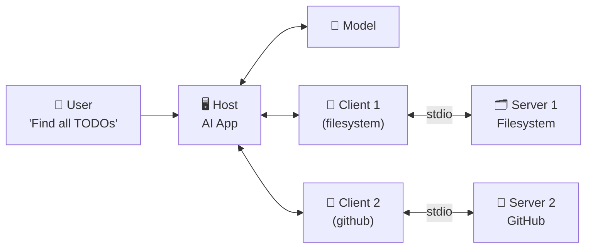

# Theory — Hosts, Clients, and Servers

## The Story 📖

Picture a busy restaurant. There is the **front of house** — the customer-facing area with tables, waiters, and the menu. There is the **kitchen** — where the actual food is prepared. And there are **waiters** who run between the two.

The customer (the user) sits at a table and reads the menu. When they want food, they tell the waiter. The waiter knows which kitchen station handles which food — sushi goes to the sushi station, steaks go to the grill, desserts go to the pastry kitchen. The customer does not need to know any of this. They just say "I'd like the salmon" and the waiter figures out the rest.

Now the manager of the restaurant (the AI model) might oversee many waiters. Each waiter is dedicated to one kitchen station. The grill waiter knows the grill. The sushi waiter knows the sushi bar. They do not overlap — each handles their own specialty. When the manager needs something from multiple kitchens, the manager talks to each dedicated waiter, and each waiter talks to their own kitchen.

👉 This is **Hosts, Clients, and Servers** in MCP — the **Host** is the restaurant (the AI app that serves the customer), the **Clients** are the waiters (protocol handlers dedicated to one server each), and the **Servers** are the specialty kitchens (filesystem, GitHub, database). The customer (user) just asks for what they want; the system handles routing.

---

## What Are Hosts, Clients, and Servers? 🤔

These are the three roles every entity in an MCP system plays:

**Host**
Think of it as the owner and operator of the whole show. The host is the application that the user directly interacts with. It runs the AI model, manages the conversation history, and decides which MCP servers to connect to.

- Examples: Claude Desktop, VS Code Copilot, a custom Python web app, a Jupyter notebook with an AI assistant
- The host is responsible for user experience and AI model management
- The host creates and manages all clients
- The host injects available tool descriptions into the model's context

**Client**
The client is a component that lives inside the host. It is the protocol specialist — it knows how to speak MCP and manages one connection to one server. If you are connecting to three servers, your host has three clients.

- Clients are not separate programs — they are code running inside the host process
- Each client is responsible for: opening the connection, doing the handshake, serializing/deserializing messages, closing the connection
- Clients are stateful — they maintain the session with their server
- If a client's server crashes, only that client is affected; other clients continue working

**Server**
The server is the specialist. It is usually a separate program (subprocess or remote HTTP service) that provides specific capabilities — reading files, querying a database, calling a GitHub API. The server does not know anything about which AI model is using it. It just responds to MCP requests.

- Servers are usually single-purpose: do one thing, do it well
- A filesystem server handles files. A GitHub server handles GitHub. A search server handles search.
- Servers declare their capabilities once during initialization and then respond to requests
- The same server can serve multiple simultaneous clients (especially with SSE transport)

---

## How It Works — Step by Step 🔧

Here is how the three components interact from startup to a complete tool call:

1. **Host boots up** — The host application starts (e.g., you open Claude Desktop)
2. **Host reads config** — The host reads its configuration to find what MCP servers to connect to
3. **Host creates clients** — For each configured server, the host creates a client instance
4. **Clients connect to servers** — Each client starts its server subprocess (stdio) or opens an HTTP connection (SSE)
5. **Initialize handshake** — Each client sends `initialize`; each server responds with its capabilities
6. **Host discovers tools** — The host asks each client "what tools/resources/prompts does your server have?" and aggregates the results
7. **User sends message** — "Help me find all TODO comments in my codebase"
8. **Model decides** — The AI model sees the available tools and decides to call `search_files` with a regex pattern
9. **Host routes to client** — The host knows that `search_files` belongs to the filesystem server; it tells that client to call the tool
10. **Client calls server** — The client sends `tools/call` to its server
11. **Server executes** — The filesystem server actually runs the search on the real filesystem
12. **Result flows back** — Server → Client → Host → AI model
13. **Model responds** — The AI model generates a response using the search results

---

## Real-World Examples 🌍

- **Claude Desktop as host**: Claude Desktop reads `~/Library/Application Support/Claude/claude_desktop_config.json`, finds two servers (filesystem and GitHub), creates two clients, and when you chat with Claude it can access both
- **VS Code as host**: The VS Code extension acts as the host; its MCP client connects to a code execution server so Copilot can run code snippets directly
- **Custom FastAPI app as host**: A developer builds a Python web app that runs Claude; the app creates MCP clients for a database server and a web search server — Claude can now answer questions using live data
- **Filesystem server**: A Node.js or Python process that exposes `read_file`, `write_file`, `list_directory`, `search_files` — it connects to nothing external; it just wraps the OS filesystem
- **GitHub MCP server**: A server that wraps GitHub's REST API — it exposes `create_branch`, `list_pull_requests`, `post_comment` as MCP tools. The AI calls these tools as if GitHub were a local service.

---

## Common Mistakes to Avoid ⚠️

**Mistake 1: Building the server logic inside the host**
If your "MCP server" is actually just functions inside your AI app, you have lost the whole benefit — portability. Put tool logic in a separate server process so it can be reused by other hosts.

**Mistake 2: One giant server for everything**
A server that handles files AND database queries AND web search AND email is hard to test, hard to maintain, and exposes too many capabilities at once. Build focused servers.

**Mistake 3: Forgetting that the host controls what the user sees**
The host decides which tools to show the AI model, how to present results, and whether to ask the user for confirmation before running dangerous tools. Do not leave this responsibility to the server.

**Mistake 4: Treating the client as optional**
The client is not optional boilerplate. It manages the session lifecycle, handles errors, and provides the protocol translation layer. Bypassing it by manually writing JSON-RPC to a server is fragile and breaks on protocol updates.

---

## Connection to Other Concepts 🔗

- **[MCP Architecture](../02_MCP_Architecture/Theory.md)** — The overall design pattern
- **[Tools, Resources, Prompts](../04_Tools_Resources_Prompts/Theory.md)** — What servers expose to clients
- **[Transport Layer](../05_Transport_Layer/Theory.md)** — How clients and servers actually communicate (stdio vs SSE)
- **[Building an MCP Server](../06_Building_an_MCP_Server/Theory.md)** — How to build the server side
- **[MCP Ecosystem](../08_MCP_Ecosystem/Theory.md)** — Pre-built servers you can use today

---

✅ **What you just learned:** The Host is the AI application (owns the model and UI). The Client is a protocol handler living inside the host, managing one connection to one server. The Server is an external process that exposes tools/resources/prompts. One host can have many clients; each client has exactly one server.

🔨 **Build this now:** Look at the Claude Desktop config file. For each entry in the `mcpServers` section, identify: which entry is the "server" definition, and understand that Claude Desktop (the host) creates one client for each entry. That is the architecture made concrete.

➡️ **Next step:** [Tools, Resources, Prompts](../04_Tools_Resources_Prompts/Theory.md) — Learn what servers actually expose and how the AI uses it.

---

## 📂 Navigation

**In this folder:**
| File | |
|---|---|
| 📄 **Theory.md** | ← you are here |
| [📄 Cheatsheet.md](./Cheatsheet.md) | Quick reference |
| [📄 Interview_QA.md](./Interview_QA.md) | Interview prep |

⬅️ **Prev:** [02 MCP Architecture](../02_MCP_Architecture/Theory.md) &nbsp;&nbsp;&nbsp; ➡️ **Next:** [04 Tools Resources Prompts](../04_Tools_Resources_Prompts/Theory.md)