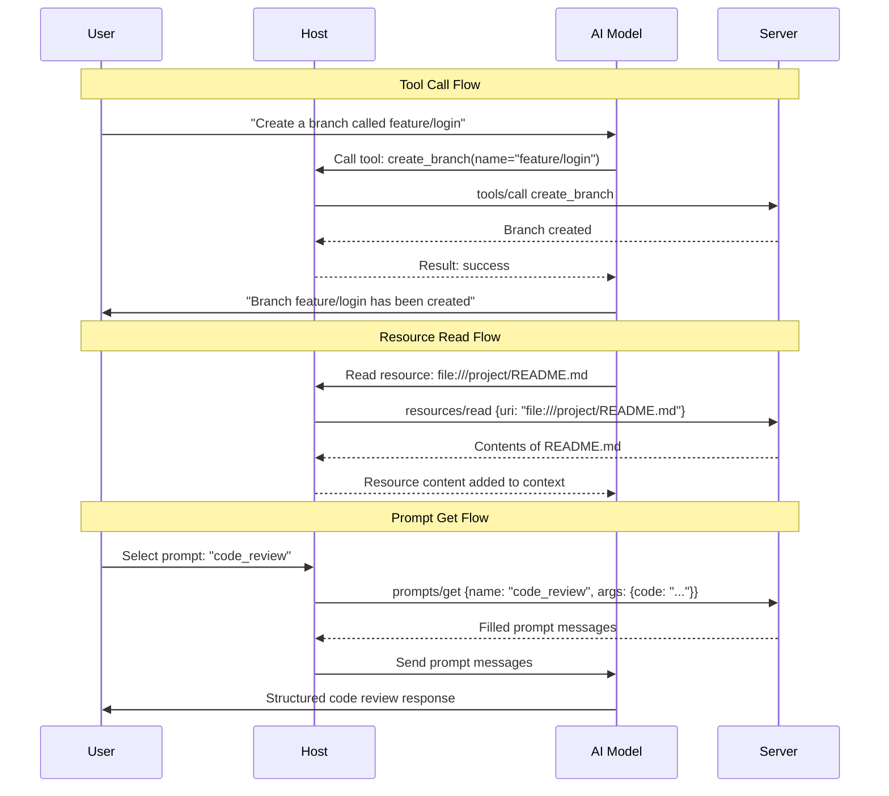
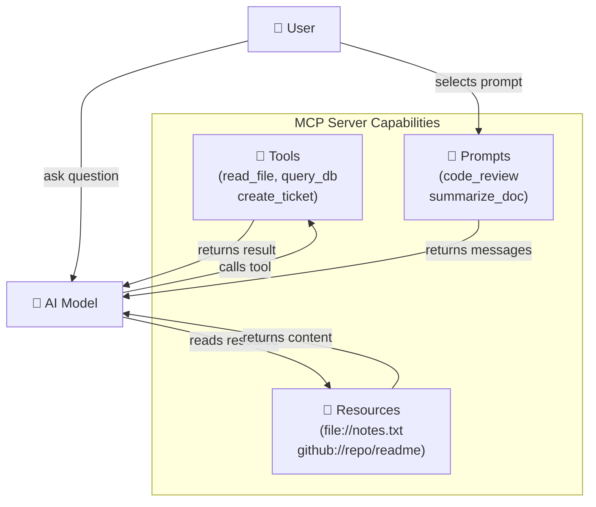

# Theory — Tools, Resources, and Prompts

## The Story 📖

A contractor renovating your kitchen brings three kinds of things. First, **power tools** — the drill, saw, nail gun. These DO work; when the drill runs, a hole appears. Second, **reference materials** — blueprints, safety codes, installation manuals. These are READ but not modified; the blueprint doesn't change when consulted. Third, **work templates** — pre-filled permit forms, standard inspection checklists. Pre-structured starting points with blanks to fill in for each job.

👉 These are the **three MCP primitives** — **Tools** (power tools — actions the AI can perform), **Resources** (blueprints — data the AI can read), and **Prompts** (work templates — pre-built prompt structures).

---

## 📌 Learning Priority

**Must Learn** — core concepts, needed to understand the rest of this file:
[Tools Resources and Prompts](#what-are-tools-resources-and-prompts-) · [The Key Difference](#what-are-tools-resources-and-prompts-)

**Should Learn** — important for real projects and interviews:
[How It Works](#how-it-works----step-by-step-) · [Common Mistakes](#common-mistakes-to-avoid-)

**Good to Know** — useful in specific situations, not needed daily:
[Real-World Examples](#real-world-examples-)

**Reference** — skim once, look up when needed:
[Connection to Other Concepts](#connection-to-other-concepts-)

---

## What Are Tools, Resources, and Prompts? 🤔

**Tools — "Do Things"**
A **tool** is a function the AI can call to perform an action. Tools change the world — they write to files, query databases, send emails, create tickets.
- Have: a `name`, a `description`, an `inputSchema` (JSON Schema), return `content`
- The AI decides when to call them based on their description
- Examples: `read_file`, `create_pull_request`, `send_email`, `run_sql_query`, `search_web`

**Resources — "Read Things"**
A **resource** is a piece of data the AI can access via a URI. Resources are read-only — think of them like a virtual filesystem.
- Have: a `uri`, a `name`, a `mimeType`, optional `description`
- No side effects — reading a resource changes nothing
- Examples: `file:///home/user/notes.txt`, `github://repos/owner/repo`, `db://products/catalog`

**Prompts — "Use Templates"**
A **prompt** is a pre-built, parameterized prompt template stored on the server. When the host requests it, the server fills in arguments and returns complete prompt messages, encoding reusable workflows.
- Have: a `name`, a `description`, an `arguments` list
- Return a list of messages (system, user, assistant) when requested
- Examples: `code_review`, `explain_error`, `summarize_document`, `write_unit_tests`

**The Key Difference:**

| | Changes State | Requires Arguments | Returns |
|---|---|---|---|
| **Tool** | YES | YES (JSON Schema) | Result content |
| **Resource** | NO | NO (just a URI) | File/data content |
| **Prompt** | NO | YES (template params) | Prompt messages |

---

## How It Works — Step by Step 🔧

---

## Real-World Examples 🌍

- **GitHub MCP server tools**: `create_branch`, `list_pull_requests`, `add_comment`, `merge_pr` — the AI can do real GitHub operations
- **Filesystem server resources**: The server exposes `file:///home/user/` as a browsable resource tree — the AI reads any file without a specific tool per file type
- **Code review prompt**: Pass it a code snippet and language; it returns a detailed system prompt + user message that triggers a thorough review workflow
- **Database server tools**: `run_query(sql)`, `list_tables()`, `describe_table(name)` — the AI explores and queries your database

---

## Common Mistakes to Avoid ⚠️

**Mistake 1: Making everything a Tool when some things should be Resources**
If you have static data the AI should read (config file, README, product catalog), expose it as a Resource, not a `get_config()` Tool. Resources are semantically cleaner and the distinction helps the AI understand whether an operation has side effects.

**Mistake 2: Writing bad Tool descriptions**
The AI decides whether to call your tool based on its `description` field. "does stuff" is useless. Write clear, specific descriptions: "Read the contents of a file at the given absolute path. Returns the file text as a string."

**Mistake 3: Not validating Tool inputs**
Always validate inputs in your tool handler and return a helpful error message if they are invalid — the AI doesn't always pass valid arguments.

**Mistake 4: Using Prompts for things that should be Tools**
Prompts guide how the AI thinks; Tools let the AI act. If you need the AI to take an action (write a file, query a database), use a Tool.

---

## Connection to Other Concepts 🔗

- **[MCP Architecture](../02_MCP_Architecture/Theory.md)** — How tools/resources/prompts flow from server to AI
- **[Building an MCP Server](../06_Building_an_MCP_Server/Theory.md)** — How to implement tools in Python
- **[Code Examples](./Code_Example.md)** — Full Python code showing a tool, a resource, and a prompt
- **[Security and Permissions](../07_Security_and_Permissions/Theory.md)** — Why Tool calls need careful permission design
- **[MCP Ecosystem](../08_MCP_Ecosystem/Theory.md)** — Servers that provide ready-to-use tools and resources

---

✅ **What you just learned:** MCP servers expose three primitives. Tools perform actions (have side effects, take arguments). Resources provide read-only data (no side effects, accessed by URI). Prompts are reusable parameterized prompt templates (no side effects, return messages). Each fills a distinct role.

🔨 **Build this now:** Open the Code_Example.md in this folder and run the Python MCP server locally. Notice how tools, resources, and prompts are each defined differently and how the server handles each type of request.

➡️ **Next step:** [Transport Layer](../05_Transport_Layer/Theory.md) — Learn how messages between clients and servers actually travel.

---

## 📝 Practice Questions

- 📝 [Q70 · mcp-tools-resources](../../ai_practice_questions_100.md#q70--interview--mcp-tools-resources)

---

## 📂 Navigation

**In this folder:**
| File | |
|---|---|
| 📄 **Theory.md** | ← you are here |
| [📄 Cheatsheet.md](./Cheatsheet.md) | Quick reference |
| [📄 Interview_QA.md](./Interview_QA.md) | Interview prep |
| [📄 Code_Example.md](./Code_Example.md) | Python code examples |

⬅️ **Prev:** [03 Hosts Clients Servers](../03_Hosts_Clients_Servers/Theory.md) &nbsp;&nbsp;&nbsp; ➡️ **Next:** [05 Transport Layer](../05_Transport_Layer/Theory.md)
