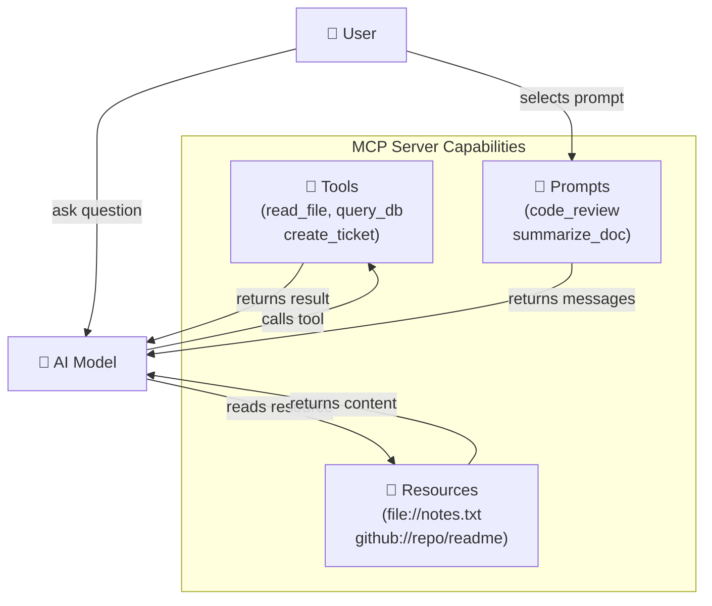

# Theory — Tools, Resources, and Prompts

## The Story 📖

A skilled contractor arrives at your house to renovate the kitchen. They bring three kinds of things with them. First, their **power tools** — the drill, the saw, the nail gun. These are the things they USE to DO work. When they pick up the drill, something changes: a hole appears in the wall. Actions have consequences.

Second, they bring **reference materials** — blueprints, safety codes, manufacturer installation manuals. These are things they READ. They do not modify them; they just consult them to make better decisions. The blueprint does not change when the contractor reads it.

Third, they bring **work templates** — pre-filled permit forms, standard inspection checklists. These are not empty forms (that would be useless) and not the finished work itself. They are pre-structured starting points with blanks to fill in for each specific job. They help the contractor work consistently and professionally.

A contractor without any of these three would be lost — no ability to act, no data to reference, no guidance for how to work.

👉 These are the **three MCP primitives** — **Tools** (power tools — actions the AI can perform), **Resources** (blueprints — data the AI can read), and **Prompts** (work templates — pre-built prompt structures). Together they give an AI model everything it needs to be genuinely useful in the real world.

---

## What Are Tools, Resources, and Prompts? 🤔

These are the three types of capabilities an MCP server can expose to an AI model. Think of them as the vocabulary of what a server can offer.

**Tools — "Do Things"**
A **tool** is a function the AI can call to perform an action. Tools change the world — they write to files, query databases, send emails, create tickets. The AI model reads the tool's description and schema, decides when to call it, and passes arguments. The server executes it and returns a result.

- Have: a `name`, a `description`, an `inputSchema` (JSON Schema), return `content`
- The AI decides when to call them based on their description
- Examples: `read_file`, `create_pull_request`, `send_email`, `run_sql_query`, `search_web`

**Resources — "Read Things"**
A **resource** is a piece of data the AI can access via a URI. Resources are read-only data sources — think of them like a virtual filesystem. The AI can list what resources exist and read their contents.

- Have: a `uri`, a `name`, a `mimeType`, optional `description`
- Do not change state — reading a resource has no side effects
- Examples: `file:///home/user/notes.txt`, `github://repos/owner/repo`, `db://products/catalog`

**Prompts — "Use Templates"**
A **prompt** is a pre-built, parameterized prompt template stored on the server. When the host requests a prompt, it fills in arguments and returns the complete prompt messages, ready to send to the AI model. This encodes reusable workflows.

- Have: a `name`, a `description`, an `arguments` list
- Return a list of messages (system, user, assistant) when requested
- Examples: `code_review`, `explain_error`, `summarize_document`, `write_unit_tests`

**The Key Difference:**

| | Changes State | Requires Arguments | Returns |
|---|---|---|---|
| **Tool** | YES | YES (JSON Schema) | Result content |
| **Resource** | NO | NO (just a URI) | File/data content |
| **Prompt** | NO | YES (template params) | Prompt messages |

---

## How It Works — Step by Step 🔧

**Tool Call Flow:**

1. Server declares tool with name + description + input schema
2. Host injects tool descriptions into AI model context
3. User asks something that requires the tool
4. AI model calls the tool with arguments
5. Host routes to appropriate client → server
6. Server executes the action, returns result
7. AI model uses result to form its response

**Resource Read Flow:**

1. Server declares resources (list of URIs with names)
2. Host may show these to the user or AI directly
3. AI or host calls `resources/read` with a URI
4. Server fetches and returns the resource content
5. Content is added to the AI's context

**Prompt Get Flow:**

1. Server declares available prompts (names + argument schemas)
2. User selects a prompt (e.g., from a UI menu)
3. Host calls `prompts/get` with the prompt name + arguments
4. Server returns the filled-in prompt messages
5. Host sends those messages to the AI model to begin the workflow

---

## Real-World Examples 🌍

- **GitHub MCP server tools**: `create_branch`, `list_pull_requests`, `add_comment`, `merge_pr` — the AI can do real GitHub operations, not just describe them
- **Filesystem server resources**: The server exposes `file:///home/user/` as a browsable resource tree — the AI can read any file without needing a specific tool for each file type
- **Code review prompt**: A server stores a `code_review` prompt template. You pass it a code snippet and language; it returns a detailed system prompt + user message that triggers a thorough review workflow
- **Database server tools**: `run_query(sql)`, `list_tables()`, `describe_table(name)` — the AI can explore and query your database through structured tool calls
- **Documentation server resources**: A knowledge base server exposes documents as resources with URIs like `docs://api-reference/authentication` — the AI reads them on demand

---

## Common Mistakes to Avoid ⚠️

**Mistake 1: Making everything a Tool when some things should be Resources**
If you have static data the AI should read (like a config file, a README, a product catalog), expose it as a Resource, not as a `get_config()` Tool. Resources are semantically cleaner and the distinction helps the AI understand whether an operation has side effects.

**Mistake 2: Writing bad Tool descriptions**
The AI model decides whether to call your tool based on its `description` field. A description like "does stuff" is useless. Write clear, specific descriptions: "Read the contents of a file at the given absolute path. Returns the file text as a string."

**Mistake 3: Not validating Tool inputs**
Just because you define a JSON Schema for tool inputs does not mean the AI will always pass valid arguments. Always validate inputs in your tool handler and return a helpful error message if they are invalid.

**Mistake 4: Using Prompts for things that should be Tools**
Prompts guide how the AI thinks; Tools let the AI act. If you need the AI to take an action (write a file, query a database), use a Tool. Use Prompts when you want to pre-load the AI with a specific workflow or persona.

---

## Connection to Other Concepts 🔗

- **[MCP Architecture](../02_MCP_Architecture/Theory.md)** — How tools/resources/prompts flow from server to AI
- **[Building an MCP Server](../06_Building_an_MCP_Server/Theory.md)** — How to implement tools in Python
- **[Code Examples](./Code_Example.md)** — Full Python code showing a tool, a resource, and a prompt
- **[Security and Permissions](../07_Security_and_Permissions/Theory.md)** — Why Tool calls need careful permission design
- **[MCP Ecosystem](../08_MCP_Ecosystem/Theory.md)** — Servers that provide ready-to-use tools and resources

---

✅ **What you just learned:** MCP servers expose three primitives. Tools perform actions (have side effects, take arguments). Resources provide read-only data (no side effects, accessed by URI). Prompts are reusable parameterized prompt templates (no side effects, return messages). Each fills a distinct role in making an AI model capable.

🔨 **Build this now:** Open the Code_Example.md in this folder and run the Python MCP server locally. Notice how tools, resources, and prompts are each defined differently and how the server handles each type of request.

➡️ **Next step:** [Transport Layer](../05_Transport_Layer/Theory.md) — Learn how messages between clients and servers actually travel.

---

## 📂 Navigation

**In this folder:**
| File | |
|---|---|
| 📄 **Theory.md** | ← you are here |
| [📄 Cheatsheet.md](./Cheatsheet.md) | Quick reference |
| [📄 Interview_QA.md](./Interview_QA.md) | Interview prep |
| [📄 Code_Example.md](./Code_Example.md) | Python code examples |

⬅️ **Prev:** [03 Hosts Clients Servers](../03_Hosts_Clients_Servers/Theory.md) &nbsp;&nbsp;&nbsp; ➡️ **Next:** [05 Transport Layer](../05_Transport_Layer/Theory.md)