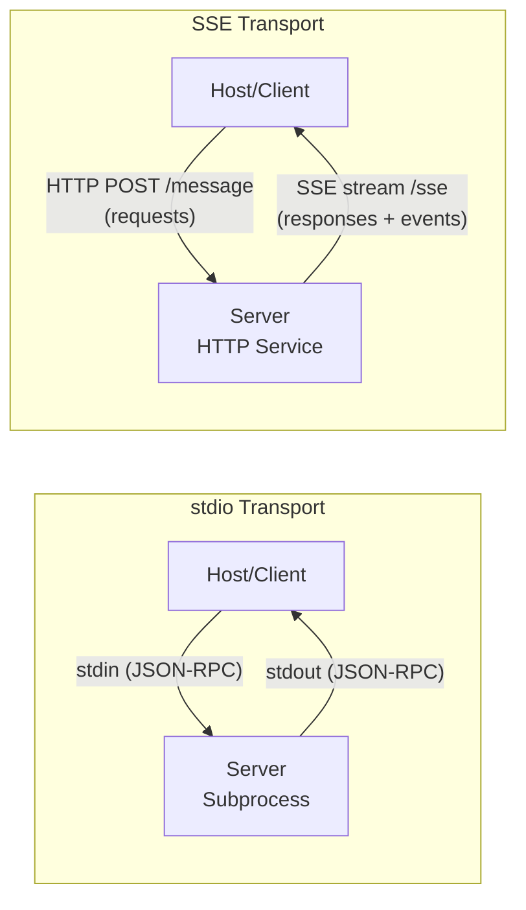

# Theory — The Transport Layer

## The Story 📖

You need to have a conversation with a colleague. You have two options. You could pick up the phone and have a real-time, two-way conversation — you speak, they immediately hear, they reply, you immediately hear. The communication is instant and bidirectional. You are both "on the line" together for the duration of the call. This is great for working locally — same office, same time zone.

Alternatively, you could use an email thread. You send a message (HTTP POST). Your colleague's inbox receives it instantly (Server-Sent Events connection). They reply with updates as they come (SSE events stream back). This model works well when your colleague is in a different city — or even a different company. You do not need a direct pipe between you; the internet handles the routing.

Both options let you have the same conversation. Both deliver the same information. The difference is the channel — how the messages physically travel from one party to the other. The content of the conversation (the JSON-RPC messages) is identical either way.

👉 This is the **MCP Transport Layer** — **stdio** (the phone call, best for local tools) and **SSE** (the email thread with instant delivery, best for remote services). Same protocol, different physical channel.

---

## What is the Transport Layer? 🤔

The **transport layer** in MCP defines the physical mechanism by which JSON-RPC messages travel between the MCP client (inside the host) and the MCP server.

MCP is **transport-agnostic** — the same JSON-RPC messages work regardless of whether they travel through stdio pipes or HTTP. This means you can build an MCP server once and run it in either mode.

**Two official transports:**

**stdio (Standard Input/Output)**
The host starts the server as a subprocess. Messages are sent via stdin (client writes → server reads) and responses come back via stdout (server writes → client reads). This is like piping data between command-line programs.

- Best for: local tools, CLI utilities, development
- Characteristics: one process per client, simple setup, no network needed

**SSE (Server-Sent Events)**
The server runs as an HTTP server. The client connects to an SSE endpoint to receive a stream of events from the server. The client sends requests via HTTP POST to a separate endpoint. This is an HTTP-based bidirectional communication pattern.

- Best for: remote servers, shared company services, web-based tools
- Characteristics: many clients can share one server, requires an HTTP server

---

## How It Works — Step by Step 🔧

**stdio Transport Flow:**

1. Host reads config: `command: "python", args: ["filesystem_server.py"]`
2. Host spawns the subprocess: the server process starts running
3. Client writes JSON-RPC request bytes to the server's **stdin**
4. Server reads from its **stdin**, processes the request
5. Server writes JSON-RPC response bytes to its **stdout**
6. Client reads from the server's **stdout**, parses the response
7. When the host closes, it terminates the subprocess

**SSE Transport Flow:**

1. Server is already running as an HTTP service on port 8000
2. Client opens a persistent HTTP connection to `http://server/sse` (SSE endpoint)
3. Client receives a stream of events over this connection — responses and notifications arrive here
4. To send a request, client makes an HTTP POST to `http://server/message`
5. Server processes the POST, sends the response back as an SSE event on the open stream
6. Connection stays alive until explicitly closed

---

## Real-World Examples 🌍

- **Claude Desktop + filesystem server**: Uses stdio. Claude Desktop spawns `python filesystem_server.py` as a subprocess and pipes messages through stdin/stdout. When you close Claude Desktop, the subprocess is killed.
- **Claude Desktop + web search server** (remote): Uses SSE. The search server runs on a remote machine. Claude's client connects to `https://search-mcp.mycompany.com/sse` and sends search requests via POST.
- **VS Code + GitHub server**: Typically stdio. VS Code spawns the GitHub MCP server as a local subprocess when the extension activates.
- **Multi-user enterprise AI**: Uses SSE. One central database MCP server serves dozens of different AI apps in the company. Each app connects to the same HTTP endpoint.
- **Development and testing**: Use stdio. It is simpler — just run `python my_server.py` and point your client at the process. No HTTP setup needed.

---

## Common Mistakes to Avoid ⚠️

**Mistake 1: Using stdio for a server that multiple clients need to share**
stdio creates one server process per client. If 50 users all need access to the same database server, you cannot use stdio — you will have 50 database server processes. Use SSE for shared servers.

**Mistake 2: Writing to stdout from a stdio server for debugging**
In stdio mode, EVERYTHING the server writes to stdout is interpreted as JSON-RPC messages. If you `print("debug info")` from a stdio server, the client will try to parse "debug info" as JSON and crash. Use stderr for logging in stdio servers: `import sys; print("debug", file=sys.stderr)`.

**Mistake 3: Forgetting about SSE connection management**
SSE connections can drop (network timeout, server restart). Your client must handle reconnection — either automatically retry or notify the user. The MCP SDK handles some of this, but you need to configure timeouts and reconnect behavior appropriately.

**Mistake 4: Thinking you need to choose one transport forever**
A well-built MCP server can support both transports. You can test locally with stdio and deploy as SSE in production. The server logic is identical; only the transport setup code changes.

---

## Connection to Other Concepts 🔗

- **[MCP Architecture](../02_MCP_Architecture/Theory.md)** — Where transport fits in the overall system
- **[Building an MCP Server](../06_Building_an_MCP_Server/Theory.md)** — How to configure transport in server code
- **[Security and Permissions](../07_Security_and_Permissions/Theory.md)** — SSE transport introduces network security concerns
- **[MCP Ecosystem](../08_MCP_Ecosystem/Theory.md)** — Real servers and their transport choices

---

✅ **What you just learned:** MCP has two transports: stdio (subprocess pipes, best for local tools) and SSE (HTTP-based, best for remote/shared servers). Both carry the same JSON-RPC messages. The server logic does not change between transports — only the setup code does.

🔨 **Build this now:** Run the demo server from section 04 using `python my_demo_server.py` directly in your terminal. Notice that it just sits there waiting — it is listening on stdin. That is stdio transport in action. Next, pipe an echo command to it and see it process a raw JSON-RPC message.

➡️ **Next step:** [Building an MCP Server](../06_Building_an_MCP_Server/Theory.md) — Put all this knowledge together and build a real server from scratch.

---

## 📂 Navigation

**In this folder:**
| File | |
|---|---|
| 📄 **Theory.md** | ← you are here |
| [📄 Cheatsheet.md](./Cheatsheet.md) | Quick reference |
| [📄 Interview_QA.md](./Interview_QA.md) | Interview prep |

⬅️ **Prev:** [04 Tools Resources Prompts](../04_Tools_Resources_Prompts/Theory.md) &nbsp;&nbsp;&nbsp; ➡️ **Next:** [06 Building an MCP Server](../06_Building_an_MCP_Server/Theory.md)