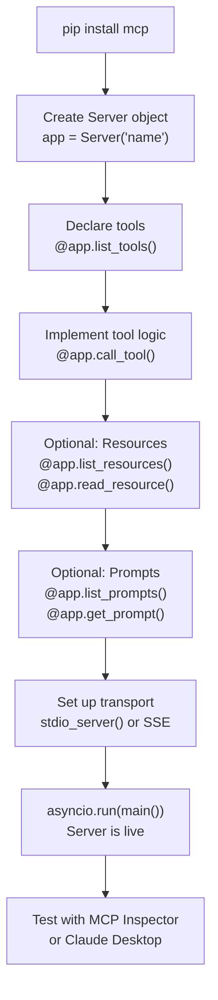

# Theory — Building an MCP Server

## The Story 📖

Setting up a specialist office requires three things: **hang your sign** (publish what services you offer so clients can find you), **set up your phone line** (connect to communications infrastructure so clients can reach you), and **answer the calls** (execute requested services and deliver results).

Building an MCP server is exactly that: declare your capabilities, set up the transport, implement handlers that execute tool logic.

👉 This is **Building an MCP Server** — capability declaration, transport setup, and handler implementation.

---

## What Goes Into an MCP Server? 🤔

An MCP server is a program that:
1. Declares what it can do (tools, resources, prompts)
2. Accepts connections from MCP clients
3. Executes requested operations and returns results

**The anatomy of an MCP server:**
- **Server object** — the central coordinator that registers handlers and manages state
- **Tool handlers** — functions that execute when a tool is called (`list_tools`, `call_tool`)
- **Resource handlers** — functions that list and serve resource data (optional)
- **Prompt handlers** — functions that list and fill in prompt templates (optional)
- **Transport setup** — the code that starts the communication channel (stdio or SSE)

**The server lifecycle:**
1. **Initialize**: Client connects and sends `initialize`. Server responds with capabilities.
2. **Discovery**: Client calls `tools/list`, `resources/list`, `prompts/list`.
3. **Operation**: Client calls `tools/call`, `resources/read`, `prompts/get` repeatedly.
4. **Shutdown**: Client disconnects. Server cleans up.

---

## How It Works — Step by Step 🔧

1. **Install the SDK**: `pip install mcp`
2. **Create the server object**: `app = Server("server-name")`
3. **Define tools**: Use `@app.list_tools()` to declare, `@app.call_tool()` to implement
4. **Add resources** (optional): Use `@app.list_resources()` and `@app.read_resource()`
5. **Add prompts** (optional): Use `@app.list_prompts()` and `@app.get_prompt()`
6. **Set up transport**: Wrap in `async with mcp.server.stdio.stdio_server()` (or SSE)
7. **Run the server**: `asyncio.run(main())`

---

## Real-World Examples 🌍

- **Filesystem server**: Implements `list_directory`, `read_file`, `write_file`, `search_files`. Wraps `pathlib` operations. Runs via stdio.
- **GitHub MCP server**: Implements `create_branch`, `list_prs`, `merge_pr`, `post_comment`. Wraps the GitHub REST API using `httpx`.
- **Database server**: Implements `run_query`, `list_tables`, `describe_table`. Wraps `psycopg2` or `sqlite3`. Takes database URL from environment variable.
- **Weather server**: Implements `get_current_weather(city)` and `get_forecast(city, days)`. Calls a weather REST API. A clean example for beginners.
- **Internal knowledge base**: Implements `search_docs(query)` and `get_document(id)`. Runs as an SSE server shared across the whole company.

---

## Common Mistakes to Avoid ⚠️

**Mistake 1: Writing to stdout in a stdio server**
`print()` in a stdio server destroys your JSON-RPC channel. Every debug print breaks the client. Always use `sys.stderr` for logging.

**Mistake 2: Not handling errors gracefully in tool handlers**
Wrap tool logic in try/except and return descriptive error messages as text content — the AI can then understand and report the error to the user.

**Mistake 3: Hardcoding credentials in the server file**
Never put API keys, database passwords, or tokens directly in your server code. Use environment variables. The host (Claude Desktop config) can pass environment variables to your server process.

**Mistake 4: Making one server do too much**
A server that reads files AND queries databases AND calls external APIs is hard to test, debug, and over-privileged. Build focused servers.

---

## Connection to Other Concepts 🔗

- **[Tools, Resources, Prompts](../04_Tools_Resources_Prompts/Theory.md)** — What to implement in your server
- **[Transport Layer](../05_Transport_Layer/Theory.md)** — How to choose and configure stdio vs SSE
- **[Security and Permissions](../07_Security_and_Permissions/Theory.md)** — How to build servers securely
- **[Code Example](./Code_Example.md)** — A complete working weather server
- **[Step by Step Guide](./Step_by_Step.md)** — Hands-on build tutorial
- **[Server Implementation Reference](./Server_Implementation.md)** — All patterns and error codes

---

✅ **What you just learned:** An MCP server consists of capability declaration (what tools/resources/prompts exist), handler implementation (what to do when called), and transport setup (how to communicate). The Python MCP SDK provides decorators that make this straightforward.

🔨 **Build this now:** Follow the Step_by_Step.md guide to build a weather lookup MCP server from scratch. You will have a working server connected to Claude Desktop in under 30 minutes.

➡️ **Next step:** [Security and Permissions](../07_Security_and_Permissions/Theory.md) — Learn how to build servers that are safe to deploy.

---

## 📝 Practice Questions

- 📝 [Q71 · building-mcp-server](../../ai_practice_questions_100.md#q71--normal--building-mcp-server)

---

## 📂 Navigation

**In this folder:**
| File | |
|---|---|
| 📄 **Theory.md** | ← you are here |
| [📄 Cheatsheet.md](./Cheatsheet.md) | Quick reference |
| [📄 Interview_QA.md](./Interview_QA.md) | Interview prep |
| [📄 Code_Example.md](./Code_Example.md) | Python code examples |
| [📄 Server_Implementation.md](./Server_Implementation.md) | Full server implementation guide |
| [📄 Step_by_Step.md](./Step_by_Step.md) | Step-by-step build guide |

⬅️ **Prev:** [05 Transport Layer](../05_Transport_Layer/Theory.md) &nbsp;&nbsp;&nbsp; ➡️ **Next:** [07 Security and Permissions](../07_Security_and_Permissions/Theory.md)
