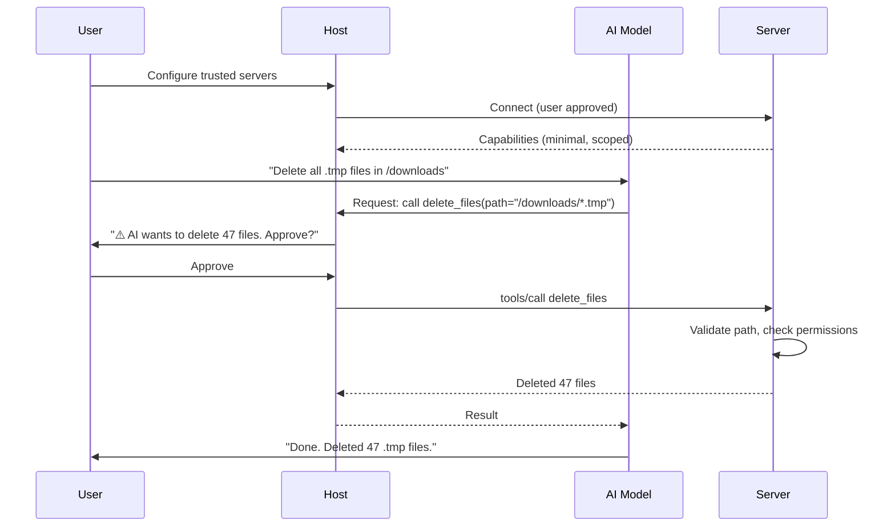

# Theory — Security and Permissions

## The Story 📖

It is your first day at a new job. You are handed an employee badge. It opens the front door and the office floor — that is all you need for now. It does not open the server room. It does not open the executive suite. It does not open the chemical storage. Even though you are a trusted employee, your access is limited to what your role actually requires.

When you need to access a new room, you do not just walk in. You file a request. Someone reviews it. If it makes sense for your role, your badge gets updated. There is a clear, transparent process — not a free-for-all where everyone can go everywhere.

Now imagine an AI assistant in this company. Without careful design, it could be given a badge that opens every door. It could read confidential files, access production databases, send emails as the CEO. The AI does not intend harm — but if its access is not carefully scoped, and if every action is not checked, accidents happen. Or worse, an attacker manipulates the AI into misusing its broad access.

👉 This is **Security and Permissions in MCP** — designing AI tool access like proper employee badges: **minimum necessary access**, **human approval for sensitive actions**, and **clear visibility into what the AI is doing**.

---

## What Are MCP Security and Permissions? 🤔

MCP security is about ensuring that AI models can only access what they should, that humans remain in control of sensitive operations, and that your MCP servers are built with safety in mind from the start.

**The core security principles in MCP:**

- **Principle of Least Privilege** — a server should only expose the tools it absolutely needs. A weather server should not have file-write tools. A read-only analytics server should not have database-delete tools.

- **Human-in-the-Loop** — for destructive or irreversible operations (delete files, send emails, charge customers), the host should ask the user for explicit confirmation before the tool is called. The AI can suggest, but humans approve.

- **Trust Boundaries** — the host decides which MCP servers to connect to. Users are responsible for only connecting to servers they trust. Servers should not be treated as trusted by default.

- **Capability Scoping** — design servers with the smallest possible capability surface. Separate read operations from write operations. Separate safe operations from dangerous ones.

- **Secret Management** — API keys, database passwords, and tokens should never appear in server code. They must come from environment variables or a secrets manager.

---

## How It Works — Step by Step 🔧

Here is how security works at each layer of MCP:

1. **User approves servers** — The user (or admin) configures which MCP servers the host connects to. This is the first and most important security gate. Only connect to servers from sources you trust.

2. **Server declares minimal capabilities** — A well-designed server only exposes tools it truly needs. A filesystem server for reading code should expose `read_file` and `list_directory`, not `delete_file` or `write_file`.

3. **Host controls AI's tool access** — The host can filter which of a server's tools it exposes to the AI model. You can give Claude access to some tools from a server but not all.

4. **Tool call is triggered** — The AI model decides to call a tool. Before it happens, the host should check whether this tool requires human confirmation.

5. **Human confirms dangerous actions** — For tools marked as dangerous (or any write/delete operation), the host shows the user what is about to happen and asks for approval. The user can approve or deny.

6. **Tool executes with scoped permissions** — The server runs the tool. The server should validate all inputs, operate with the minimum OS/file/database permissions needed.

7. **Result returned to AI** — The result flows back. Sensitive data in results (passwords, tokens) should not be logged or stored unnecessarily.

---

## Real-World Examples 🌍

- **Read-only vs read-write servers**: For an analytics AI, create a database server that only exposes `SELECT` queries. Keep the write operations in a separate server that requires extra confirmation.
- **Sandboxed code execution**: A code execution MCP server should run code in a container (Docker/sandbox) with no network access and limited filesystem access, not directly on the host machine.
- **Secret rotation**: Store API keys in a secrets manager (AWS Secrets Manager, HashiCorp Vault). Load them at server startup via environment variables — never hardcode them.
- **Audit logging**: Log every MCP tool call with: timestamp, session ID, tool name, arguments (sanitized), outcome. This creates an audit trail for compliance and debugging.
- **Rate limiting tools**: A web search tool should have rate limiting to prevent the AI from making thousands of API calls (and racking up costs or hitting limits).

---

## Common Mistakes to Avoid ⚠️

**Mistake 1: Giving the AI "god mode" access**
A single all-purpose server with tools to read files, delete records, send emails, and charge customers is a disaster waiting to happen. Separate capabilities. Use multiple servers. Apply least privilege.

**Mistake 2: Not requiring confirmation for irreversible actions**
The AI might confidently decide to delete files, send emails, or make payments. Without a human confirmation step, a misunderstood instruction can cause irreversible damage. Mark destructive tools clearly and require user approval.

**Mistake 3: Hardcoding credentials in server files**
`api_key = "sk-abc123..."` in your source code is a security incident waiting to happen. If the file is ever version-controlled, shared, or leaked, the key is compromised. Always use environment variables.

**Mistake 4: Trusting server input without validation**
An AI model may pass malformed or adversarial arguments to your tools (either by mistake or due to prompt injection). Always validate and sanitize tool inputs in your server before executing them.

---

## Connection to Other Concepts 🔗

- **[Building an MCP Server](../06_Building_an_MCP_Server/Theory.md)** — Security starts with server design
- **[Tools, Resources, Prompts](../04_Tools_Resources_Prompts/Theory.md)** — Dangerous tools need careful design
- **[Best Practices](./Best_Practices.md)** — Numbered security checklist
- **[MCP Ecosystem](../08_MCP_Ecosystem/Theory.md)** — What community servers expose and how to evaluate them
- **[Connect MCP to Agents](../09_Connect_MCP_to_Agents/Theory.md)** — Agents amplify security risks since they take many actions automatically

---

✅ **What you just learned:** MCP security is built on four pillars: least privilege (servers expose only what is needed), human-in-the-loop (humans confirm dangerous actions), trust boundaries (users control which servers connect), and secret management (never hardcode credentials).

🔨 **Build this now:** Review an MCP server you have built and ask: "What is the most dangerous thing this server can do?" Then add a check in the tool handler that returns an error with a warning message when that dangerous tool is called with a parameter that looks risky (e.g., a file path outside an approved directory).

➡️ **Next step:** [MCP Ecosystem](../08_MCP_Ecosystem/Theory.md) — Explore the growing library of ready-to-use MCP servers.

---

## 📂 Navigation

**In this folder:**
| File | |
|---|---|
| 📄 **Theory.md** | ← you are here |
| [📄 Cheatsheet.md](./Cheatsheet.md) | Quick reference |
| [📄 Interview_QA.md](./Interview_QA.md) | Interview prep |
| [📄 Best_Practices.md](./Best_Practices.md) | Security best practices |

⬅️ **Prev:** [06 Building an MCP Server](../06_Building_an_MCP_Server/Theory.md) &nbsp;&nbsp;&nbsp; ➡️ **Next:** [08 MCP Ecosystem](../08_MCP_Ecosystem/Theory.md)