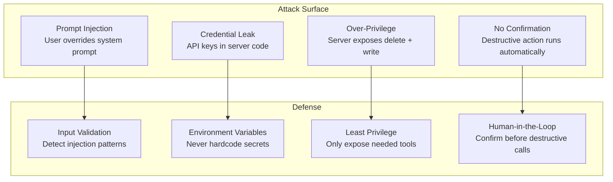
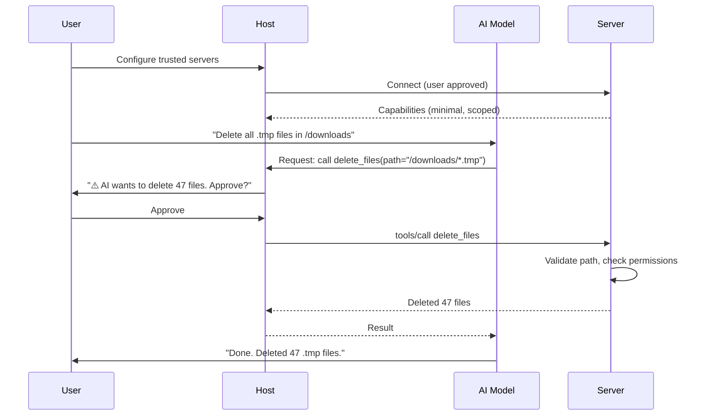

# Theory — Security and Permissions

## The Story 📖

It's your first day at a new job. Your employee badge opens the front door and your office floor — that's all you need. It doesn't open the server room, the executive suite, or chemical storage. Even as a trusted employee, your access is limited to what your role requires.

Now imagine an AI assistant in this company given a badge that opens every door. It could read confidential files, access production databases, send emails as the CEO. The AI doesn't intend harm — but without carefully scoped access and action checks, accidents happen. Or an attacker manipulates the AI into misusing its broad access.

👉 This is **Security and Permissions in MCP** — designing AI tool access like proper employee badges: **minimum necessary access**, **human approval for sensitive actions**, and **clear visibility into what the AI is doing**.

---

## What Are MCP Security and Permissions? 🤔

**The core security principles:**

- **Principle of Least Privilege** — a server should only expose the tools it absolutely needs. A weather server shouldn't have file-write tools.
- **Human-in-the-Loop** — for destructive or irreversible operations (delete files, send emails, charge customers), the host should ask the user for confirmation before the tool is called.
- **Trust Boundaries** — the host decides which servers to connect to. Only connect to servers from sources you trust.
- **Capability Scoping** — separate read operations from write operations. Separate safe operations from dangerous ones.
- **Secret Management** — API keys and tokens should never appear in server code. Use environment variables or a secrets manager.

---

## How It Works — Step by Step 🔧

Security at each layer:
1. **User approves servers** — first and most important gate
2. **Server declares minimal capabilities** — only expose truly needed tools
3. **Host controls AI's tool access** — can filter which of a server's tools the AI sees
4. **Human confirms dangerous actions** — for tools that are destructive or irreversible
5. **Server validates inputs** — validate all inputs, operate with minimum OS/file/database permissions
6. **Results handled carefully** — sensitive data (passwords, tokens) not logged unnecessarily

---

## Real-World Examples 🌍

- **Read-only vs read-write servers**: For analytics AI, create a database server exposing only `SELECT` queries; keep write operations in a separate server requiring extra confirmation.
- **Sandboxed code execution**: Run code in a container (Docker/sandbox) with no network access and limited filesystem access.
- **Secret rotation**: Store API keys in a secrets manager (AWS Secrets Manager, HashiCorp Vault). Load at server startup via environment variables.
- **Audit logging**: Log every MCP tool call with: timestamp, session ID, tool name, arguments (sanitized), outcome.
- **Rate limiting tools**: A web search tool should have rate limiting to prevent the AI from making thousands of API calls.

---

## Common Mistakes to Avoid ⚠️

**Mistake 1: Giving the AI "god mode" access**
A single all-purpose server with tools to read files, delete records, send emails, and charge customers is a disaster. Separate capabilities. Use multiple servers. Apply least privilege.

**Mistake 2: Not requiring confirmation for irreversible actions**
The AI might confidently decide to delete files, send emails, or make payments. Without a human confirmation step, a misunderstood instruction can cause irreversible damage.

**Mistake 3: Hardcoding credentials in server files**
`api_key = "sk-abc123..."` in source code is a security incident waiting to happen. Always use environment variables.

**Mistake 4: Trusting server input without validation**
An AI model may pass malformed or adversarial arguments to your tools. Always validate and sanitize tool inputs before executing.

---

## Connection to Other Concepts 🔗

- **[Building an MCP Server](../06_Building_an_MCP_Server/Theory.md)** — Security starts with server design
- **[Tools, Resources, Prompts](../04_Tools_Resources_Prompts/Theory.md)** — Dangerous tools need careful design
- **[Best Practices](./Best_Practices.md)** — Numbered security checklist
- **[MCP Ecosystem](../08_MCP_Ecosystem/Theory.md)** — How to evaluate community servers
- **[Connect MCP to Agents](../09_Connect_MCP_to_Agents/Theory.md)** — Agents amplify security risks since they take many actions automatically

---

✅ **What you just learned:** MCP security is built on four pillars: least privilege (servers expose only what is needed), human-in-the-loop (humans confirm dangerous actions), trust boundaries (users control which servers connect), and secret management (never hardcode credentials).

🔨 **Build this now:** Review an MCP server you have built and ask: "What is the most dangerous thing this server can do?" Then add a check in the tool handler that returns an error with a warning message when that dangerous tool is called with a parameter that looks risky (e.g., a file path outside an approved directory).

➡️ **Next step:** [MCP Ecosystem](../08_MCP_Ecosystem/Theory.md) — Explore the growing library of ready-to-use MCP servers.

---

## 📂 Navigation

**In this folder:**
| File | |
|---|---|
| 📄 **Theory.md** | ← you are here |
| [📄 Cheatsheet.md](./Cheatsheet.md) | Quick reference |
| [📄 Interview_QA.md](./Interview_QA.md) | Interview prep |
| [📄 Best_Practices.md](./Best_Practices.md) | Security best practices |

⬅️ **Prev:** [06 Building an MCP Server](../06_Building_an_MCP_Server/Theory.md) &nbsp;&nbsp;&nbsp; ➡️ **Next:** [08 MCP Ecosystem](../08_MCP_Ecosystem/Theory.md)
