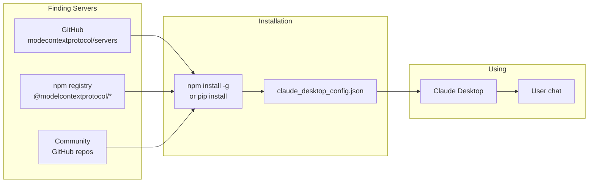

# Theory — The MCP Ecosystem

## The Story 📖

Think about when Apple launched the App Store in 2008. Before the App Store, getting software onto your iPhone was genuinely hard — you needed to know how to develop for iOS, get through Apple's developer program, and distribute your app through unofficial channels. The result: very few apps, very few users benefiting from them.

After the App Store, everything changed. A standardized platform meant developers could build once and distribute to millions. Users could find and install apps with one tap. The ecosystem exploded — games, productivity tools, utilities, niche apps for every imaginable purpose. The platform's value multiplied with every new app added.

MCP is going through the same transition right now. Before MCP, connecting Claude to your company's tools meant custom code, custom maintenance, and custom headaches. After MCP, the ecosystem is growing: official servers from Anthropic, servers from major software vendors, a growing community of open-source contributors. You can often find a pre-built server for what you need — and if you cannot, you can build one that others can use too.

👉 This is the **MCP Ecosystem** — a growing collection of ready-to-use MCP servers, an emerging standard for how AI accesses the world, and an opportunity to contribute tools that benefit everyone using AI.

---

## What Is the MCP Ecosystem? 🤔

The **MCP Ecosystem** is the collection of:

1. **Official MCP servers** — Built and maintained by Anthropic, covering common services (filesystem, GitHub, Slack, databases, web browser, etc.)
2. **Community MCP servers** — Built by developers and companies, covering specialized tools (specific APIs, databases, productivity tools)
3. **MCP client implementations** — Hosts that support MCP (Claude Desktop, VS Code, Cursor, custom apps)
4. **MCP registries and discovery** — Places where you can find servers (GitHub repos, npm packages, the MCP Hub)
5. **SDKs and tools** — The official Python, TypeScript, Go, and Rust SDKs; the MCP Inspector for development

**Why it matters:**
- You do not need to build everything from scratch — leverage existing servers
- Servers you build can be used by the whole community
- The ecosystem creates a virtuous cycle: more servers → more capable AI → more demand → more servers

**The current state (2024-2025):**
- Anthropic maintains official servers for ~15 common services
- Hundreds of community servers on GitHub
- Integration in Claude Desktop, VS Code, Cursor, and more
- Official SDKs for Python, TypeScript, Go, Rust, Java

---

## How It Works — Step by Step 🔧

Here is how you find and use existing MCP servers:

1. **Find a server** — Browse the Anthropic GitHub org (`github.com/modelcontextprotocol/servers`), search npm/PyPI for `mcp-server-*`, or check community hubs
2. **Install the server** — Most servers are installed via `npm install -g @modelcontextprotocol/server-NAME` or `pip install mcp-server-NAME`
3. **Configure in Claude Desktop** — Add the server to `claude_desktop_config.json` with any required env vars (API keys)
4. **Restart Claude Desktop** — The new server is loaded on restart
5. **Use it** — Ask Claude to use the capabilities the server provides

---

## Real-World Examples 🌍

- **Filesystem server**: The most commonly used official server. Lets Claude read and write files on your machine. Install via npm, configure a directory, and Claude can organize, summarize, and edit your files directly.
- **GitHub server**: Official server that wraps the GitHub API. Claude can browse repos, create branches, review PRs, and post comments — all from a conversation.
- **PostgreSQL server**: Lets Claude query your database in natural language. Claude can explore the schema and run queries to answer questions about your data.
- **Slack server**: Claude can read messages from Slack channels and post responses. Useful for building AI-powered Slack bots that can answer questions from company knowledge.
- **Brave Search server**: Gives Claude access to real-time web search via Brave's API. Lets Claude answer questions about current events and recent information.
- **Puppeteer server**: Lets Claude control a headless browser — take screenshots, fill forms, navigate websites. Useful for UI testing and web automation.

---

## Common Mistakes to Avoid ⚠️

**Mistake 1: Building before searching**
Before writing a new MCP server from scratch, spend 10 minutes searching GitHub and npm. Many common integrations (GitHub, Slack, databases, web search) already have polished, maintained servers. Use them.

**Mistake 2: Connecting to community servers without reviewing them**
Not all community servers are safe or maintained. Before connecting a community server to Claude, review its source code. Check: what does it do? What permissions does it need? Is the code maintained? Is it from a known author?

**Mistake 3: Using outdated servers**
MCP is a fast-moving ecosystem. A server built for an older MCP spec version might not work correctly with current Claude Desktop. Check the server's GitHub repo for recent commits and compatibility notes.

**Mistake 4: Not contributing back**
If you build a useful MCP server, consider open-sourcing it. The ecosystem grows through contribution. If your company's internal server wraps a widely-used public API, making it open source helps the whole community and gets you valuable feedback and improvements.

---

## Connection to Other Concepts 🔗

- **[MCP Fundamentals](../01_MCP_Fundamentals/Theory.md)** — What MCP is and why the ecosystem matters
- **[Integration Guide](./Integration_Guide.md)** — How to add servers to Claude Desktop, VS Code, and custom apps
- **[Known Servers](./Known_Servers.md)** — A directory of well-known servers with install instructions
- **[Building an MCP Server](../06_Building_an_MCP_Server/Theory.md)** — How to contribute your own server
- **[Security and Permissions](../07_Security_and_Permissions/Theory.md)** — How to evaluate community servers safely

---

✅ **What you just learned:** The MCP ecosystem is a growing collection of official and community-built servers that you can plug into Claude and other AI hosts. Anthropic maintains official servers for common services. A growing community maintains servers for specialized needs. Finding and using existing servers saves significant development time.

🔨 **Build this now:** Go to `github.com/modelcontextprotocol/servers` and browse the official server list. Pick one that interests you (GitHub, filesystem, or a database), install it following the README, and connect it to Claude Desktop. Spend 10 minutes chatting with Claude using that server's capabilities.

➡️ **Next step:** [Connect MCP to Agents](../09_Connect_MCP_to_Agents/Theory.md) — Learn how MCP servers supercharge AI agents.

---

## 📂 Navigation

**In this folder:**
| File | |
|---|---|
| 📄 **Theory.md** | ← you are here |
| [📄 Cheatsheet.md](./Cheatsheet.md) | Quick reference |
| [📄 Interview_QA.md](./Interview_QA.md) | Interview prep |
| [📄 Integration_Guide.md](./Integration_Guide.md) | Integration guide |
| [📄 Known_Servers.md](./Known_Servers.md) | Known MCP servers directory |

⬅️ **Prev:** [07 Security and Permissions](../07_Security_and_Permissions/Theory.md) &nbsp;&nbsp;&nbsp; ➡️ **Next:** [09 Connect MCP to Agents](../09_Connect_MCP_to_Agents/Theory.md)