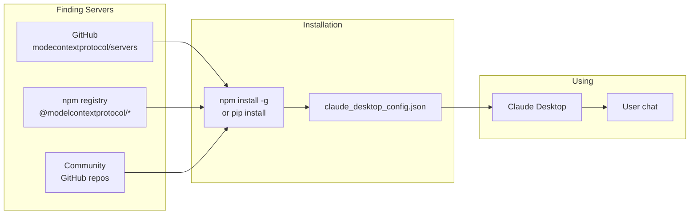

# Theory — The MCP Ecosystem

## The Story 📖

When Apple launched the App Store in 2008, getting software onto your iPhone was genuinely hard. After the App Store, a standardized platform meant developers could build once and distribute to millions. Users could install apps with one tap. The ecosystem exploded — because the platform's value multiplied with every new app added.

MCP is going through the same transition. Before MCP, connecting Claude to company tools meant custom code, custom maintenance, and custom headaches. After MCP, the ecosystem is growing: official servers from Anthropic, servers from major software vendors, a growing community of open-source contributors.

👉 This is the **MCP Ecosystem** — a growing collection of ready-to-use MCP servers and an opportunity to contribute tools that benefit everyone using AI.

---

## 📌 Learning Priority

**Must Learn** — core concepts, needed to understand the rest of this file:
[What Is the MCP Ecosystem?](#what-is-the-mcp-ecosystem-) · [How It Works](#how-it-works----step-by-step-)

**Should Learn** — important for real projects and interviews:
[Common Mistakes](#common-mistakes-to-avoid-) · [Real-World Examples](#real-world-examples-)

**Good to Know** — useful in specific situations, not needed daily:
[Connection to Other Concepts](#connection-to-other-concepts-)

---

## What Is the MCP Ecosystem? 🤔

The **MCP Ecosystem** is the collection of:

1. **Official MCP servers** — Built and maintained by Anthropic, covering common services (filesystem, GitHub, Slack, databases, web browser, etc.)
2. **Community MCP servers** — Built by developers and companies for specialized tools (specific APIs, databases, productivity tools)
3. **MCP client implementations** — Hosts that support MCP (Claude Desktop, VS Code, Cursor, custom apps)
4. **MCP registries and discovery** — Places to find servers (GitHub repos, npm packages, the MCP Hub)
5. **SDKs and tools** — Official Python, TypeScript, Go, and Rust SDKs; the MCP Inspector for development

**The current state (2024-2025):**
- Anthropic maintains official servers for ~15 common services
- Hundreds of community servers on GitHub
- Integration in Claude Desktop, VS Code, Cursor, and more
- Official SDKs for Python, TypeScript, Go, Rust, Java

---

## How It Works — Step by Step 🔧

1. **Find a server** — Browse `github.com/modelcontextprotocol/servers`, search npm/PyPI for `mcp-server-*`
2. **Install the server** — `npm install -g @modelcontextprotocol/server-NAME` or `pip install mcp-server-NAME`
3. **Configure in Claude Desktop** — Add to `claude_desktop_config.json` with required env vars (API keys)
4. **Restart Claude Desktop** — New server is loaded on restart
5. **Use it** — Ask Claude to use the capabilities the server provides

---

## Real-World Examples 🌍

- **Filesystem server**: Lets Claude read and write files on your machine. Install via npm, configure a directory, and Claude can organize, summarize, and edit your files directly.
- **GitHub server**: Claude can browse repos, create branches, review PRs, and post comments — all from a conversation.
- **PostgreSQL server**: Claude can query your database in natural language, exploring the schema and running queries.
- **Slack server**: Claude can read messages from Slack channels and post responses.
- **Brave Search server**: Gives Claude real-time web search via Brave's API.
- **Puppeteer server**: Lets Claude control a headless browser — take screenshots, fill forms, navigate websites.

---

## Common Mistakes to Avoid ⚠️

**Mistake 1: Building before searching**
Before writing a new MCP server from scratch, spend 10 minutes searching GitHub and npm. Many common integrations already have polished, maintained servers.

**Mistake 2: Connecting to community servers without reviewing them**
Not all community servers are safe or maintained. Review source code before connecting. Check: what does it do? What permissions does it need? Is it maintained? Is it from a known author?

**Mistake 3: Using outdated servers**
MCP is a fast-moving ecosystem. Check the server's GitHub repo for recent commits and compatibility notes.

**Mistake 4: Not contributing back**
If you build a useful MCP server, consider open-sourcing it. If your internal server wraps a widely-used public API, making it open source helps the whole community.

---

## Connection to Other Concepts 🔗

- **[MCP Fundamentals](../01_MCP_Fundamentals/Theory.md)** — What MCP is and why the ecosystem matters
- **[Integration Guide](./Integration_Guide.md)** — How to add servers to Claude Desktop, VS Code, and custom apps
- **[Known Servers](./Known_Servers.md)** — A directory of well-known servers with install instructions
- **[Building an MCP Server](../06_Building_an_MCP_Server/Theory.md)** — How to contribute your own server
- **[Security and Permissions](../07_Security_and_Permissions/Theory.md)** — How to evaluate community servers safely

---

✅ **What you just learned:** The MCP ecosystem is a growing collection of official and community-built servers you can plug into Claude and other AI hosts. Anthropic maintains official servers for common services. Finding and using existing servers saves significant development time.

🔨 **Build this now:** Go to `github.com/modelcontextprotocol/servers` and browse the official server list. Pick one that interests you (GitHub, filesystem, or a database), install it following the README, and connect it to Claude Desktop. Spend 10 minutes chatting with Claude using that server's capabilities.

➡️ **Next step:** [Connect MCP to Agents](../09_Connect_MCP_to_Agents/Theory.md) — Learn how MCP servers supercharge AI agents.

---

## 📂 Navigation

**In this folder:**
| File | |
|---|---|
| 📄 **Theory.md** | ← you are here |
| [📄 Cheatsheet.md](./Cheatsheet.md) | Quick reference |
| [📄 Interview_QA.md](./Interview_QA.md) | Interview prep |
| [📄 Integration_Guide.md](./Integration_Guide.md) | Integration guide |
| [📄 Known_Servers.md](./Known_Servers.md) | Known MCP servers directory |

⬅️ **Prev:** [07 Security and Permissions](../07_Security_and_Permissions/Theory.md) &nbsp;&nbsp;&nbsp; ➡️ **Next:** [09 Connect MCP to Agents](../09_Connect_MCP_to_Agents/Theory.md)
