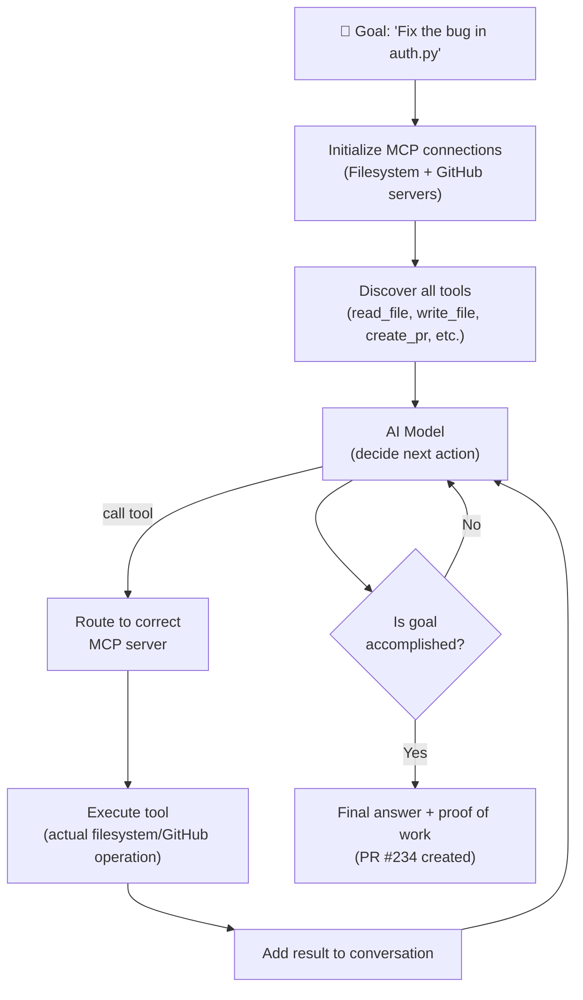

# Theory — Connecting MCP to Agents

## The Story 📖

Think about an employee's first day at a new company. They are smart, capable, and motivated — but they cannot do anything meaningful yet. They do not have a laptop. They cannot access the company email. They cannot log into any systems. They cannot look up customer records. Without access to the company's tools, their intelligence and motivation are useless.

On day two, IT gives them access: a laptop, company email, the CRM system, the code repository, the project management tool, the shared drive. Suddenly the same person becomes dramatically more effective. They can now actually DO things — look up a customer, update a ticket, push code, schedule a meeting. The tools turned their capability into actual output.

Before MCP, an AI agent had the intelligence but not the tools. It could reason brilliantly about what needed to be done, but it could not actually do any of it. It could suggest "you should query the database for this customer" but it could not actually query the database. With MCP, you hand the AI agent its tools — and it becomes capable of taking real actions in the real world, not just describing what actions should be taken.

👉 This is **connecting MCP to Agents** — giving AI agents the tools they need to go from brilliant-but-useless to capable-and-productive. MCP is how AI agents get their day-two access.

---

## What Is an MCP-Powered Agent? 🤔

An **agent** is an AI that takes sequences of actions to accomplish longer-horizon tasks — not just answering a single question, but doing a series of things to complete a goal.

An **MCP-powered agent** is an agent that uses MCP servers as its tool infrastructure. Instead of hardcoded functions, the agent's tools come from MCP servers — which means:

- The tools are portable (same server works with any agent framework)
- The tools are modular (add new capabilities by adding new servers)
- The tools are maintainable (fix a tool in one place, all agents benefit)

**The agent loop with MCP:**

1. Agent receives a goal ("Find all bugs in PR #234 and create issues for them")
2. Agent has access to multiple MCP servers (GitHub, code analysis, issue tracker)
3. Agent reasons: what tools do I have? What sequence of actions gets me to the goal?
4. Agent calls `list_pull_request_files` → reviews the diff
5. Agent calls `analyze_code` → finds potential issues
6. Agent calls `create_issue` for each bug found → creates real GitHub issues
7. Agent reports back: "I found 3 bugs and created issues #501, #502, #503"

The key difference from regular AI chat: the agent **does** the work, not just describes it.

**Multi-server agents:**
A powerful pattern is connecting one agent to multiple MCP servers simultaneously. The agent gets tools from all servers at once:

```
Agent
├── Filesystem Server → read/write files
├── GitHub Server    → create branches, PRs, issues
├── Database Server  → query customer data
└── Email Server     → send notifications
```

The agent can now write code to a file, commit it via GitHub, look up a customer in the database, and email them — all as part of one autonomous workflow.

---

## How It Works — Step by Step 🔧

Here is the architecture of an MCP-powered agent:

1. **Initialize connections** — The agent host starts all configured MCP servers and initializes client connections
2. **Discover tools** — Query each server's tool list; aggregate into one combined tool list
3. **Format for AI** — Convert MCP tool definitions to the AI model's function calling format
4. **Start agent loop** — Send user's goal to the AI model with all available tools
5. **Model reasons** — Model decides which tool to call and what arguments to pass
6. **Route tool call** — Host finds which MCP server owns the requested tool; sends the call
7. **Execute** — Server executes the tool and returns the result
8. **Continue loop** — Result is added to the conversation; model decides next action
9. **Repeat until done** — Loop continues until the model says it is done (stop_reason = "end_turn")



---

## Real-World Examples 🌍

- **Code review agent**: Connects to GitHub + code analysis MCP servers. Given a PR number, it reads each changed file, analyzes the code, and posts a structured review as a PR comment — all automatically.
- **Data pipeline agent**: Connects to a database server + email server. Every morning, it queries yesterday's sales data, generates a summary, and emails it to the team. No human needed.
- **DevOps agent**: Connects to Kubernetes + GitHub + Slack servers. When an alert fires, it reads logs, determines the issue, rolls back the deployment if needed, and posts a summary to Slack.
- **Research agent**: Connects to a web search server + filesystem server. Given a research question, it searches the web, reads relevant pages, synthesizes findings, and saves a summary report to a file.
- **Customer support agent**: Connects to a CRM server + email server + knowledge base server. When a customer emails, the agent looks up their account, finds relevant documentation, and drafts a personalized response.

---

## Common Mistakes to Avoid ⚠️

**Mistake 1: No confirmation for irreversible actions**
An autonomous agent that deletes files, sends emails, or charges customers without any human checkpoint is dangerous. Build confirmation steps for any action that cannot be undone.

**Mistake 2: Not handling tool call failures**
External services fail. Files are not found. APIs rate-limit you. An agent that crashes when a single tool call fails is fragile. Implement error handling and recovery strategies: retry once, try an alternative tool, or report the failure and ask for guidance.

**Mistake 3: Giving the agent too many tools**
More is not always better. An agent with 50 tools from 10 servers is more likely to pick the wrong one, make mistakes, and act unpredictably than one with 10 focused, well-described tools from 2-3 servers. Start small, add tools as genuinely needed.

**Mistake 4: Infinite loops in the agent loop**
Without a maximum step count or a clear stopping condition, an agent can spiral — calling tools repeatedly without making progress. Always set a maximum number of tool calls per session and implement detection for "not making progress" scenarios.

---

## Connection to Other Concepts 🔗

- **[MCP Fundamentals](../01_MCP_Fundamentals/Theory.md)** — The protocol that powers agent tools
- **[Tools, Resources, Prompts](../04_Tools_Resources_Prompts/Theory.md)** — What agents actually use
- **[Security and Permissions](../07_Security_and_Permissions/Theory.md)** — Agents amplify security risks — plan for them
- **[Code Example](./Code_Example.md)** — Full working agent with MCP tools in Python
- **[MCP Ecosystem](../08_MCP_Ecosystem/Theory.md)** — Ready-to-use servers for your agents

---

✅ **What you just learned:** MCP powers AI agents by giving them access to real-world tools through a standardized protocol. An agent uses the MCP client-server architecture to discover and call tools from multiple servers simultaneously. The agent loop runs until the goal is accomplished — calling tools, using results, and deciding next steps autonomously.

🔨 **Build this now:** Take the weather server from section 06. Connect it to the Anthropic Python SDK using the Code_Example.md pattern. Make the agent answer "What should I wear today in Tokyo based on the weather?" — it should call the weather tool automatically.

➡️ **Next step:** [Production AI](../../12_Production_AI/01_Model_Serving/Theory.md) — Learn how to deploy AI systems reliably at scale.

---

## 📂 Navigation

**In this folder:**
| File | |
|---|---|
| 📄 **Theory.md** | ← you are here |
| [📄 Cheatsheet.md](./Cheatsheet.md) | Quick reference |
| [📄 Interview_QA.md](./Interview_QA.md) | Interview prep |
| [📄 Code_Example.md](./Code_Example.md) | Python code examples |

⬅️ **Prev:** [08 MCP Ecosystem](../08_MCP_Ecosystem/Theory.md) &nbsp;&nbsp;&nbsp; ➡️ **Next:** [01 Model Serving](../../12_Production_AI/01_Model_Serving/Theory.md)