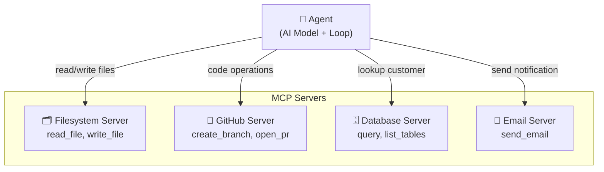
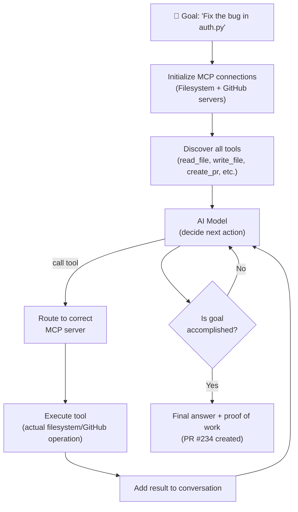

# Theory — Connecting MCP to Agents

## The Story 📖

An employee's first day at a new company: they're smart, capable, motivated — but they can't do anything meaningful yet. No laptop, no email access, no system logins. Without tools, their intelligence is useless.

Day two, IT gives them access: laptop, email, CRM, code repository, project management tool. Suddenly the same person becomes dramatically more effective — they can look up a customer, update a ticket, push code, schedule a meeting.

Before MCP, an AI agent had the intelligence but not the tools. It could reason brilliantly about what needed to be done, but it couldn't actually do any of it. With MCP, you hand the AI agent its tools — and it becomes capable of real actions in the real world.

👉 This is **connecting MCP to Agents** — giving AI agents the tools they need to go from brilliant-but-useless to capable-and-productive.

---

## 📌 Learning Priority

**Must Learn** — core concepts, needed to understand the rest of this file:
[What Is an MCP-Powered Agent?](#what-is-an-mcp-powered-agent-) · [How It Works](#how-it-works----step-by-step-)

**Should Learn** — important for real projects and interviews:
[Common Mistakes](#common-mistakes-to-avoid-) · [Real-World Examples](#real-world-examples-)

**Good to Know** — useful in specific situations, not needed daily:
[Multi-Server Agent Pattern](#what-is-an-mcp-powered-agent-)

**Reference** — skim once, look up when needed:
[Connection to Other Concepts](#connection-to-other-concepts-)

---

## What Is an MCP-Powered Agent? 🤔

An **agent** takes sequences of actions to accomplish longer-horizon tasks — not just answering a single question, but doing a series of things to complete a goal.

An **MCP-powered agent** uses MCP servers as its tool infrastructure. Instead of hardcoded functions, tools come from MCP servers — which means:
- Tools are portable (same server works with any agent framework)
- Tools are modular (add new capabilities by adding new servers)
- Tools are maintainable (fix a tool in one place, all agents benefit)

**The agent loop with MCP:**
1. Agent receives a goal ("Find all bugs in PR #234 and create issues for them")
2. Agent has access to multiple MCP servers (GitHub, code analysis, issue tracker)
3. Agent reasons: what tools do I have? What sequence of actions gets me to the goal?
4. Agent calls `list_pull_request_files` → reviews the diff
5. Agent calls `analyze_code` → finds potential issues
6. Agent calls `create_issue` for each bug → creates real GitHub issues
7. Agent reports: "I found 3 bugs and created issues #501, #502, #503"

**Multi-server agents — a powerful pattern:**

```
Agent
├── Filesystem Server → read/write files
├── GitHub Server    → create branches, PRs, issues
├── Database Server  → query customer data
└── Email Server     → send notifications
```



---

## How It Works — Step by Step 🔧



1. **Initialize connections** — start all configured MCP servers, initialize client connections
2. **Discover tools** — query each server's tool list; aggregate into one combined tool list
3. **Format for AI** — convert MCP tool definitions to the AI model's function calling format
4. **Start agent loop** — send user's goal to AI model with all available tools
5. **Model reasons** — decides which tool to call and what arguments to pass
6. **Route tool call** — find which MCP server owns the requested tool; send the call
7. **Execute** — server executes and returns result
8. **Continue loop** — result added to conversation; model decides next action
9. **Repeat until done** — loop continues until `stop_reason = "end_turn"`

---

## Real-World Examples 🌍

- **Code review agent**: Connects to GitHub + code analysis servers. Given a PR number, reads each changed file, analyzes code, and posts a structured review as a PR comment — automatically.
- **Data pipeline agent**: Connects to database + email servers. Every morning, queries yesterday's sales data, generates a summary, and emails it to the team.
- **DevOps agent**: Connects to Kubernetes + GitHub + Slack. When an alert fires, reads logs, determines the issue, rolls back the deployment if needed, and posts a summary to Slack.
- **Research agent**: Connects to web search + filesystem servers. Searches the web, reads relevant pages, synthesizes findings, and saves a summary report to a file.

---

## Common Mistakes to Avoid ⚠️

**Mistake 1: No confirmation for irreversible actions**
An autonomous agent that deletes files, sends emails, or charges customers without any human checkpoint is dangerous. Build confirmation steps for any action that cannot be undone.

**Mistake 2: Not handling tool call failures**
External services fail. Files are not found. APIs rate-limit you. Implement error handling: retry once, try an alternative tool, or report the failure and ask for guidance.

**Mistake 3: Giving the agent too many tools**
An agent with 50 tools from 10 servers is more likely to pick the wrong one than one with 10 focused, well-described tools from 2–3 servers. Start small, add tools as genuinely needed.

**Mistake 4: Infinite loops in the agent loop**
Always set a maximum number of tool calls per session and implement detection for "not making progress" scenarios.

---

## Connection to Other Concepts 🔗

- **[MCP Fundamentals](../01_MCP_Fundamentals/Theory.md)** — The protocol that powers agent tools
- **[Tools, Resources, Prompts](../04_Tools_Resources_Prompts/Theory.md)** — What agents actually use
- **[Security and Permissions](../07_Security_and_Permissions/Theory.md)** — Agents amplify security risks — plan for them
- **[Code Example](./Code_Example.md)** — Full working agent with MCP tools in Python
- **[MCP Ecosystem](../08_MCP_Ecosystem/Theory.md)** — Ready-to-use servers for your agents

---

✅ **What you just learned:** MCP powers AI agents by giving them access to real-world tools through a standardized protocol. An agent uses the MCP client-server architecture to discover and call tools from multiple servers simultaneously. The agent loop runs until the goal is accomplished — calling tools, using results, and deciding next steps autonomously.

🔨 **Build this now:** Take the weather server from section 06. Connect it to the Anthropic Python SDK using the Code_Example.md pattern. Make the agent answer "What should I wear today in Tokyo based on the weather?" — it should call the weather tool automatically.

➡️ **Next step:** [Production AI](../../12_Production_AI/01_Model_Serving/Theory.md) — Learn how to deploy AI systems reliably at scale.

---

## 📂 Navigation

**In this folder:**
| File | |
|---|---|
| 📄 **Theory.md** | ← you are here |
| [📄 Cheatsheet.md](./Cheatsheet.md) | Quick reference |
| [📄 Interview_QA.md](./Interview_QA.md) | Interview prep |
| [📄 Code_Example.md](./Code_Example.md) | Python code examples |

⬅️ **Prev:** [08 MCP Ecosystem](../08_MCP_Ecosystem/Theory.md) &nbsp;&nbsp;&nbsp; ➡️ **Next:** [01 Model Serving](../../12_Production_AI/01_Model_Serving/Theory.md)
