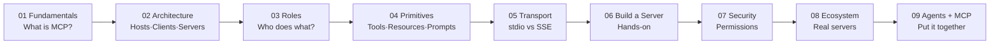

# 11 MCP — Model Context Protocol

MCP (Model Context Protocol) is an open standard by Anthropic that lets AI assistants connect to external tools, data sources, and services in a standardized way.

Think of it as **USB for AI** — before USB, every device had a different connector. After USB, one standard worked everywhere. MCP does the same for AI tools.

---

## Topics in This Section

| # | Topic | What you learn |
|---|---|---|
| 01 | [MCP Fundamentals](./01_MCP_Fundamentals/Theory.md) | What MCP is, why it exists, the three primitives (Tools, Resources, Prompts) |
| 02 | [MCP Architecture](./02_MCP_Architecture/Theory.md) | Hosts, Clients, and Servers — how the three roles work together |
| 03 | [Hosts Clients Servers](./03_Hosts_Clients_Servers/Theory.md) | Deep dive into each role's responsibilities |
| 04 | [Tools Resources Prompts](./04_Tools_Resources_Prompts/Theory.md) | The three MCP primitives — what each does and when to use each |
| 05 | [Transport Layer](./05_Transport_Layer/Theory.md) | stdio vs SSE — how messages travel between client and server |
| 06 | [Building an MCP Server](./06_Building_an_MCP_Server/Theory.md) | Step-by-step guide to building your own MCP server in Python |
| 07 | [Security and Permissions](./07_Security_and_Permissions/Theory.md) | Security model, credential handling, dangerous tool design |
| 08 | [MCP Ecosystem](./08_MCP_Ecosystem/Theory.md) | Official servers, community servers, Claude Desktop integration |
| 09 | [Connect MCP to Agents](./09_Connect_MCP_to_Agents/Theory.md) | Using MCP servers inside an AI agent loop |

---

## Learning Path

---

## What You'll Be Able to Do After This Section

- Explain what MCP is and why it exists (in a job interview)
- Connect Claude Desktop to any MCP server
- Build your own MCP server that exposes tools to any MCP client
- Wire MCP tools into an AI agent loop
- Understand the security model and design safe servers

---

## 📂 Navigation

**In this folder:**
| File | |
|---|---|
| 📄 **Readme.md** | ← you are here |

⬅️ **Prev:** [09 Build an Agent](../10_AI_Agents/09_Build_an_Agent/Project_Guide.md) &nbsp;&nbsp;&nbsp; ➡️ **Next:** [01 MCP Fundamentals](./01_MCP_Fundamentals/Theory.md)