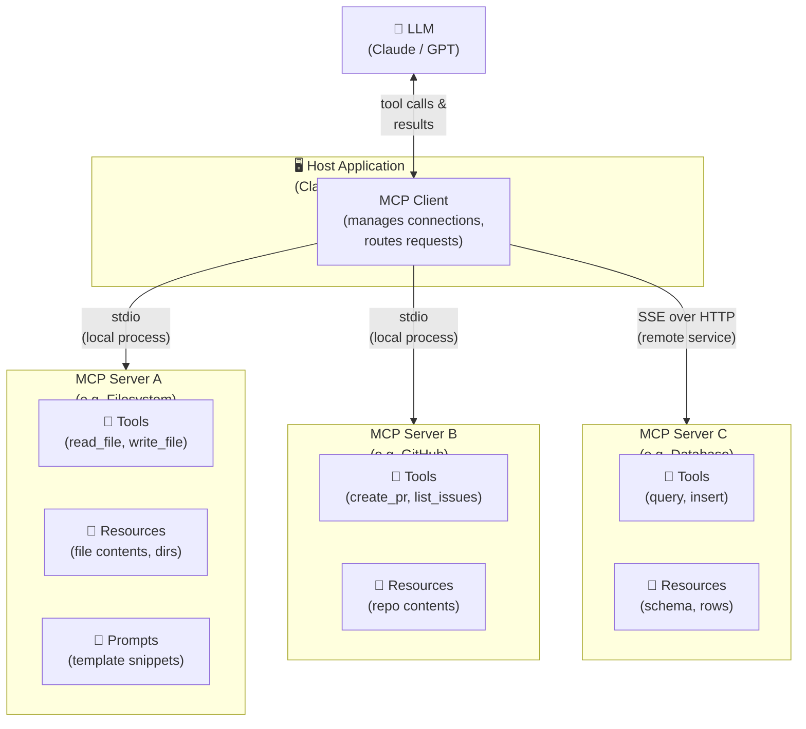

# 🔌 11 — MCP: Model Context Protocol

⬅️ [10 AI Agents](../10_AI_Agents/Readme.md) &nbsp;|&nbsp; [🏠 Home](../00_Learning_Guide/Readme.md) &nbsp;|&nbsp; [12 Production AI ➡️](../12_Production_AI/Readme.md)

> USB standardized hardware connections. MCP does the same for AI — one protocol, every tool, any model.

**[▶ Start here → MCP Fundamentals Theory](./01_MCP_Fundamentals/Theory.md)**

---

## At a Glance

| | |
|---|---|
| 📚 Topics | 9 topics |
| ⏱️ Est. Time | 4–5 hours |
| 📋 Prerequisites | [10 AI Agents](../10_AI_Agents/Readme.md) |
| 🔓 Unlocks | [12 Production AI](../12_Production_AI/Readme.md) |

---

## What's in This Section

---

## Topics

| # | Topic | What You'll Learn | Files |
|---|---|---|---|
| 01 | [MCP Fundamentals](./01_MCP_Fundamentals/) | What MCP is, why it exists, and the three primitives that underpin everything | [📖 Theory](./01_MCP_Fundamentals/Theory.md) · [⚡ Cheatsheet](./01_MCP_Fundamentals/Cheatsheet.md) · [🎯 Interview Q&A](./01_MCP_Fundamentals/Interview_QA.md) · [⚖️ MCP vs REST](./01_MCP_Fundamentals/MCP_vs_REST_API.md) |
| 02 | [MCP Architecture](./02_MCP_Architecture/) | How Hosts, Clients, and Servers fit together — the full system picture | [📖 Theory](./02_MCP_Architecture/Theory.md) · [⚡ Cheatsheet](./02_MCP_Architecture/Cheatsheet.md) · [🎯 Interview Q&A](./02_MCP_Architecture/Interview_QA.md) · [🏗️ Deep Dive](./02_MCP_Architecture/Architecture_Deep_Dive.md) · [🔍 Components](./02_MCP_Architecture/Component_Breakdown.md) |
| 03 | [Hosts, Clients & Servers](./03_Hosts_Clients_Servers/) | The three roles in depth — what each one owns and who is responsible for what | [📖 Theory](./03_Hosts_Clients_Servers/Theory.md) · [⚡ Cheatsheet](./03_Hosts_Clients_Servers/Cheatsheet.md) · [🎯 Interview Q&A](./03_Hosts_Clients_Servers/Interview_QA.md) |
| 04 | [Tools, Resources & Prompts](./04_Tools_Resources_Prompts/) | The three MCP primitives — when to use each and how to design them well | [📖 Theory](./04_Tools_Resources_Prompts/Theory.md) · [⚡ Cheatsheet](./04_Tools_Resources_Prompts/Cheatsheet.md) · [🎯 Interview Q&A](./04_Tools_Resources_Prompts/Interview_QA.md) · [💻 Code](./04_Tools_Resources_Prompts/Code_Example.md) |
| 05 | [Transport Layer](./05_Transport_Layer/) | stdio vs SSE — how messages physically travel between client and server | [📖 Theory](./05_Transport_Layer/Theory.md) · [⚡ Cheatsheet](./05_Transport_Layer/Cheatsheet.md) · [🎯 Interview Q&A](./05_Transport_Layer/Interview_QA.md) |
| 06 | [Building an MCP Server](./06_Building_an_MCP_Server/) | Step-by-step: build a real MCP server in Python that exposes tools to any host | [📖 Theory](./06_Building_an_MCP_Server/Theory.md) · [⚡ Cheatsheet](./06_Building_an_MCP_Server/Cheatsheet.md) · [🎯 Interview Q&A](./06_Building_an_MCP_Server/Interview_QA.md) · [💻 Code](./06_Building_an_MCP_Server/Code_Example.md) · [👣 Step by Step](./06_Building_an_MCP_Server/Step_by_Step.md) · [🔧 Implementation](./06_Building_an_MCP_Server/Server_Implementation.md) |
| 07 | [Security & Permissions](./07_Security_and_Permissions/) | The MCP security model — credential handling, scoping, and designing safe servers | [📖 Theory](./07_Security_and_Permissions/Theory.md) · [⚡ Cheatsheet](./07_Security_and_Permissions/Cheatsheet.md) · [🎯 Interview Q&A](./07_Security_and_Permissions/Interview_QA.md) · [✅ Best Practices](./07_Security_and_Permissions/Best_Practices.md) |
| 08 | [MCP Ecosystem](./08_MCP_Ecosystem/) | Official servers, community servers, and how to connect Claude Desktop in practice | [📖 Theory](./08_MCP_Ecosystem/Theory.md) · [⚡ Cheatsheet](./08_MCP_Ecosystem/Cheatsheet.md) · [🎯 Interview Q&A](./08_MCP_Ecosystem/Interview_QA.md) · [🌐 Known Servers](./08_MCP_Ecosystem/Known_Servers.md) · [🔗 Integration Guide](./08_MCP_Ecosystem/Integration_Guide.md) |
| 09 | [Connect MCP to Agents](./09_Connect_MCP_to_Agents/) | Wire MCP servers into an agent loop — your agent gets every tool automatically | [📖 Theory](./09_Connect_MCP_to_Agents/Theory.md) · [⚡ Cheatsheet](./09_Connect_MCP_to_Agents/Cheatsheet.md) · [🎯 Interview Q&A](./09_Connect_MCP_to_Agents/Interview_QA.md) · [💻 Code](./09_Connect_MCP_to_Agents/Code_Example.md) |

---

## Key Concepts at a Glance

| Concept | Why It Matters |
|---|---|
| **MCP separates concerns cleanly** | The Host manages UX, the Client manages the protocol, the Server manages the capability — none bleeds into the others |
| **Three primitives cover everything** | Tools (model calls a function), Resources (model reads data), Prompts (reusable instruction templates) |
| **Transport choice matters** | stdio is for local processes (fast, zero network overhead); SSE over HTTP is for remote or cloud-hosted servers |
| **Security is opt-in by design** | Servers declare what they expose, clients approve what the model may call, hosts enforce user consent |
| **MCP + Agents = superpowers** | An agent with an MCP client can dynamically discover and call any server's tools without hard-coded integrations |

---

## 📂 Navigation

⬅️ **Prev:** [10 AI Agents](../10_AI_Agents/Readme.md) &nbsp;&nbsp; ➡️ **Next:** [12 Production AI](../12_Production_AI/Readme.md)
