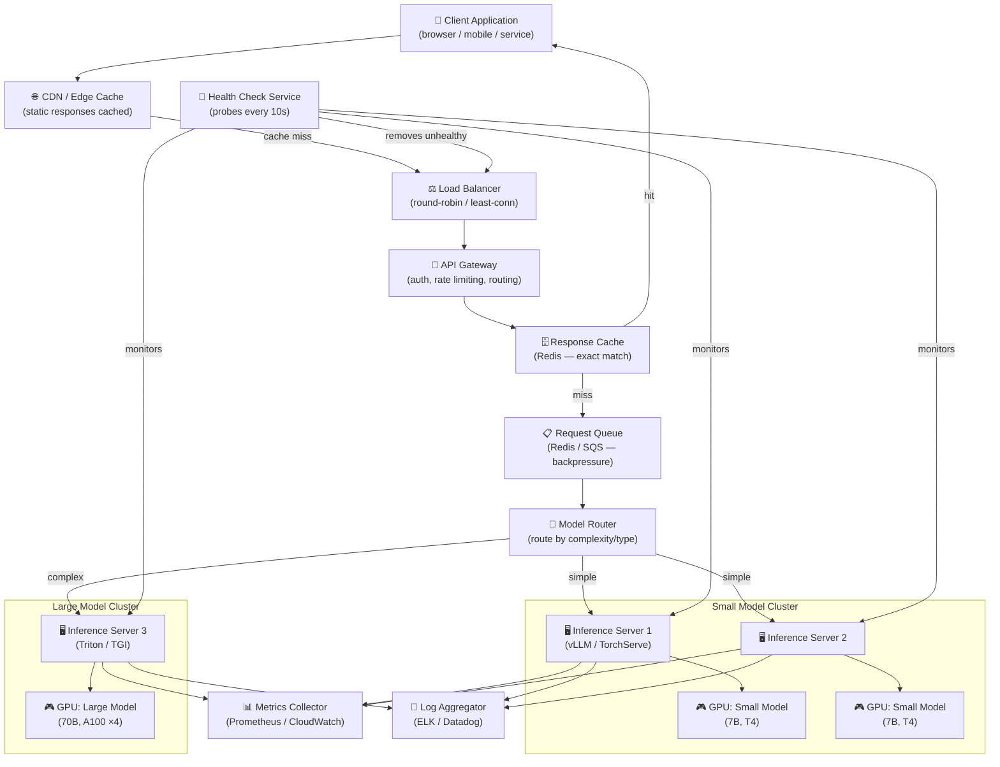

# Architecture Deep Dive — Model Serving

## Full Serving Stack Architecture

This diagram shows a production-grade model serving system from client request to GPU response, including all the critical infrastructure layers.



---

## Component Breakdown

### Load Balancer
- Distributes incoming requests across inference server replicas
- Algorithms: round-robin (default), least-connections (better for variable-length LLM responses), IP hash (sticky sessions)
- Health check integration: removes servers that fail `/health` probes
- Examples: NGINX, HAProxy, AWS ALB, GCP Load Balancer

### API Gateway
- **Authentication**: validates API keys, JWT tokens, OAuth
- **Rate limiting**: prevent individual clients from overwhelming the system (e.g., 100 req/min per key)
- **Request routing**: route `/v1/chat` to LLM cluster, `/v1/embed` to embedding cluster
- **Request/response transformation**: normalize input formats, add headers
- Examples: Kong, AWS API Gateway, Apigee

### Request Queue
- Acts as a **buffer** when traffic spikes exceed serving capacity
- Provides **backpressure** — callers get a "busy" signal instead of timeout
- Enables **async processing** for non-time-critical requests
- Queue depth metric is a key auto-scaling trigger
- Examples: Redis Streams, AWS SQS, RabbitMQ

### Inference Servers

| Server | Best For | Key Feature |
|---|---|---|
| **vLLM** | LLM serving | PagedAttention (efficient KV cache), continuous batching |
| **NVIDIA Triton** | Multi-model, multi-framework | Supports PyTorch, TF, ONNX, TensorRT in one server |
| **TorchServe** | PyTorch models | Native PyTorch integration, model archiver |
| **TGI (Text Generation Inference)** | HuggingFace LLMs | Optimized for HuggingFace ecosystem |
| **FastAPI + custom** | Simple/custom models | Maximum flexibility, minimal overhead |

### Health Checks
Two types of probes:
- **Liveness probe**: Is the server process running? If it fails, restart the container.
- **Readiness probe**: Is the server ready to accept traffic? If it fails, remove from load balancer rotation until it recovers (model loaded, warm).

### Metrics Collection
Key metrics to collect at each inference server:
- **Request rate** (requests/second)
- **Latency** (P50, P95, P99 in milliseconds)
- **GPU utilization** (%)
- **GPU memory usage** (GB)
- **Queue depth** (requests waiting)
- **Error rate** (4xx, 5xx per minute)
- **Token throughput** (tokens/second for LLMs)

---

## Deployment Topology Options

### Single-Region (Small Scale)
```
[Load Balancer]
    ├── [Inference Server 1] → [GPU Node]
    ├── [Inference Server 2] → [GPU Node]
    └── [Inference Server 3] → [GPU Node]
```
- Simple, low cost
- Single point of failure for the region
- Suitable up to ~1,000 RPS

### Multi-Region (Production Scale)
```
[Global CDN / Anycast DNS]
    ├── US-East: [LB] → [Cluster of 10 GPUs]
    ├── EU-West: [LB] → [Cluster of 10 GPUs]
    └── AP-Southeast: [LB] → [Cluster of 5 GPUs]
```
- Users routed to nearest region (latency win)
- Compliance: EU data stays in EU region
- Higher cost; requires model replication across regions

---

## Auto-Scaling Configuration

```yaml
# Kubernetes HPA example for inference server
apiVersion: autoscaling/v2
kind: HorizontalPodAutoscaler
metadata:
  name: inference-server-hpa
spec:
  scaleTargetRef:
    apiVersion: apps/v1
    kind: Deployment
    name: inference-server
  minReplicas: 2          # Always keep 2 warm
  maxReplicas: 20         # Cap cost
  metrics:
  - type: External
    external:
      metric:
        name: queue_depth  # Scale based on request queue depth
      target:
        type: AverageValue
        averageValue: "10"  # Scale up when >10 requests waiting per pod
```

---

## Model Versioning Strategy

```
Model Registry
├── model-name/
│   ├── v1/  (stable — 100% traffic)
│   │   ├── weights.safetensors
│   │   ├── config.json
│   │   └── metadata.json  {"accuracy": 0.91, "deployed": "2024-01-01"}
│   ├── v2/  (canary — 5% traffic)
│   │   ├── weights.safetensors
│   │   └── metadata.json  {"accuracy": 0.93, "deployed": "2024-02-01"}
│   └── v3/  (staging — 0% traffic, being tested)
```

Rollback procedure:
1. Detect regression via automated metric alert
2. Flip traffic: v2 → 0%, v1 → 100% (takes ~30 seconds)
3. Investigate v2 failure offline
4. Fix, re-test, redeploy as new v3

---

## FastAPI Minimal Serving Example

```python
from fastapi import FastAPI
from transformers import pipeline
import uvicorn

app = FastAPI()

# Load model ONCE at startup — never in the request handler
classifier = pipeline("text-classification", model="distilbert-base-uncased-finetuned-sst-2-english")

@app.get("/health")
def health():
    return {"status": "ok"}

@app.post("/predict")
def predict(text: str):
    result = classifier(text)[0]
    return {"label": result["label"], "score": round(result["score"], 4)}

if __name__ == "__main__":
    uvicorn.run(app, host="0.0.0.0", port=8000)
```

Test it:
```bash
curl -X POST "http://localhost:8000/predict?text=I+love+this+product"
# {"label": "POSITIVE", "score": 0.9998}
```

---

## 📂 Navigation

**In this folder:**
| File | |
|---|---|
| [📄 Theory.md](./Theory.md) | Core concepts |
| [📄 Cheatsheet.md](./Cheatsheet.md) | Quick reference |
| [📄 Interview_QA.md](./Interview_QA.md) | Interview prep |
| 📄 **Architecture_Deep_Dive.md** | ← you are here |

⬅️ **Prev:** [09 Connect MCP to Agents](../../11_MCP_Model_Context_Protocol/09_Connect_MCP_to_Agents/Theory.md) &nbsp;&nbsp;&nbsp; ➡️ **Next:** [02 Latency Optimization](../02_Latency_Optimization/Theory.md)
