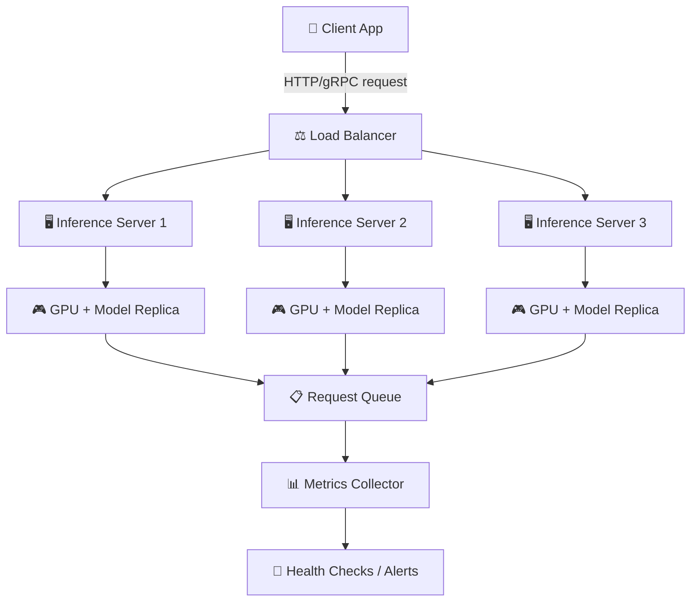

# Theory — Model Serving

## The Story 📖

Imagine you own a bakery. Every night, your team works hard baking loaves of bread — perfecting the recipe, testing different flours, dialing in the oven temperature. By morning, the bread is perfect. But here is the thing: the bread sitting in the back kitchen helps nobody. Customers come to the front counter, ring the bell, and expect to be handed their loaf quickly. They don't care about the oven settings from last night. They just want the bread — now.

The baking is **training** your model. All those hours on GPUs, all those gradient updates, all that hyperparameter tuning — that produced a great "loaf." But the moment you call it done, you have a new problem: how do you get it to customers at scale? How do you handle 1,000 customers arriving at the same time? How do you make sure the counter doesn't collapse under the rush? How do you keep track of what sold and what didn't?

That front-counter operation — the staff, the queue management, the cash register, the opening hours, the backup plan when one baker calls in sick — is **model serving**. Without it, even a world-class model is useless in production. The bakery only survives if the bread reaches people.

👉 This is **Model Serving** — the infrastructure that takes a trained model and makes it available to the real world, reliably, at scale, with measurable performance.

---

## What is Model Serving?

**Model serving** is the process of deploying a trained ML model as a live service that accepts requests, runs inference, and returns predictions. It is the bridge between a notebook experiment and a production product.

Think of it as: **a waiter that wraps your model in an API, manages incoming orders, and makes sure the kitchen (GPU) never gets overwhelmed.**

Key components:
- **The model itself** — the trained weights, loaded into memory
- **An inference server** — software that accepts requests and passes them to the model
- **An API layer** — REST or gRPC endpoint that clients call
- **A scaling layer** — logic that spins up more servers when load increases
- **A monitoring layer** — tracks latency, errors, throughput, and cost

---

## How It Works — Step by Step

1. **Train the model** — offline, on a GPU cluster. Output: saved weights (e.g. `.pt`, `.onnx`, `.safetensors`)
2. **Package the model** — wrap it in a serving framework (TorchServe, Triton, FastAPI)
3. **Containerize** — package everything into a Docker image
4. **Deploy** — push the container to a cloud service (SageMaker, Vertex AI, Kubernetes)
5. **Expose an endpoint** — the inference server listens for HTTP/gRPC requests
6. **Receive a request** — a client sends input data (e.g. a prompt, an image)
7. **Preprocess** — tokenize text, normalize image pixels, validate input
8. **Run inference** — pass the preprocessed data through the model on GPU/CPU
9. **Postprocess** — decode output tokens, format JSON response
10. **Return response** — send the result back to the client

---

## Real-World Examples

1. **ChatGPT**: When you type a message, your browser sends an HTTP POST to OpenAI's serving layer. Multiple inference servers run the GPT-4 weights in parallel. Your specific request hits one of them, and the response streams back token by token.

2. **Image moderation at Instagram**: Every uploaded photo is sent to a model serving endpoint. The model classifies it in under 100ms. If it returns a "potentially harmful" label above a threshold, a human review queue is triggered.

3. **Search ranking at Google**: When you type a query, Google's serving infrastructure runs your query through a transformer-based ranking model. Millions of requests per second are handled through highly optimized Triton inference servers on TPUs.

4. **Medical imaging startup**: A hospital uploads an X-ray image via an API. The serving layer preprocesses the DICOM file, runs it through a ResNet classifier, and returns a JSON payload with probability scores for different diagnoses — all in under 500ms.

5. **Fraud detection at a bank**: Every card transaction triggers a real-time inference call. A gradient boosting model scores the transaction and returns a fraud probability. The serving system must respond in under 50ms or the transaction times out.

---

## Common Mistakes to Avoid ⚠️

**1. Loading the model on every request**
Never load your model weights inside your request handler. Load once at server startup, keep it in memory. Loading a 7B parameter model takes 10-30 seconds — if you do it per-request, you will destroy your latency.

**2. Ignoring batching**
GPUs are parallel processors. Sending one request at a time is like filling a bus with one passenger. If you serve many small requests, batch them together before passing to the GPU. This can give you 5-20x better throughput.

**3. No fallback when the model server crashes**
Production systems need a fallback strategy. If your primary model serving endpoint goes down, route to a backup (simpler model, cached results, or graceful degradation). Never let a model crash bring down your whole application.

**4. Not versioning your models**
If you deploy a new model and it regresses, you need to be able to roll back in minutes. Always tag models with a version, keep the previous version warm, and use blue-green deployments so you can switch traffic instantly.

---

## Connection to Other Concepts 🔗

- **Latency Optimization** → Once you have a serving layer, the next question is how to make it faster. See [02_Latency_Optimization](../02_Latency_Optimization/Theory.md).
- **Observability** → Your serving layer needs to be monitored. Logs, metrics, traces — covered in [05_Observability](../05_Observability/Theory.md).
- **Scaling AI Apps** → When one server is not enough, you need horizontal scaling, load balancing, and auto-scaling — see [09_Scaling_AI_Apps](../09_Scaling_AI_Apps/Theory.md).
- **Evaluation Pipelines** → Before you serve a new model version, you need to evaluate it offline. See [06_Evaluation_Pipelines](../06_Evaluation_Pipelines/Theory.md).
- **Fine-Tuning in Production** → Fine-tuned models need the same serving infrastructure but have different versioning concerns. See [08_Fine_Tuning_in_Production](../08_Fine_Tuning_in_Production/Theory.md).

---

✅ **What you just learned:** Model serving is the infrastructure that takes a trained model and delivers predictions to real users. It involves an inference server, an API layer, preprocessing/postprocessing, and scaling logic. Good serving infrastructure is what separates a research prototype from a production product.

🔨 **Build this now:** Take any scikit-learn or HuggingFace model you have trained, wrap it in a FastAPI endpoint (5 lines of code), containerize it with Docker, and test it with curl. That is a working model serving system.

➡️ **Next step:** [02 Latency Optimization](../02_Latency_Optimization/Theory.md) — now that you can serve, let's make it fast.

---

## 📂 Navigation

**In this folder:**
| File | |
|---|---|
| 📄 **Theory.md** | ← you are here |
| [📄 Cheatsheet.md](./Cheatsheet.md) | Quick reference |
| [📄 Interview_QA.md](./Interview_QA.md) | Interview prep |
| [📄 Architecture_Deep_Dive.md](./Architecture_Deep_Dive.md) | Model serving architectures |

⬅️ **Prev:** [09 Connect MCP to Agents](../../11_MCP_Model_Context_Protocol/09_Connect_MCP_to_Agents/Theory.md) &nbsp;&nbsp;&nbsp; ➡️ **Next:** [02 Latency Optimization](../02_Latency_Optimization/Theory.md)
