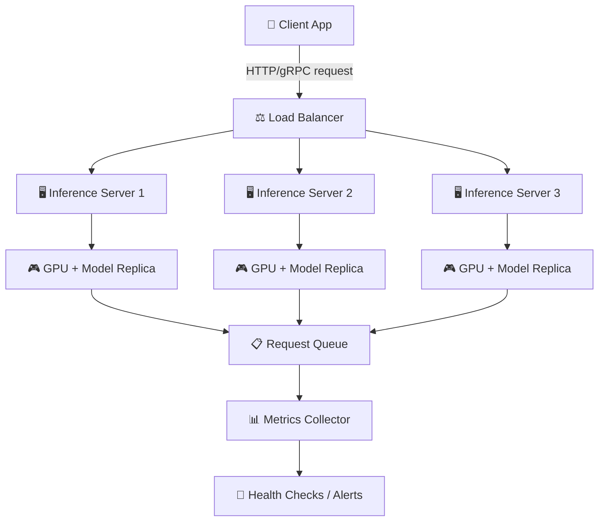

# Theory — Model Serving

## The Story 📖

You own a bakery. Every night your team perfects the recipe — but bread sitting in the back kitchen helps nobody. Customers come to the front counter and expect their loaf now. The baking is **training**. Getting bread to customers at scale — managing the queue, the counter staff, the cash register, the backup plan — is **model serving**.

👉 This is **Model Serving** — the infrastructure that takes a trained model and makes it available to the real world, reliably, at scale, with measurable performance.

---

## 📌 Learning Priority

**Must Learn** — core concepts, needed to understand the rest of this file:
[What is Model Serving?](#what-is-model-serving) · [How It Works](#how-it-works--step-by-step)

**Should Learn** — important for real projects and interviews:
[Real-World Examples](#real-world-examples) · [Common Mistakes](#common-mistakes-to-avoid-)

**Good to Know** — useful in specific situations, not needed daily:
[Connection to Other Concepts](#connection-to-other-concepts-)

**Reference** — skim once, look up when needed:
[Practice Questions](#-practice-questions)

---

## What is Model Serving?

**Model serving** is the process of deploying a trained ML model as a live service that accepts requests, runs inference, and returns predictions — the bridge between a notebook experiment and a production product.

Key components:
- **The model itself** — trained weights loaded into memory
- **An inference server** — accepts requests and passes them to the model
- **An API layer** — REST or gRPC endpoint clients call
- **A scaling layer** — spins up more servers when load increases
- **A monitoring layer** — tracks latency, errors, throughput, and cost

---

## How It Works — Step by Step

1. **Train** — save weights (`.pt`, `.onnx`, `.safetensors`)
2. **Package** — wrap in a serving framework (TorchServe, Triton, FastAPI)
3. **Containerize** — Docker image
4. **Deploy** — push to cloud service (SageMaker, Vertex AI, Kubernetes)
5. **Expose endpoint** — inference server listens for HTTP/gRPC
6. **Receive request** — client sends input (prompt, image)
7. **Preprocess** — tokenize, normalize, validate
8. **Run inference** — pass data through model on GPU/CPU
9. **Postprocess** — decode tokens, format JSON
10. **Return response**

---

## Real-World Examples

1. **ChatGPT**: HTTP POST hits OpenAI's serving layer; multiple inference servers run GPT-4 weights in parallel; response streams back token by token.
2. **Image moderation at Instagram**: Every uploaded photo hits a serving endpoint, classified in <100ms; "potentially harmful" labels above threshold trigger a human review queue.
3. **Search ranking at Google**: Every query runs through a transformer-based ranking model on TPUs via Triton — millions of requests per second.
4. **Medical imaging startup**: Hospital uploads X-ray via API; serving layer preprocesses DICOM, runs ResNet classifier, returns JSON with diagnosis probabilities — all in <500ms.
5. **Fraud detection at a bank**: Every card transaction triggers a real-time inference call; model must respond in <50ms or the transaction times out.

---

## Common Mistakes to Avoid ⚠️

**1. Loading the model on every request** — Load weights once at server startup. A 7B model takes 10-30 seconds to load; loading per-request destroys latency.

**2. Ignoring batching** — GPUs are parallel processors. Batch small requests together before passing to the GPU for 5-20x better throughput.

**3. No fallback when the model server crashes** — Route to a backup (simpler model, cached results, graceful degradation). Never let a model crash bring down the whole app.

**4. Not versioning models** — Always tag versions, keep the previous version warm, use blue-green deployments for instant traffic switching.

---

## Connection to Other Concepts 🔗

- **Latency Optimization** → Make your serving layer faster: [02_Latency_Optimization](../02_Latency_Optimization/Theory.md)
- **Observability** → Monitor your serving layer: [05_Observability](../05_Observability/Theory.md)
- **Scaling AI Apps** → Horizontal scaling and auto-scaling: [09_Scaling_AI_Apps](../09_Scaling_AI_Apps/Theory.md)
- **Evaluation Pipelines** → Evaluate before serving a new version: [06_Evaluation_Pipelines](../06_Evaluation_Pipelines/Theory.md)
- **Fine-Tuning in Production** → Fine-tuned models need the same infrastructure: [08_Fine_Tuning_in_Production](../08_Fine_Tuning_in_Production/Theory.md)

---

✅ **What you just learned:** Model serving is the infrastructure that delivers predictions to real users — inference server, API layer, preprocessing/postprocessing, and scaling logic. It's what separates a research prototype from a production product.

🔨 **Build this now:** Take any scikit-learn or HuggingFace model, wrap it in a FastAPI endpoint (5 lines), containerize with Docker, and test with curl. That's a working model serving system.

➡️ **Next step:** [02 Latency Optimization](../02_Latency_Optimization/Theory.md) — now that you can serve, make it fast.

---

## 📝 Practice Questions

- 📝 [Q72 · model-serving](../../ai_practice_questions_100.md#q72--interview--model-serving)

---

## 📂 Navigation

**In this folder:**
| File | |
|---|---|
| 📄 **Theory.md** | ← you are here |
| [📄 Cheatsheet.md](./Cheatsheet.md) | Quick reference |
| [📄 Interview_QA.md](./Interview_QA.md) | Interview prep |
| [📄 Architecture_Deep_Dive.md](./Architecture_Deep_Dive.md) | Model serving architectures |

⬅️ **Prev:** [09 Connect MCP to Agents](../../11_MCP_Model_Context_Protocol/09_Connect_MCP_to_Agents/Theory.md) &nbsp;&nbsp;&nbsp; ➡️ **Next:** [02 Latency Optimization](../02_Latency_Optimization/Theory.md)
