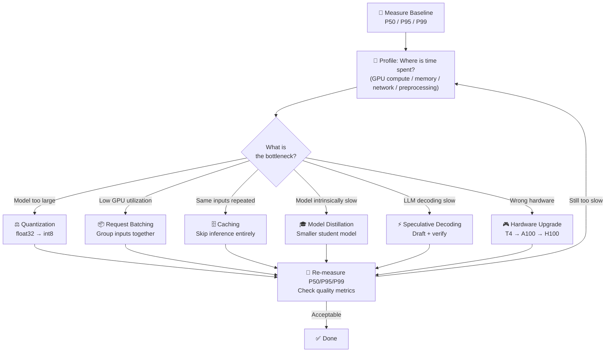

# Theory — Latency Optimization

## The Story 📖

Imagine you run a pizza delivery business. You have perfected your recipe — the dough is incredible, the sauce is homemade, the cheese is top quality. But if every delivery takes 45 minutes, customers cancel and order from somewhere else. The pizza is great. The speed is not. And in a competitive market, speed matters almost as much as quality.

So you start looking for every second you can shave off. You move the kitchen closer to the city center. You pre-make dough in the morning so the moment an order comes in, you don't start from scratch. You hire faster drivers with better bikes. You use an app so customers don't wait on hold to order. You notice that 80% of orders are pepperoni — so you always have some partially assembled, ready to go. None of these changes make the pizza taste better. But now the delivery time is 18 minutes. Customers come back.

That is latency optimization: **not changing what you produce, but relentlessly engineering every step so it takes less time.** The model's "taste" (accuracy) stays the same. You are optimizing the pipeline around it.

👉 This is **Latency Optimization** — the art and engineering of reducing the time from a request arriving at your system to the response reaching the user, without sacrificing meaningful quality.

---

## What is Latency Optimization?

**Latency** is the elapsed time between a client sending a request and receiving a complete response. In AI systems, latency is typically measured in milliseconds (ms).

Think of it as: **every millisecond between "user presses Enter" and "answer appears on screen" is an opportunity to lose the user's attention (and potentially their business).**

**Why percentiles matter more than averages:**
- P50 (median): Half of requests are faster, half are slower
- P95: 95% of requests are faster than this. 1 in 20 users sees this latency or worse.
- P99: 99% of requests are faster. 1 in 100 users sees this latency or worse.

If your P50 is 200ms but P99 is 8 seconds, your average looks fine but your worst users are having a terrible experience. Always optimize P95/P99, not the mean.

**Sources of latency in AI systems:**
- **Model size**: More parameters = more computation per forward pass
- **Batch size**: Processing one sample at a time vs. many (affects GPU utilization)
- **Hardware**: CPU vs T4 GPU vs A100 vs H100 — 10-100x differences
- **Network**: Round-trip to an API endpoint (50-200ms baseline)
- **Preprocessing**: Tokenization, image resizing, data validation
- **Memory bandwidth**: Moving data between RAM and GPU VRAM

---

## How It Works — Step by Step

Optimizing latency is a profiling-first discipline. Never optimize blindly.

1. **Measure baseline** — Establish P50/P95/P99 latency under realistic load
2. **Profile the bottleneck** — Is it GPU compute? Memory? Network? Preprocessing?
3. **Apply targeted optimization** — Pick the technique that addresses your specific bottleneck
4. **Measure again** — Verify improvement. Watch for quality regressions.
5. **Repeat** — Latency optimization is iterative. After fixing the biggest bottleneck, the next one becomes visible.

---

## Real-World Examples

1. **OpenAI's ChatGPT streaming**: Instead of waiting for the full response to be generated (30+ seconds for long answers), OpenAI streams tokens as they are generated. This reduces *perceived* latency to ~200ms for the first token, even if the full response takes 20 seconds.

2. **Google's translation API**: Uses quantization (int8) to cut memory bandwidth needs by 4x. The model is slightly less accurate on rare words, but for common translation tasks the quality is indistinguishable and it is 3-4x faster.

3. **Spotify's music recommendation**: Uses a distilled recommendation model. The teacher model has 500M parameters and takes 150ms. The student model has 50M parameters, took the teacher's "knowledge" and runs in 18ms — making real-time playlist generation feasible.

4. **NVIDIA's speculative decoding demo**: A 7B draft model generates 5 candidate tokens in one pass. A 70B verify model accepts or rejects them in one pass (much faster than generating 5 tokens sequentially). Result: 2.5-3x throughput improvement on long generations.

5. **A fintech startup's fraud detection**: Pre-computes feature vectors for every user account nightly (batch). When a real-time transaction comes in, only the transaction features are computed fresh — the user features are looked up from cache. This cut inference time from 120ms to 15ms.

---

## Common Mistakes to Avoid ⚠️

**1. Optimizing without measuring first**
Never guess where your latency comes from. A common mistake: spending two weeks quantizing the model to int8, only to discover the bottleneck was actually the database lookup that happens before inference. Always profile first.

**2. Obsessing over average latency instead of P99**
The average is a lie. If 1% of requests take 10 seconds, your average might look fine. But that 1% represents real users having a terrible experience. Set SLOs (Service Level Objectives) on P99, not on the mean.

**3. Using quantization without evaluating quality impact**
Quantization can silently degrade quality for specific input types. A model might be equally accurate on common inputs but much worse on rare edge cases. Always run your full evaluation suite after quantizing — don't just check overall accuracy.

**4. Over-batching causing higher tail latency**
Batching improves throughput but hurts individual request latency. If you wait 100ms to fill a batch, every request now has at least 100ms of added latency. Dynamic batching with a short timeout (2-10ms) is usually the right balance.

---

## Connection to Other Concepts 🔗

- **Model Serving** → Latency only matters once you have a serving layer. The techniques here improve what you have built in [01_Model_Serving](../01_Model_Serving/Theory.md).
- **Cost Optimization** → Many latency optimizations also reduce cost (smaller model = cheaper compute). See [03_Cost_Optimization](../03_Cost_Optimization/Theory.md).
- **Caching Strategies** → Caching is one of the most effective latency wins. Full deep dive at [04_Caching_Strategies](../04_Caching_Strategies/Theory.md).
- **Observability** → You can't optimize what you can't measure. Latency metrics and tracing covered in [05_Observability](../05_Observability/Theory.md).
- **Scaling AI Apps** → When a single server is too slow under load (not per-request latency but queue latency), scaling is the answer — [09_Scaling_AI_Apps](../09_Scaling_AI_Apps/Theory.md).

---

✅ **What you just learned:** Latency is the time from request to response. Always measure P95/P99, not averages. Profile the bottleneck first, then apply targeted techniques: quantization, batching, caching, distillation, speculative decoding, or hardware upgrades. Streaming (for LLMs) dramatically improves perceived latency.

🔨 **Build this now:** Take an existing model endpoint and measure its P50/P95/P99 using a load testing tool (locust or wrk). Apply `torch.quantization.quantize_dynamic()` to a PyTorch model and measure the speedup. Compare.

➡️ **Next step:** [03 Cost Optimization](../03_Cost_Optimization/Theory.md) — latency and cost are deeply linked.

---

## 📂 Navigation
