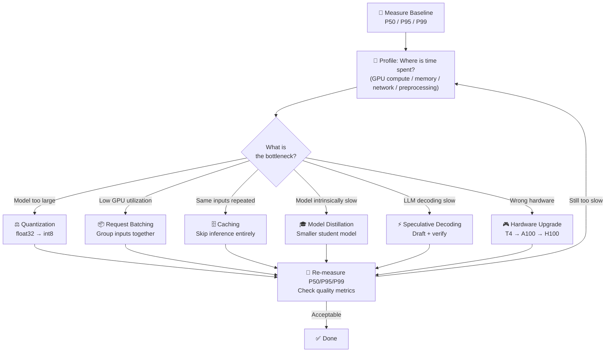

# Theory — Latency Optimization

## The Story 📖

You run a pizza delivery business with a perfect recipe — but 45-minute deliveries cost you customers. So you engineer every step: move the kitchen closer to the city, pre-make dough in the morning, pre-assemble the 80%-of-orders pepperoni pizzas. None of these changes make the pizza taste better, but delivery time drops from 45 to 18 minutes. Customers come back.

👉 This is **Latency Optimization** — reducing time from request to response without sacrificing quality.

---

## What is Latency Optimization?

**Latency** is the elapsed time between a client sending a request and receiving a complete response, measured in milliseconds.

**Why percentiles matter more than averages:**
- P50 (median): half of requests are faster, half slower
- P95: 1 in 20 users sees this latency or worse
- P99: 1 in 100 users sees this latency or worse

If your P50 is 200ms but P99 is 8 seconds, the average looks fine but your worst users are suffering. Always optimize P95/P99, not the mean.

**Sources of latency:**
- **Model size** — more parameters = more computation per forward pass
- **Batch size** — one sample at a time vs. many (affects GPU utilization)
- **Hardware** — CPU vs T4 vs A100 vs H100 = 10-100x differences
- **Network** — round-trip to API endpoint (50-200ms baseline)
- **Preprocessing** — tokenization, image resizing, data validation
- **Memory bandwidth** — moving data between RAM and GPU VRAM

---

## How It Works — Step by Step

Latency optimization is profiling-first. Never optimize blindly.

1. **Measure baseline** — establish P50/P95/P99 under realistic load
2. **Profile the bottleneck** — GPU compute? Memory? Network? Preprocessing?
3. **Apply targeted optimization** — technique matched to your bottleneck
4. **Measure again** — verify improvement, watch for quality regressions
5. **Repeat** — after fixing the biggest bottleneck, the next one becomes visible

---

## Real-World Examples

1. **ChatGPT streaming**: Tokens stream as generated, reducing *perceived* latency to ~200ms for first token even when full response takes 20 seconds.
2. **Google Translate API**: int8 quantization cuts memory bandwidth 4x — 3-4x faster with indistinguishable quality on common translations.
3. **Spotify recommendation**: 50M-parameter student model distilled from 500M-parameter teacher runs in 18ms vs 150ms — enabling real-time playlist generation.
4. **NVIDIA speculative decoding**: 7B draft model generates 5 candidate tokens; 70B verify model accepts/rejects in one pass. Result: 2.5-3x throughput on long generations.
5. **Fintech fraud detection**: Pre-computed user feature vectors (batch, nightly) + fresh transaction features at inference time cut latency from 120ms to 15ms.

---

## Common Mistakes to Avoid ⚠️

**1. Optimizing without measuring first** — A common trap: spending two weeks on int8 quantization when the bottleneck was a database lookup before inference. Profile first, always.

**2. Obsessing over average latency** — The average is a lie. Set SLOs on P99, not the mean. That 1% of 10-second requests represents real users.

**3. Using quantization without evaluating quality** — Quantization can silently degrade quality on rare edge cases while average accuracy looks fine. Run your full eval suite after quantizing.

**4. Over-batching causing higher tail latency** — Waiting 100ms to fill a batch adds 100ms to every request. Dynamic batching with 2-10ms timeouts is usually the right balance.

---

## Connection to Other Concepts 🔗

- **Model Serving** → Latency only matters once you have a serving layer: [01_Model_Serving](../01_Model_Serving/Theory.md)
- **Cost Optimization** → Many latency optimizations also reduce cost: [03_Cost_Optimization](../03_Cost_Optimization/Theory.md)
- **Caching Strategies** → Often the most effective latency win: [04_Caching_Strategies](../04_Caching_Strategies/Theory.md)
- **Observability** → You can't optimize what you can't measure: [05_Observability](../05_Observability/Theory.md)
- **Scaling AI Apps** → When queue latency (not per-request latency) is the problem: [09_Scaling_AI_Apps](../09_Scaling_AI_Apps/Theory.md)

---

✅ **What you just learned:** Latency = time from request to response. Measure P95/P99, not averages. Profile the bottleneck first, then apply targeted techniques: quantization, batching, caching, distillation, speculative decoding, or hardware upgrades. Streaming dramatically improves perceived latency for LLMs.

🔨 **Build this now:** Measure P50/P95/P99 on any model endpoint using locust or wrk. Apply `torch.quantization.quantize_dynamic()` to a PyTorch model. Compare the results.

➡️ **Next step:** [03 Cost Optimization](../03_Cost_Optimization/Theory.md) — latency and cost are deeply linked.

---

## 🛠️ Practice Project

Apply what you just learned → **[A5: Fine-Tune → Evaluate → Deploy](../../20_Projects/02_Advanced_Projects/05_Fine_Tune_Evaluate_Deploy/Project_Guide.md)**
> This project uses: quantizing a fine-tuned model to 4-bit (INT4), measuring latency before/after, serving with optimized batch size

---

## 📝 Practice Questions

- 📝 [Q73 · latency-optimization](../../ai_practice_questions_100.md#q73--design--latency-optimization)

---

## 📂 Navigation
