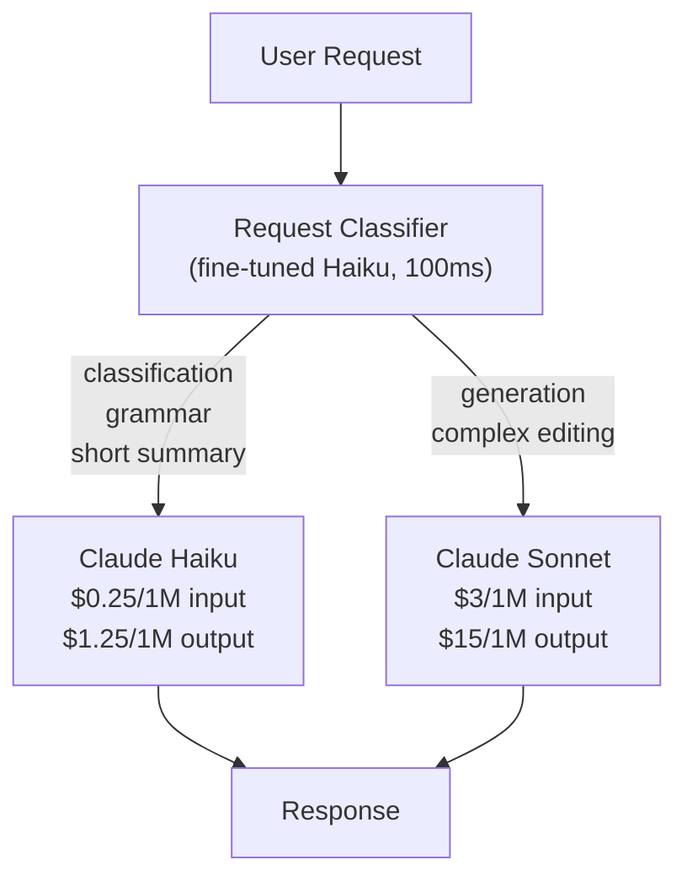
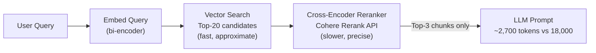
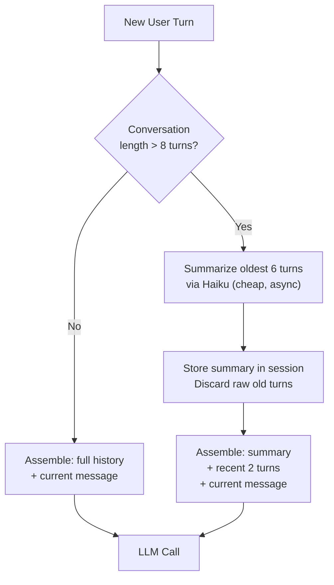

# Cost Case Studies — Real-World Reductions

## The Story 📖

A chef who sources every ingredient from the finest import shop is not running a restaurant — they're running a money pit. A smart chef knows when to use truffle oil and when a quality olive oil is indistinguishable on the plate. AI cost optimization works the same way: the expensive model, the bloated prompt, the redundant API call — these are your truffle oil. You only reach for it when diners will actually notice the difference.

These three case studies are real patterns drawn from production AI systems. Numbers are representative of actual engineering outcomes.

---

## Case Study 1: From $45K/Month to $12K/Month 📉

### The Situation

A B2B SaaS startup built a writing assistant that used GPT-4 (now GPT-4o equivalent) for every single request — intent classification, content generation, grammar check, summarization, everything. Six months after launch, their monthly OpenAI bill was $45,200.

**Initial architecture:**
```
Every user request → GPT-4 → Response
```

Every request, regardless of complexity, hit the most expensive model.

---

### The Audit

The engineering team logged every request for two weeks and categorized them:

| Request Type | % of Traffic | Complexity | Was GPT-4 Necessary? |
|---|---|---|---|
| Intent classification ("is this a rephrase request?") | 38% | Low | No |
| Grammar / spelling fix | 11% | Low | No |
| Short summary (< 200 words) | 23% | Medium | Rarely |
| Full content generation (blog post, proposal) | 19% | High | Yes |
| Creative rewrites, complex editing | 9% | High | Yes |

**72% of requests were low-to-medium complexity.** They were paying GPT-4 rates for tasks that a much cheaper model handles equally well.

---

### The Fix: Three-Lever Strategy

**Lever 1 — Model Routing**

They introduced a lightweight router that classified incoming requests and dispatched to the right model:



The classifier itself ran on Claude Haiku — a meta-cost that was negligible compared to the savings.

**Lever 2 — Prompt Caching for System Prompts**

Their system prompt was 2,400 tokens: persona, tone guidelines, brand voice rules, output format instructions. It was identical on every single request.

With Anthropic prompt caching (or equivalent OpenAI cached input tokens), the system prompt tokens cost 90% less on cache hits.

```
System prompt: 2,400 tokens
Requests/day: 85,000
Cache hit rate: 91% (high because system prompt never changes)

Without caching:
  85,000 × 2,400 tokens × $3/1M = $612/day

With caching (91% hit rate):
  8% miss: 6,800 × 2,400 × $3/1M     = $48.96/day
  92% hit: 78,200 × 2,400 × $0.30/1M = $56.30/day
  Total: $105.26/day

Savings: $506.74/day → $15,200/month
```

**Lever 3 — Batch Processing for Non-Urgent Requests**

23% of requests were from a background feature: weekly content reports, scheduled summaries, digest emails. These didn't require real-time responses.

They moved batch jobs to the Anthropic Batches API (50% cheaper, 24-hour SLA):

```
Batch requests/month: ~590,000 (previously at real-time pricing)
Average tokens/request: 1,800 input + 600 output

Before: 590,000 × (1,800 × $3 + 600 × $15) / 1M = $8,496/month
After:  590,000 × (1,800 × $1.5 + 600 × $7.5) / 1M = $4,248/month

Savings: $4,248/month
```

---

### The Math

| Month | Configuration | Monthly Cost |
|---|---|---|
| Before | All requests → GPT-4, no caching | $45,200 |
| After Lever 1 | Model routing (72% → Haiku) | $21,800 |
| After Lever 2 | + Prompt caching (91% hit rate) | $16,600 |
| After Lever 3 | + Batch processing non-urgent | $12,352 |

**Total reduction: 73% ($32,848/month saved)**

Engineering investment: one week to implement routing logic, one day to enable caching, two days to migrate batch jobs.

**ROI: First month savings paid back the engineering cost 8x over.**

---

### What They Didn't Do (And Why)

They considered switching everything to Haiku. They ran a quality A/B test first: 200 complex content generation requests on Haiku vs Sonnet, evaluated by their content team blind. Haiku scored 3.1/5 average vs Sonnet's 4.4/5 on their rubric. That settled it — model routing, not wholesale downgrade.

---

## Case Study 2: RAG System Token Explosion 💥

### The Situation

A legal research startup built a RAG system over 400,000 legal documents. Their MVP approach: for every question, retrieve the top 20 chunks (to ensure nothing relevant was missed), then stuff all of them into the prompt.

**Initial prompt structure:**
```
System prompt:           800 tokens
User question:           120 tokens
20 retrieved chunks:  18,000 tokens (avg 900 tokens/chunk)
─────────────────────────────────────────────────────────
Total input:          18,920 tokens
Output:                1,200 tokens
```

Monthly token spend at 12,000 queries/day: **$278,000/month**.

---

### The Problem

Three things were broken simultaneously:

1. **Retrieval precision was low** — 20 chunks is a shotgun approach. Many retrieved chunks were marginally relevant at best, adding noise and cost.
2. **Chunk size was bloated** — 900 tokens/chunk was too large. A single legal clause might be 50-100 tokens. Retrieving a 900-token chunk to get one clause wastes 800 tokens.
3. **Query quality was poor** — Users asked vague questions. Poor queries → poor retrieval → retrieving 20 chunks to compensate for bad precision.

---

### The Fix: Three-Layer Token Reduction

**Layer 1 — Re-ranking from 20 to 3 chunks**

They added a cross-encoder reranker (Cohere Rerank API). After retrieving the initial top-20 via vector search, the reranker assessed each chunk against the query more accurately. Only the top 3 passed through to the LLM prompt.



**Reranker cost:**
```
12,000 queries/day × $0.001/query (Cohere Rerank) = $12/day = $360/month
```

This is noise compared to the token savings.

**Layer 2 — Chunk size reduction from 900 to 300 tokens**

They re-indexed their corpus with smaller, semantically coherent chunks. Legal documents have natural boundaries: numbered clauses, defined terms, subsections. They used a structure-aware splitter that respected these boundaries.

```
Before: 20 chunks × 900 tokens = 18,000 retrieved tokens/query
After:   3 chunks × 300 tokens =    900 retrieved tokens/query
```

Re-indexing took 3 days of compute time (one-time cost).

**Layer 3 — Query rewriting to improve retrieval precision**

Instead of sending the user's raw question directly to the vector index, they added a query rewriting step using Haiku (cheap, fast):

```
User: "Can they get out of the contract if the supplier misses delivery?"

Haiku rewrites to:
  Query 1: "force majeure clause delivery failure supplier liability"
  Query 2: "contract termination conditions breach of delivery obligation"
  Query 3: "buyer remedies late delivery commercial contract"
```

Running three precision queries and retrieving top-1 each matched the coverage of a single vague query retrieving top-20.

**Query rewriting cost:**
```
12,000 queries/day × ~200 tokens × $0.25/1M input = $0.60/day
```

---

### The Token Reduction Math

```
                     Before          After
System prompt:        800 tokens      800 tokens
User query:           120 tokens      120 tokens
Retrieved chunks:  18,000 tokens      900 tokens (3 × 300)
─────────────────────────────────────────────────────────
Input per query:   18,920 tokens    1,820 tokens    ← 90% reduction
Output per query:   1,200 tokens    1,200 tokens    (unchanged)
```

**Monthly cost recalculation:**

```
Before:
  Input:  12,000/day × 30 × 18,920 tokens × $15/1M = $102,168/month
  Output: 12,000/day × 30 × 1,200 tokens × $75/1M  = $32,400/month
  Total:  ~$134,568/month (on Claude Opus equivalent)

After:
  Input:  12,000/day × 30 × 1,820 tokens × $15/1M  = $9,828/month
  Output: 12,000/day × 30 × 1,200 tokens × $75/1M  = $32,400/month
  Reranker overhead:                                 = $360/month
  Query rewriting:                                   = $18/month
  Total:  ~$42,606/month
```

**Total reduction: 68% ($91,962/month saved)**

Quality did not degrade — it improved. The reranker found better chunks than the top-20 raw retrieval was doing. Precision@3 improved from 0.61 to 0.84 on their evaluation set.

---

### The Lesson

Token explosion in RAG is almost always caused by low retrieval precision compensated by stuffing more chunks. The fix is better retrieval, not bigger context windows.

---

## Case Study 3: Chatbot with Redundant Context 💬

### The Situation

A consumer chatbot for a productivity app sent the full conversation history on every turn. The system prompt was also rebuilt from scratch every request — dynamically generating instructions based on user settings, which meant it was never identical and could never be cached.

At 10,000 daily active users, with an average of 14 messages per session:

**Average context per turn (mid-session, turn 7):**
```
System prompt (dynamic, rebuilt each turn): 1,800 tokens
Full conversation history (6 prior turns):  3,200 tokens
Current user message:                          90 tokens
─────────────────────────────────────────────────────────
Input per LLM call:                          5,090 tokens
Output per LLM call:                           400 tokens
```

With 10,000 DAU × 14 turns/session = 140,000 LLM calls/day:

```
Input cost:  140,000 × 5,090 × $3/1M  = $2,138/day
Output cost: 140,000 × 400  × $15/1M  =   $840/day
Total:                                  $2,978/day → $89,340/month
```

---

### The Fix: Three-Part Context Strategy

**Part 1 — Stable System Prompt (unlock prompt caching)**

The dynamic system prompt was generating all its instructions fresh each turn. The engineers examined which parts actually changed per-user vs which were constant:

```
Constant (same for all users):       1,400 tokens  ← make this the cacheable prefix
User-specific settings (dynamic):      400 tokens  ← append dynamically at the end
```

By restructuring the prompt so the stable 1,400-token block came first (with cache_control: ephemeral), they achieved a 78% cache hit rate.

```
1,400-token prefix cached at 90% discount:
  Before: 140,000 × 1,400 × $3/1M     = $588/day
  After:  140,000 × 1,400 × $0.30/1M  = $58.80/day  (78% hit rate factored in)
  Savings: $529.20/day
```

**Part 2 — Sliding Window + Summarization**

Instead of sending the full conversation history (grows without bound), they implemented a sliding window with a background summarization step:



The summary replaced 6 turns (~2,700 tokens) with a 300-token digest. Raw history was kept in Postgres for audit but not fed to the LLM.

**Part 3 — History Compression Numbers**

```
Before sliding window (turn 7 average):
  History: 6 turns × ~533 tokens/turn = 3,200 tokens

After sliding window:
  Summary of turns 1-4: ~250 tokens
  Raw turns 5-6:         ~500 tokens
  Total history:          750 tokens  ← 77% reduction in history tokens
```

---

### The Combined Math at 10K DAU

```
                         Before              After
System prompt:           1,800 tokens/call   1,800 tokens/call
  - Cached prefix:       —                   78% hit rate on 1,400 tokens
Conversation history:    3,200 tokens        750 tokens
Current message:            90 tokens          90 tokens
─────────────────────────────────────────────────────────────────
Effective input:         5,090 tokens        ~2,340 tokens (avg, factoring cache)
Output:                    400 tokens          400 tokens

Daily LLM calls: 140,000

Input cost before:  140,000 × 5,090 × $3/1M  = $2,138/day
Input cost after:   140,000 × 2,340 × $3/1M  = $  983/day
  Minus cache savings on 1,400-token prefix:  = -$  471/day
  Effective input cost:                        = $  512/day

Output cost: unchanged = $840/day

Total before: $2,978/day → $89,340/month
Total after:  $1,352/day → $40,560/month
```

**Total reduction: 55% ($48,780/month saved at 10K DAU)**

**Projection at 50K DAU (3-month growth target):**
Without optimization: $446,700/month
With optimization: $202,800/month
**Difference at scale: $243,900/month**

---

### Engineering Investment

| Change | Engineering Time | Monthly Savings |
|---|---|---|
| Restructure system prompt for caching | 4 hours | ~$14,700 |
| Implement sliding window + summarization | 2 days | ~$28,000 |
| Background summarization job (Haiku) | 1 day | (included above) |
| **Total** | **~3 days** | **~$48,780** |

---

### The Meta-Lesson

In all three case studies, the highest-ROI fix was not the clever engineering — it was the audit that revealed where money was actually going. Token logging per request type is the most important first step. You cannot optimize what you cannot measure.

---

✅ **What you just learned:** Three real cost reduction patterns — model routing (73% savings), RAG chunk reduction via reranking (68% savings), and context management via caching + sliding window (55% savings). Every case started with an audit.

🔨 **Build this now:** Add per-request token logging to any LLM app you have running. Tag each log with the request type. After 1 week, look at which request type is generating the most tokens. That is your first optimization target.

➡️ **Next step:** [Model Routing Guide](./Model_Routing_Guide.md) — decision tree and implementation for dispatching requests to the right model automatically.

---

## 📂 Navigation

**In this folder:**
| File | |
|---|---|
| [📄 Theory.md](./Theory.md) | Core concepts |
| [📄 Cheatsheet.md](./Cheatsheet.md) | Quick reference |
| [📄 Interview_QA.md](./Interview_QA.md) | Interview prep |
| [📄 Cost_Calculator_Guide.md](./Cost_Calculator_Guide.md) | Cost calculation guide |
| 📄 **Cost_Case_Studies.md** | ← you are here |
| [📄 Model_Routing_Guide.md](./Model_Routing_Guide.md) | Model routing decision guide |

⬅️ **Prev:** [Theory](./Theory.md) &nbsp;&nbsp;&nbsp; ➡️ **Next:** [Model Routing Guide](./Model_Routing_Guide.md)
