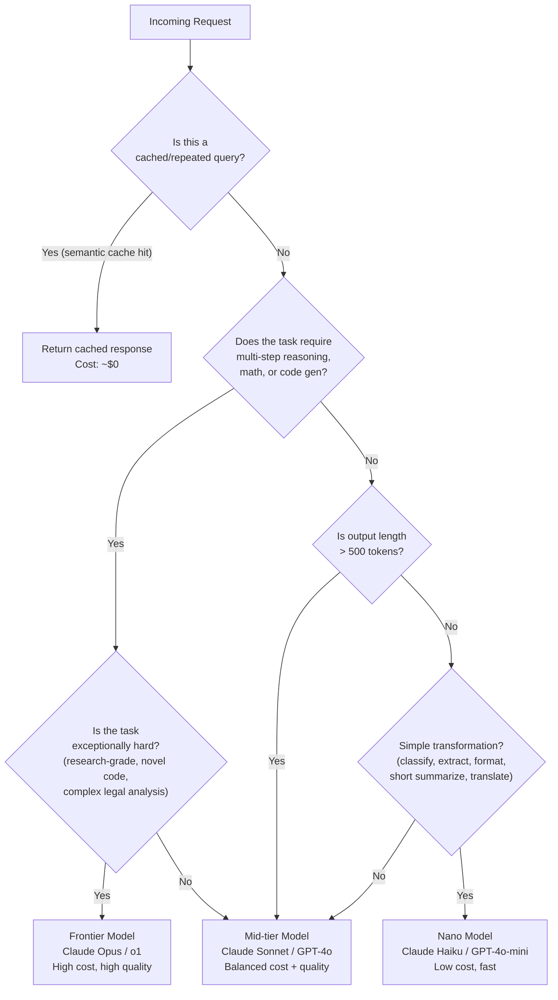
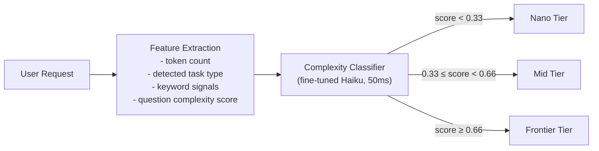
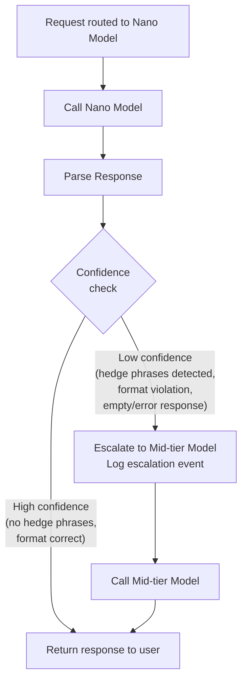
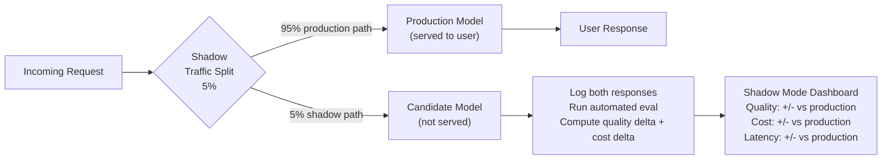

# Model Routing Guide

## The Story 📖

A hospital triage nurse doesn't send everyone to the trauma surgeon. A patient with a sprained ankle goes to the urgent care nurse practitioner. A patient with chest pain goes directly to the cardiologist. The same clinical outcome, at a fraction of the cost, because the routing decision was made correctly at intake.

**Model routing** is AI triage. A lightweight classifier examines each incoming request and dispatches it to the cheapest model that can handle it correctly. The expensive model (the trauma surgeon) only sees the cases that genuinely require its capabilities.

---

## The Model Tier Landscape

As of 2025, three capability tiers exist across major providers. The cost differentials between tiers are significant:

| Tier | Example Models | Input Cost | Output Cost | Best For |
|---|---|---|---|---|
| Nano/Micro | Claude Haiku 3.5, GPT-4o-mini, Gemini Flash | $0.08–0.25/1M | $0.30–1.25/1M | Classification, extraction, simple Q&A, formatting |
| Mid-tier | Claude Sonnet 4, GPT-4o, Gemini Pro | $3–5/1M | $15–20/1M | Generation, analysis, moderate reasoning |
| Frontier | Claude Opus, o1/o3, Gemini Ultra | $15–75/1M | $75–300/1M | Complex reasoning, research, code generation, hard problems |

**The cost gap between Nano and Frontier is 100–1000x per token.**

A request that costs $0.0001 on Haiku costs $0.01 on Claude Opus. At 1 million requests/day, routing that request correctly saves $9,900/day.

---

## Decision Tree: Which Model to Use



---

## Latency-Accuracy-Cost Tradeoff Matrix

Every routing decision is a tradeoff across three dimensions. This table maps common task types to the right operating point:

| Task Type | Latency Req | Accuracy Req | Use | Reason |
|---|---|---|---|---|
| Intent classification | < 200ms | Medium | Nano | Fast inference, simple pattern matching |
| Named entity extraction | < 300ms | High | Nano | Structured output, deterministic patterns |
| Sentiment analysis | < 200ms | Medium | Nano | Binary/multi-class classification |
| Short summarization (< 300w) | < 1s | Medium | Nano | Compression, no complex reasoning |
| Translation | < 500ms | High | Nano/Mid | Nano handles common languages well |
| Long-form content generation | < 5s | High | Mid | Requires fluency and coherence |
| Code generation (simple functions) | < 2s | High | Mid | Non-trivial but not research-grade |
| RAG answer synthesis | < 3s | High | Mid | Grounding reduces hallucination risk |
| Complex code (algorithms, debugging) | < 10s | Very High | Frontier | Requires deep reasoning |
| Multi-document research synthesis | < 15s | Very High | Frontier | Non-linear reasoning over long context |
| Mathematical proofs / formal reasoning | Any | Very High | Frontier | Current frontier capability |

---

## Dynamic Routing: Complexity-Based Dispatch

Static routing rules ("all summarizations go to Haiku") leave money on the table and occasionally misroute. **Dynamic routing** classifies each request at runtime to estimate its complexity.

### Approach 1: Lightweight Classifier

Train or fine-tune a small model (Haiku itself, or a distilled BERT) on labeled examples of {request_text → complexity_tier}. The classifier itself runs in ~50ms and costs less than $0.000001 per call.



**Feature signals the classifier uses:**
- Token count of the request (long requests ≈ more complex)
- Presence of reasoning keywords: "analyze", "compare", "explain why", "debug", "design"
- Presence of simple-task keywords: "classify", "extract", "translate", "summarize"
- Number of sub-questions in a single request
- Code block presence
- Domain signals (legal, medical, financial → higher stakes → route up)

### Approach 2: Prompt Prefix Heuristics

Without a classifier model, use deterministic rules as a cheaper first pass:

```python
def route_request(request: str, system_prompt: str) -> str:
    tokens = count_tokens(request + system_prompt)
    text_lower = request.lower()

    # Tier 1: Definite nano candidates
    nano_keywords = ["classify", "extract", "yes or no", "which category",
                     "translate to", "format this", "fix the grammar",
                     "sentiment of", "list the"]
    if any(kw in text_lower for kw in nano_keywords) and tokens < 800:
        return "nano"

    # Tier 3: Definite frontier candidates
    frontier_keywords = ["write a research paper", "prove that", "design a system",
                         "debug this entire codebase", "comprehensive analysis",
                         "multiple competing hypotheses"]
    if any(kw in text_lower for kw in frontier_keywords) or tokens > 6000:
        return "frontier"

    # Tier 2: Everything else
    return "mid"
```

---

## Confidence-Based Escalation

Even after routing, a nano model may return a low-confidence or uncertain response. **Confidence-based escalation** catches these cases and automatically re-runs with a higher-tier model.



**Confidence signals to check in the response:**
- Hedge phrases: "I'm not sure", "I think", "I believe", "you may want to verify", "I don't have enough information"
- Failed format compliance: asked for JSON, got prose; asked for a number, got a paragraph
- Response too short: asked for analysis, got one sentence
- Explicit inability: "I cannot", "I don't know how to", "this is outside my abilities"

**Implementation:**

```python
def check_confidence(response: str, expected_format: str) -> bool:
    hedge_phrases = [
        "i'm not sure", "i think", "i believe", "i may be wrong",
        "you might want to verify", "i don't have enough",
        "i cannot", "i don't know"
    ]

    # Hedge phrase detection
    if any(phrase in response.lower() for phrase in hedge_phrases):
        return False

    # Format compliance check
    if expected_format == "json":
        try:
            json.loads(response)
        except json.JSONDecodeError:
            return False

    # Minimum length check
    if len(response.split()) < 10:
        return False

    return True
```

**Cost impact of escalation:**
Track your escalation rate. If 15% of nano-routed requests escalate to mid-tier, factor that into your effective cost:

```
Effective cost = (0.85 × nano_cost) + (0.15 × mid_cost + nano_cost)
              = (0.85 × $0.001) + (0.15 × ($0.05 + $0.001))
              = $0.00085 + $0.00765
              = $0.0085

vs. routing everything to mid-tier: $0.05
Still 83% cheaper even with 15% escalation rate.
```

---

## Implementation Example: Full Routing Layer

```python
from enum import Enum
from dataclasses import dataclass

class ModelTier(Enum):
    NANO = "claude-haiku-3-5"
    MID = "claude-sonnet-4"
    FRONTIER = "claude-opus-4"

@dataclass
class RoutingDecision:
    tier: ModelTier
    reason: str
    estimated_cost_usd: float

class CostAwareRouter:
    NANO_PRICE = (0.08, 0.30)      # (input, output) per 1M tokens
    MID_PRICE  = (3.00, 15.00)
    FRONTIER_PRICE = (15.00, 75.00)

    def route(self, request: str, context: dict) -> RoutingDecision:
        """
        Returns which model tier to use for this request.
        context: dict with keys like 'expected_format', 'domain', 'max_latency_ms'
        """
        tokens = count_tokens(request)
        tier = self._classify_tier(request, tokens, context)

        # Estimate cost (rough)
        est_input  = tokens
        est_output = 400 if tier != ModelTier.FRONTIER else 1000
        price      = self._price_for_tier(tier)
        cost       = (est_input * price[0] + est_output * price[1]) / 1_000_000

        return RoutingDecision(tier=tier, reason=self._reason, estimated_cost_usd=cost)

    def _classify_tier(self, text: str, tokens: int, context: dict) -> ModelTier:
        lower = text.lower()

        # Hard overrides
        if context.get("force_tier"):
            self._reason = "forced by caller"
            return ModelTier[context["force_tier"].upper()]

        # Frontier signals
        if tokens > 8000:
            self._reason = "large input → frontier"
            return ModelTier.FRONTIER
        if any(k in lower for k in ["research report", "prove", "comprehensive analysis"]):
            self._reason = "complexity keywords → frontier"
            return ModelTier.FRONTIER

        # Nano signals
        if tokens < 500 and any(k in lower for k in [
            "classify", "extract", "yes or no", "translate", "format", "sentiment"
        ]):
            self._reason = "simple task, small input → nano"
            return ModelTier.NANO

        # Default to mid
        self._reason = "no strong signal → mid"
        return ModelTier.MID
```

---

## Shadow Mode: Testing New Models Safely

Before promoting a new model to production routing, run it in **shadow mode**: route 5-10% of real traffic to the new model in parallel with the current production model. Compare outputs, don't serve the shadow response to users.



**Promotion criteria:**
- Quality delta ≥ -2% (candidate is no worse than production)
- Cost delta ≤ 0 (candidate is cheaper) or quality delta > +5% (worth the extra cost)
- Latency P99 within 20% of production
- Zero catastrophic failures in shadow window (malformed outputs, refusals, PII leaks)

---

## Routing Metrics to Track

| Metric | Target | Alert Threshold |
|---|---|---|
| Escalation rate (nano → mid) | < 10% | > 20% (routing too aggressive) |
| Escalation rate (mid → frontier) | < 5% | > 15% |
| Average cost per request (weighted) | Baseline × 0.5 after tuning | +20% vs baseline |
| Routing classifier latency | < 100ms | > 250ms |
| Mis-routing rate (from manual eval sample) | < 3% | > 8% |

---

✅ **What you just learned:** Model routing is the highest-leverage cost reduction strategy. Route by task complexity (nano / mid / frontier), use confidence-based escalation as a safety net, and validate new models in shadow mode before full rollout.

🔨 **Build this now:** Take any LLM app you have. Add a five-line routing function that sends requests with fewer than 600 tokens and containing "classify", "extract", or "translate" to a nano model. Measure how much of your traffic this captures and what the quality difference is.

➡️ **Next step:** [04 Caching Strategies](../04_Caching_Strategies/Theory.md) — the complementary cost lever that eliminates inference cost entirely for repeated queries.

---

## 📂 Navigation

**In this folder:**
| File | |
|---|---|
| [📄 Theory.md](./Theory.md) | Core concepts |
| [📄 Cheatsheet.md](./Cheatsheet.md) | Quick reference |
| [📄 Interview_QA.md](./Interview_QA.md) | Interview prep |
| [📄 Cost_Calculator_Guide.md](./Cost_Calculator_Guide.md) | Cost calculation guide |
| [📄 Cost_Case_Studies.md](./Cost_Case_Studies.md) | Real-world case studies |
| 📄 **Model_Routing_Guide.md** | ← you are here |

⬅️ **Prev:** [Cost Case Studies](./Cost_Case_Studies.md) &nbsp;&nbsp;&nbsp; ➡️ **Next:** [04 Caching Strategies](../04_Caching_Strategies/Theory.md)
