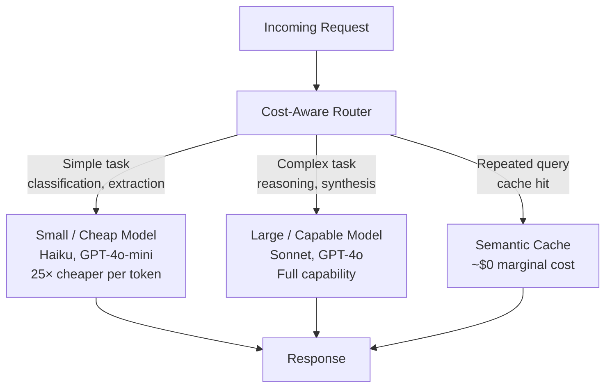
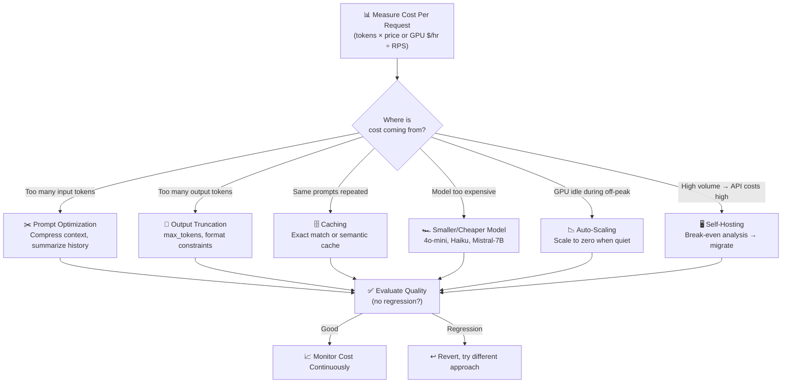

# Theory — Cost Optimization

## The Story 📖

You run a taxi company. Cars cost money the moment they leave the garage — fuel, driver wages, insurance — whether carrying a passenger or idling. A smart operator right-sizes vehicles for trips, carpools passengers going to the same place, and tracks cost per mile. Your AI system is that taxi company: GPUs are cars (expensive whether busy or idle), requests are passengers. Running a 70B model for every simple request, sending enormous prompts, or leaving GPU instances warm 24/7 is the same as sending a 7-seat SUV to pick up a solo traveler.

👉 This is **Cost Optimization** — eliminating waste at every layer so your AI system does exactly what it needs to do at the right price.

---

## What is Cost Optimization?

**Cost optimization** means reducing monetary cost per inference without reducing quality below acceptable levels. It's a continuous engineering practice, not a one-time fix.

Two cost models:

**API Cost Model (pay-per-token):**
```
Cost = (input_tokens × input_price) + (output_tokens × output_price)
```

**Self-Hosting Cost Model (pay-per-hour):**
```
Cost per request = (GPU instance $/hour) / (requests per hour)
```

At low volume, APIs win. At high volume, self-hosting wins. The **break-even point** is where per-request cost equals between both models.

**Key cost levers:**
- **Model selection** — smaller models cost 10-100x less per token
- **Prompt length** — fewer input tokens = lower cost
- **Caching** — skip inference entirely for repeated inputs
- **Batching** — spread fixed GPU costs over more requests
- **Spot instances** — 60-90% cheaper than on-demand, with interruption risk
- **Prompt caching** — cache system prompt KV state (up to 90% discount on cached tokens)



---

## How It Works — Step by Step



---

## Real-World Examples

1. **Legal AI startup**: Sending full 50,000-word contracts per question. Switching to RAG (retrieving only 3 relevant clauses) reduced input tokens from 35,000 to 800 — a 97% input cost reduction.
2. **Anthropic prompt caching**: 10,000-token system prompt cached server-side. At 85% hit rate and 90% cache discount, savings at 100,000 requests/day: ~$1,100/day.
3. **SaaS model routing**: 72% of requests were simple classification/template-filling — routed to Haiku (25x cheaper). Net cost reduction: 85% at equivalent quality.
4. **Video startup on spot instances**: Nightly batch inference moved from $3.50/hr on-demand A100s to $0.40/hr spot. 15% interruption rate handled with checkpointing. Cost reduction: 89%.
5. **Semantic caching for Q&A bot**: 500 common questions asked in varying phrasings. At similarity > 0.95, 55% cache hit rate — cutting inference costs by more than half.

---

## Common Mistakes to Avoid ⚠️

**1. Cutting costs without measuring quality impact** — Switching to a smaller model silently degrades quality. Always A/B test on a real evaluation set before rolling out a cheaper model.

**2. Over-engineering for low volume** — If savings are $50/month, don't spend 3 engineer-weeks building a multi-tier routing system. Calculate the ROI first.

**3. Ignoring output token costs** — Output tokens often cost 3-5x more than input tokens. Verbose models add up. Explicit brevity instructions or `max_tokens` limits can cut output costs 40-60%.

**4. Underestimating self-hosting total cost** — Self-hosting costs include engineering time, reliability overhead, on-call rotations, and opportunity cost. Realistic TCO often shows self-hosting makes sense at 10x higher volume than the naive calculation.

---

## Connection to Other Concepts 🔗

- **Latency Optimization** → Many latency wins also reduce cost: [02_Latency_Optimization](../02_Latency_Optimization/Theory.md)
- **Caching Strategies** → The most direct cost reduction lever: [04_Caching_Strategies](../04_Caching_Strategies/Theory.md)
- **Observability** → You can't optimize cost without measuring it: [05_Observability](../05_Observability/Theory.md)
- **Fine-Tuning in Production** → A fine-tuned small model can match large model quality at a fraction of the cost: [08_Fine_Tuning_in_Production](../08_Fine_Tuning_in_Production/Theory.md)
- **Scaling AI Apps** → Auto-scaling (scale to zero when idle) is the key infrastructure cost tool: [09_Scaling_AI_Apps](../09_Scaling_AI_Apps/Theory.md)

---

✅ **What you just learned:** AI cost comes from tokens (APIs) or GPU hours (self-hosting). Key levers: model selection, prompt compression, caching, and right-sizing infrastructure. Always measure quality impact after cost cuts. Break-even analysis determines when to switch from API to self-hosting.

🔨 **Build this now:** Add cost tracking to any LLM app — log `input_tokens`, `output_tokens`, and `model_name` per request, multiply by current pricing, and check your daily/monthly cost. Then target the biggest bucket.

➡️ **Next step:** [04 Caching Strategies](../04_Caching_Strategies/Theory.md) — the single highest-leverage cost reduction technique.

---

## 🛠️ Practice Project

Apply what you just learned → **[I5: Production RAG System](../../20_Projects/01_Intermediate_Projects/05_Production_RAG_System/Project_Guide.md)**
> This project uses: tracking token usage per query, estimating cost per API call, implementing caching to reduce redundant API calls

---

## 📂 Navigation
