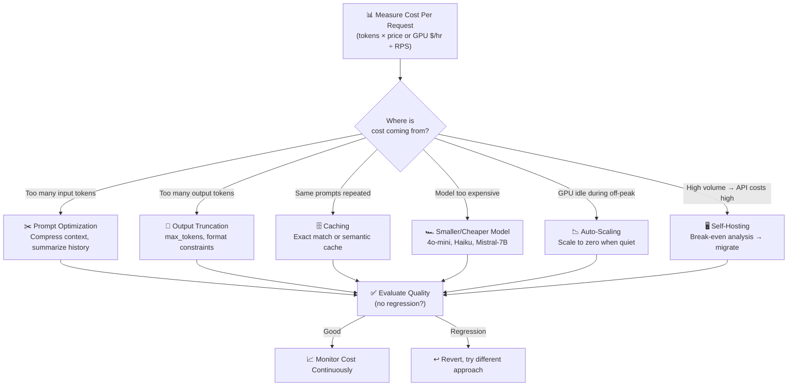

# Theory — Cost Optimization

## The Story 📖

Imagine you own a taxi company. Each car costs money the moment it leaves the garage — fuel, driver wages, insurance. Whether it's carrying a passenger or sitting in traffic waiting, the meter is running. A poorly run taxi company leaves cars idling at the depot for hours, sends a 7-seat SUV to pick up a solo traveler, and doesn't realize most passengers are going to the same three destinations. Money flows out; not enough flows in.

A smart taxi operator does the math. They right-size vehicles for trips — small cars for solo rides, big ones for groups. They carpool passengers going to the same place. They pre-position cars near the airport before rush hour. And they track every penny: cost per mile, cost per ride, idle time. They make data-driven decisions about when to idle a car, when to bring in a new driver, and when the economics of owning a car beat using a rental.

Your AI system is exactly this taxi company. GPUs are the cars — expensive whether busy or idle. Requests are the passengers. You can overspend massively by running a 70B-parameter model for every simple request, sending enormous prompts full of padding, or leaving GPU instances warm 24/7 for bursty traffic.

👉 This is **Cost Optimization** — the discipline of making your AI system do exactly what it needs to do, at exactly the right price, by eliminating waste at every layer.

---

## What is Cost Optimization?

**Cost optimization** in AI systems means reducing the monetary cost per inference request (or per thousand tokens) without reducing quality below acceptable levels. It is a continuous engineering practice, not a one-time fix.

Think of it as: **measuring and eliminating every dollar of waste between "user makes a request" and "user gets an answer."**

Two cost models exist:

**API Cost Model (pay-per-token):**
```
Cost = (input_tokens × input_price) + (output_tokens × output_price)
```

**Self-Hosting Cost Model (pay-per-hour):**
```
Cost per request = (GPU instance $/hour) / (requests per hour)
```

The right model depends on your scale. At low volume, APIs win. At high volume, self-hosting wins. The **break-even point** is where the per-request cost of both models is equal.

**Key cost levers:**
- **Model selection**: Smaller models cost 10-100x less per token
- **Prompt length**: Fewer input tokens = lower cost
- **Caching**: Skip inference entirely for repeated inputs
- **Batching**: Spread fixed GPU costs over more requests
- **Spot instances**: 60-90% cheaper than on-demand, with interruption risk
- **Prompt caching**: Cache system prompt KV state (up to 90% discount on cached tokens)

---

## How It Works — Step by Step

1. **Measure current costs** — Track cost per request, cost per user, monthly total
2. **Break down the cost** — Is it input tokens, output tokens, or compute time?
3. **Identify the biggest bucket** — Where is the money actually going?
4. **Apply targeted optimizations** — Pick techniques that hit your biggest cost bucket
5. **Monitor for quality regression** — Cost cuts that break quality are not wins
6. **Repeat** — Optimize the next-biggest bucket



---

## Real-World Examples

1. **A legal AI startup's context management**: Each contract review sent the full 50,000-word contract as context every time a question was asked. By implementing a RAG pipeline (retrieving only the 3 most relevant clauses), they reduced input tokens from 35,000 to 800 per request — an 97% reduction in input costs.

2. **Anthropic prompt caching**: A customer support bot has a 10,000-token system prompt with company policies and product catalog. With prompt caching enabled, those 10,000 tokens are cached on Anthropic's servers and re-used across requests. Cache hit rate: 85%. The 10,000 tokens go from $0.015/request (at $3/M tokens) to $0.00225/request when cached (90% discount on cache read). At 100,000 requests/day, savings: ~$1,100/day.

3. **A SaaS company's model routing**: They were using Claude Opus for every request. After analyzing logs, they found 72% of requests were simple classification or template-filling tasks. They routed those to Claude Haiku (25x cheaper per token). Net cost reduction: 85% at the same quality level.

4. **Video processing startup on spot instances**: Their batch inference pipeline (process videos nightly, no real-time SLA) moved from on-demand A100 instances ($3.50/hr) to spot instances ($0.40/hr). Interruptions happen ~15% of the time — they just checkpoint and resume. Cost reduction: 89%.

5. **Semantic caching for a Q&A bot**: A documentation chatbot found that users asked the same ~500 questions in different phrasings. Using semantic caching (embedding comparison at similarity > 0.95), they achieved a 55% cache hit rate — cutting inference costs by more than half.

---

## Common Mistakes to Avoid ⚠️

**1. Cutting costs without measuring quality impact**
The most dangerous mistake. You switch from a large model to a tiny one, your cost drops 90%, and your users quietly stop trusting the answers. Always A/B test on a real evaluation set before rolling out a cheaper model.

**2. Over-engineering cost cuts for low-volume systems**
Building a complex multi-tier model routing system costs engineering time that may never pay off if you have 100 requests/day. Calculate the ROI: if savings are $50/month, don't spend 3 engineer-weeks building the optimization.

**3. Ignoring output token costs**
Many engineers optimize input tokens (shorter prompts) but ignore that output tokens often cost 3-5x more per token than input tokens (in APIs like Claude, GPT-4). If your model tends to be verbose, adding explicit brevity instructions or limiting `max_tokens` can cut output costs by 40-60%.

**4. Not modeling the self-hosting break-even correctly**
Self-hosting costs include more than GPU time: engineering time to manage infrastructure, reliability overhead, the cost of on-call rotations, and the opportunity cost of not using that engineering time for product work. A realistic total cost of ownership analysis often shows that self-hosting makes sense at 10x higher volume than the naive calculation suggests.

---

## Connection to Other Concepts 🔗

- **Latency Optimization** → Many latency wins also reduce cost: quantization makes models faster AND cheaper to run. See [02_Latency_Optimization](../02_Latency_Optimization/Theory.md).
- **Caching Strategies** → Caching is the most direct cost reduction lever — free the inference entirely. See [04_Caching_Strategies](../04_Caching_Strategies/Theory.md).
- **Observability** → You cannot optimize cost without measuring it. Per-request cost tracking is essential. See [05_Observability](../05_Observability/Theory.md).
- **Fine-Tuning in Production** → Fine-tuning a small model can match a large model's quality at a fraction of the cost. See [08_Fine_Tuning_in_Production](../08_Fine_Tuning_in_Production/Theory.md).
- **Scaling AI Apps** → Auto-scaling (scale to zero when idle) is the key infrastructure tool for cost management. See [09_Scaling_AI_Apps](../09_Scaling_AI_Apps/Theory.md).

---

✅ **What you just learned:** AI cost comes from tokens (for APIs) or GPU hours (for self-hosting). The biggest levers are model selection, prompt compression, caching, and right-sizing infrastructure. Always measure quality impact after cost cuts. The break-even analysis determines when to switch from API to self-hosting.

🔨 **Build this now:** Add cost tracking to any LLM application you have. Log `input_tokens`, `output_tokens`, and `model_name` per request. Multiply by current pricing. See your daily/monthly cost. Then pick the biggest optimization.

➡️ **Next step:** [04 Caching Strategies](../04_Caching_Strategies/Theory.md) — caching is the single highest-leverage cost reduction technique.

---

## 📂 Navigation
