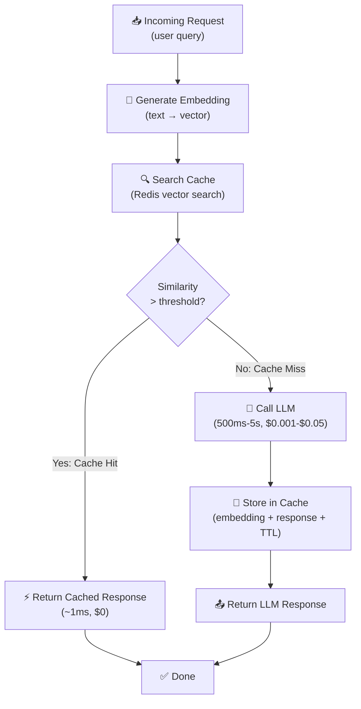

# Theory — Caching Strategies

## The Story 📖

Picture a librarian who has worked at the same library for 20 years. Every day, students and researchers come in with questions. Early in her career, she would walk to the stacks for every question — even ones she'd answered a hundred times before. It worked, but it was slow.

Over time, she started keeping a stack of sticky notes on her desk. When someone asked "What's the capital of France?", she wrote the question and answer on a sticky note. Next time, she checked the sticky notes first. The answer was right there, and she could respond in two seconds instead of two minutes. For trickier questions with multiple phrasings — "Where is the Eiffel Tower?", "What city is the Eiffel Tower in?", "France's biggest city?" — she used her judgment to recognize they were close enough to questions she'd already answered, and pulled the relevant sticky note.

That stack of sticky notes is a **cache**. And the librarian checking it before heading to the stacks is the fundamental principle behind caching in AI systems: if we already know the answer (or something close enough), skip the expensive work.

👉 This is **Caching** — storing previously computed results and returning them immediately when the same (or similar) input arrives again, avoiding expensive model inference entirely.

---

## What is Caching?

**Caching** is the practice of storing the result of an expensive operation so that future requests for the same (or similar) input can be served from the stored result instead of recomputing.

Think of it as: **a shortcut that makes frequently-traveled roads instant.**

In AI systems, there are three distinct types of caching — each targeting a different layer:

- **Exact-match caching**: Store the literal (input → output) pair. If the exact same input arrives, return the cached output immediately.
- **Semantic caching**: Store (embedding, output) pairs. If a new input is *similar* to a cached one (cosine similarity > threshold), return the cached output.
- **KV cache / prompt caching**: Cache the model's internal attention state (key-value pairs) for repeated prompt prefixes. The model skips reprocessing those tokens.

**Why is caching so powerful?**
- A cache hit costs ~1ms (Redis lookup). An LLM inference costs 500ms-5 seconds.
- A cache hit costs $0.0000001. An LLM inference costs $0.001-$0.05.
- At a 30% cache hit rate: you reduce latency and cost by 30% with almost no code.
- At a 70% hit rate: you have fundamentally changed your system economics.

---

## How It Works — Step by Step

For **exact-match caching** (simpler):
1. Hash or directly use the input string as the cache key
2. Check Redis: does this key exist?
3. Yes → return cached value (skip inference)
4. No → run inference, store result with TTL, return

For **KV cache / prompt caching**:
1. You mark parts of your prompt with `cache_control: {"type": "ephemeral"}` (Anthropic) or similar
2. The provider processes those tokens and caches the K/V attention states server-side
3. Subsequent requests with the same prefix skip reprocessing those tokens
4. You pay a reduced "cache read" price instead of the full input token price

---

## Real-World Examples

1. **Customer support FAQ bot**: 80% of questions are variations of 20 common questions. Semantic caching with threshold 0.92 catches most paraphrases. Cache hit rate: 74%. The LLM is called for only 26% of requests — mostly novel questions. Cost and latency both drop by 74%.

2. **RAG legal document assistant**: Every question about "Acme Corp's liability policy" sends the same 15,000-token policy document as context. With Anthropic's prompt caching enabled, the K/V state for those 15,000 tokens is cached. Cache hits cost 10% of normal token price. Savings: ~$3,000/month.

3. **Code autocomplete tool**: Caches the tokenized representation of the code file prefix (the "context" that doesn't change between keystrokes). This is the KV cache inside the model — modern coding assistants keep this in memory so that as you type, only the new character is processed, not the entire file.

4. **Movie recommendation API**: A streaming service caches the top-20 recommendation list per user segment (age/genre preference cluster). Recommendations for any user in segment "thriller-fan-25-34" are the same — the response is cached for 6 hours. The ML model runs for the first request per segment, then cache handles millions of page loads.

5. **Embedding search (exact match)**: A company embeds every employee question to their internal HR chatbot. They maintain a Redis index of previous question embeddings. If a new question has cosine similarity > 0.95 with a cached question, they return the previous answer. This dramatically reduces both API costs and database load.

---

## Common Mistakes to Avoid ⚠️

**1. Setting similarity threshold too low**
A threshold of 0.80 cosine similarity might cause "How do I reset my password?" and "Can I delete my account?" to return the same cached response. These are different questions. Tune your threshold on real data — start at 0.92-0.95 for most applications.

**2. Caching without TTL (time-to-live)**
If you cache responses indefinitely, they go stale. A cached answer about your product pricing becomes wrong after a price change. Always set a TTL appropriate to how often your information changes: seconds for real-time data, hours for mostly-static content, days for truly static FAQ content.

**3. Caching user-specific or sensitive content**
Never cache a response that is personalized to a specific user and return it to a different user. If your responses include the user's account balance, order history, or private data, that data must never be served from a shared cache. Scope your cache keys to include user ID for private content, or only cache content that is genuinely public and identical for all users.

**4. Not measuring cache hit rate**
Caching without measuring hit rate is guessing. Track it. A hit rate below 10% means you're paying for Redis and getting minimal benefit. A hit rate above 90% might mean your threshold is too loose and you're serving incorrect cached responses.

---

## Connection to Other Concepts 🔗

- **Latency Optimization** → Caching is the most impactful single latency optimization available. A cache hit is near-zero latency. See [02_Latency_Optimization](../02_Latency_Optimization/Theory.md).
- **Cost Optimization** → Cache hits have near-zero marginal cost. At 50% hit rate, you cut API spending nearly in half. See [03_Cost_Optimization](../03_Cost_Optimization/Theory.md).
- **Observability** → You need to track cache hit rate, miss rate, and cache-related latency as key metrics. See [05_Observability](../05_Observability/Theory.md).
- **RAG** → RAG systems often have a fixed set of context documents. Prompt caching and result caching can massively reduce the cost of repeated queries over the same documents.

---

✅ **What you just learned:** Caching stores computed AI results to avoid repeating expensive inference. Three types: exact-match (identical inputs), semantic (similar inputs via embeddings), and KV/prompt caching (shared context at the provider level). Measure your hit rate — caching is the highest-leverage single optimization in any high-traffic AI system.

🔨 **Build this now:** Add exact-match caching with Redis to any LLM endpoint. Use `hash(str(messages))` as the key, set a 24-hour TTL, and log hit vs miss. Check your hit rate after 24 hours.

➡️ **Next step:** [05 Observability](../05_Observability/Theory.md) — now that you have caching, you need to measure whether it's working.

---

## 📂 Navigation
