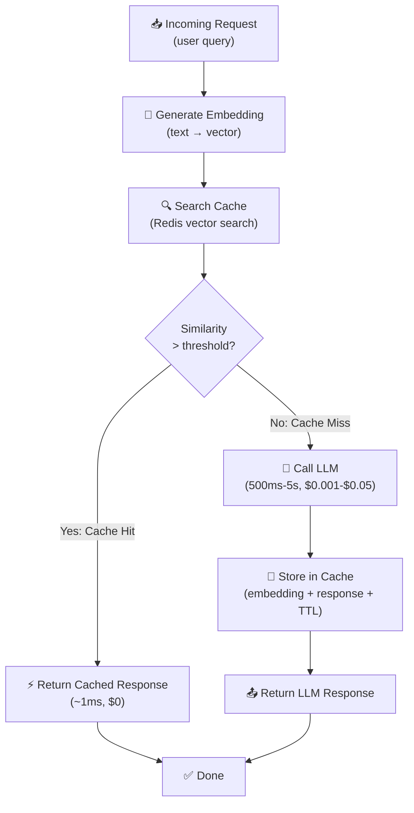

# Theory — Caching Strategies

## The Story 📖

A librarian with 20 years of experience keeps sticky notes on her desk. When someone asks "What's the capital of France?", she writes it down. Next time, she checks the sticky notes first — two seconds instead of two minutes. For similar questions with different phrasings ("Where is the Eiffel Tower?", "What city is the Eiffel Tower in?"), she uses judgment to recognize them as close enough and pulls the right note.

That stack of sticky notes is a **cache**. The librarian checking it before heading to the stacks is the core principle: if we already know the answer, skip the expensive work.

👉 This is **Caching** — storing previously computed results and returning them when the same (or similar) input arrives, avoiding expensive model inference entirely.

---

## What is Caching?

**Caching** stores the result of an expensive operation so future requests for the same or similar input can be served from storage instead of recomputing.

Three types target different layers:

- **Exact-match caching**: Store literal `(input → output)` pairs. Identical input = return cached output immediately.
- **Semantic caching**: Store `(embedding, output)` pairs. If a new input is *similar* (cosine similarity > threshold), return the cached output.
- **KV cache / prompt caching**: Cache the model's internal attention state for repeated prompt prefixes. Subsequent requests skip reprocessing those tokens.

**Why caching is powerful:**
- Cache hit: ~1ms, ~$0.0000001
- LLM inference: 500ms-5s, $0.001-$0.05
- At 30% hit rate: 30% reduction in latency and cost with almost no code
- At 70% hit rate: fundamentally different system economics

---

## How It Works — Step by Step

For **exact-match caching**: hash the input string as the cache key → check Redis → hit returns cached value, miss runs inference and stores result with TTL.

For **KV / prompt caching**: mark prompt sections with `cache_control: {"type": "ephemeral"}` → provider caches K/V attention states server-side → repeated requests with the same prefix skip reprocessing → you pay cache-read price instead of full input token price.

---

## Real-World Examples

1. **Customer support FAQ bot**: 80% of questions are variations of 20 common ones. Semantic cache at threshold 0.92 achieves 74% hit rate — the LLM handles only 26% of requests. Both cost and latency drop by 74%.
2. **RAG legal document assistant**: Same 15,000-token policy document sent as context for every question. Anthropic prompt caching cuts those tokens to 10% of normal price. At 85% hit rate: ~$3,000/month saved.
3. **Code autocomplete**: KV cache holds the tokenized file prefix. As you type, only the new character is processed — not the entire file on every keystroke.
4. **Movie recommendation API**: Top-20 recommendations per user segment cached for 6 hours. The ML model runs once per segment; millions of page loads hit cache.
5. **HR chatbot (exact match)**: Redis index of previous question embeddings at similarity > 0.95. Dramatically reduces both API costs and database load.

---

## Common Mistakes to Avoid ⚠️

**1. Similarity threshold too low** — A threshold of 0.80 might serve the same cached response to "How do I reset my password?" and "Can I delete my account?" — very different questions. Start at 0.92-0.95 and tune on real data.

**2. No TTL** — Cached answers go stale. A cached price answer becomes wrong after a price change. Set TTL appropriate to how often your data changes: seconds for real-time, hours for mostly-static, days for truly static content.

**3. Caching user-specific or sensitive content** — Never return another user's private data from a shared cache. Scope cache keys to include user ID for private content, or only cache genuinely public responses.

**4. Not measuring cache hit rate** — Track it. Below 10%: you're paying for Redis with minimal benefit. Above 90%: your threshold may be too loose and you're serving incorrect responses.

---

## Connection to Other Concepts 🔗

- **Latency Optimization** → A cache hit is near-zero latency — the single most impactful optimization: [02_Latency_Optimization](../02_Latency_Optimization/Theory.md)
- **Cost Optimization** → At 50% hit rate, you cut API spending nearly in half: [03_Cost_Optimization](../03_Cost_Optimization/Theory.md)
- **Observability** → Track hit rate, miss rate, and cache-related latency as key metrics: [05_Observability](../05_Observability/Theory.md)
- **RAG** → Fixed context documents benefit enormously from prompt caching and result caching.

---

✅ **What you just learned:** Three cache types — exact-match (identical inputs), semantic (similar inputs via embeddings), KV/prompt caching (shared context at provider level). Measure hit rate — caching is the highest-leverage single optimization in any high-traffic AI system.

🔨 **Build this now:** Add exact-match Redis caching to any LLM endpoint. Use `hash(str(messages))` as the key, 24-hour TTL, log hit vs miss. Check your hit rate after 24 hours.

➡️ **Next step:** [05 Observability](../05_Observability/Theory.md) — now that you have caching, measure whether it's working.

---

## 🛠️ Practice Project

Apply what you just learned → **[I5: Production RAG System](../../20_Projects/01_Intermediate_Projects/05_Production_RAG_System/Project_Guide.md)**
> This project uses: semantic cache (skip embedding+LLM if similar query was seen), exact-match cache for repeated queries

---

## 📂 Navigation
