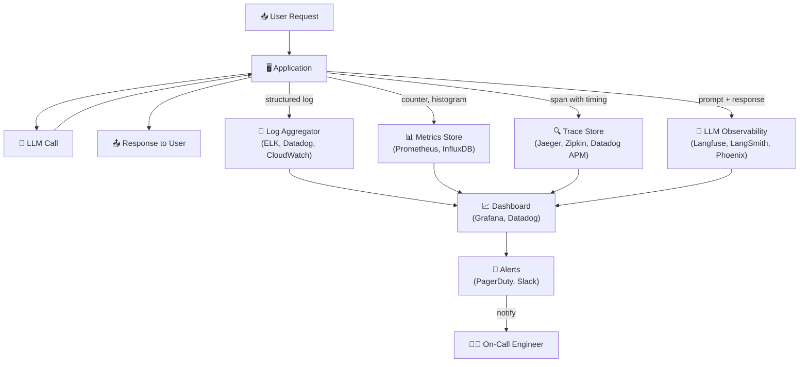

# Theory — Observability

## The Story 📖

Imagine a hospital Intensive Care Unit. Every patient in the ICU is connected to a set of monitors: heart rate, blood pressure, oxygen saturation, respiratory rate, temperature. Nurses watch a bank of screens. When a number goes red, an alarm sounds. The team rushes to investigate before the situation becomes a crisis.

Now imagine removing all those monitors. No displays, no alarms. The nurses still check on patients every 30 minutes. Do you think outcomes would be the same? Of course not — by the time you notice a problem with your eyes alone, it may be too late.

A production AI system without observability is exactly that. Your model is running, requests are flowing, users are getting answers — but you have no idea if it's getting slower, costing more than expected, producing worse answers, or silently failing for 5% of users. You only find out when a user tweets about it or a customer cancels.

Observability is the ICU monitor system for your AI application. It gives you real-time visibility into every dimension of your system's health, so you can catch and fix problems before they become crises.

👉 This is **Observability** — the infrastructure, practices, and tools that give you deep, real-time understanding of what your AI system is doing, how fast, at what cost, and with what quality.

---

## What is Observability?

**Observability** is the ability to understand the internal state of your system from its external outputs. A system is observable if you can answer "Why is this happening?" just from the data it produces.

Think of it as: **the difference between flying blind and flying with instruments.**

### The Three Pillars

Every observability system rests on three data types:

- **Logs** — Records of *what happened*. Timestamped events: "Request 1234 arrived at 10:30:15. Model returned response after 340ms. 1,200 input tokens consumed."
- **Metrics** — Numerical measurements of *how much / how fast*. "Requests per second: 142. P99 latency: 840ms. Cost per hour: $2.34."
- **Traces** — The journey of *where time was spent*. "Request 1234 spent: 5ms in auth, 12ms in embedding, 320ms in LLM inference, 3ms in postprocessing."

### AI-Specific Additions

Traditional software observability covers performance. AI systems need additional layers:
- **LLM quality monitoring**: Are the answers actually good? Are they hallucinating?
- **Token usage tracking**: How many tokens per request? What's the cost per request?
- **Prompt/response logging**: Capturing the actual prompts and responses for debugging and quality analysis
- **Model drift detection**: Is the model's output distribution changing over time?

---

## How It Works — Step by Step

The pipeline:
1. **Instrument the application** — Add logging, metrics, and tracing code to your application
2. **Collect data** — Ship data to centralized stores (Prometheus for metrics, ELK for logs, Jaeger for traces)
3. **Visualize** — Build dashboards that show your key health indicators in real time
4. **Alert** — Set threshold-based alerts: "If error_rate > 1% for 5 minutes, page me"
5. **Investigate** — When alerted, use traces to drill into specific requests and understand root cause
6. **Improve** — Fix the problem, verify via metrics, and potentially set tighter SLOs

---

## Real-World Examples

1. **Detecting a latency regression**: After a model update, the Grafana dashboard shows P99 latency jumping from 800ms to 3,200ms. Traces reveal the new model has 4x more parameters. Team rolls back the update within 10 minutes — before most users notice.

2. **Catching cost overrun**: A new feature was accidentally sending 20x more context than intended (a bug in the history truncation logic). The daily cost alert fires when the day's spend reaches 120% of the 7-day average at 10am. The engineer finds and fixes the bug by noon, saving $2,000 in API costs.

3. **Quality degradation detection via LangSmith**: After a prompt change, the LLM-as-judge quality score drops from 4.2/5 to 3.1/5. The observability system catches this before any user reports a problem. The prompt change is reverted.

4. **Abuse detection**: A single user is making 10,000 requests per hour (likely an automated attack or crawl). The per-user token usage metric triggers an alert. The account is rate-limited automatically.

5. **Prompt injection detection**: A Langfuse dashboard showing unusual system prompt override attempts (prompt injection) triggers an alert. The security team investigates and patches the input validation.

---

## Common Mistakes to Avoid ⚠️

**1. Only logging errors, not happy paths**
You need to log every request — successful and failed. Otherwise, your observability data is a biased sample and you can't calculate error rates, latency percentiles, or cost.

**2. Not setting up alerts until something breaks**
Alerts should be set up before you need them. "We'll add alerting after launch" is how you first learn about an outage from an angry customer tweet. Set up at minimum: error rate alert, latency spike alert, and daily cost threshold alert before going live.

**3. Logging prompts and responses without considering privacy**
Your logs will contain user inputs, which may include personal information, passwords accidentally typed, sensitive business data. Before logging prompt/response pairs, implement PII scrubbing, set appropriate log retention policies, and ensure only authorized personnel can access raw logs.

**4. Alert fatigue from too many low-signal alerts**
If your alerts fire constantly for minor variations, engineers start ignoring them. Set thresholds at genuinely actionable levels. A P99 alert at "200ms" will fire constantly in normal conditions. A P99 alert at "3x the baseline rolling average" fires only on real anomalies.

---

## Connection to Other Concepts 🔗

- **Model Serving** → Observability is layered on top of your serving infrastructure. Inference servers emit the raw data. See [01_Model_Serving](../01_Model_Serving/Theory.md).
- **Latency Optimization** → You find latency problems through observability. Traces show exactly where time is spent. See [02_Latency_Optimization](../02_Latency_Optimization/Theory.md).
- **Cost Optimization** → You find cost problems through observability. Token usage logs power cost tracking. See [03_Cost_Optimization](../03_Cost_Optimization/Theory.md).
- **Evaluation Pipelines** → Online evaluation (monitoring quality in production) is a part of observability. See [06_Evaluation_Pipelines](../06_Evaluation_Pipelines/Theory.md).
- **Safety and Guardrails** → Guardrail trigger rates (how often inputs are blocked) are an important observability metric. See [07_Safety_and_Guardrails](../07_Safety_and_Guardrails/Theory.md).

---

✅ **What you just learned:** Observability is the three pillars (logs, metrics, traces) plus AI-specific layers (prompt/response logging, token tracking, quality monitoring). Without it, you're flying blind in production. Start with basic logging and cost tracking, add tracing and quality monitoring as you grow.

🔨 **Build this now:** Add a simple logging wrapper around every LLM call: log `timestamp`, `model`, `input_tokens`, `output_tokens`, `latency_ms`, and compute `cost`. Ship these to any log aggregation system (CloudWatch, Datadog free tier, or even a CSV file to start). Check the data daily.

➡️ **Next step:** [06 Evaluation Pipelines](../06_Evaluation_Pipelines/Theory.md) — observability tells you *that* quality changed; evaluation pipelines tell you *why*.

---

## 📂 Navigation
