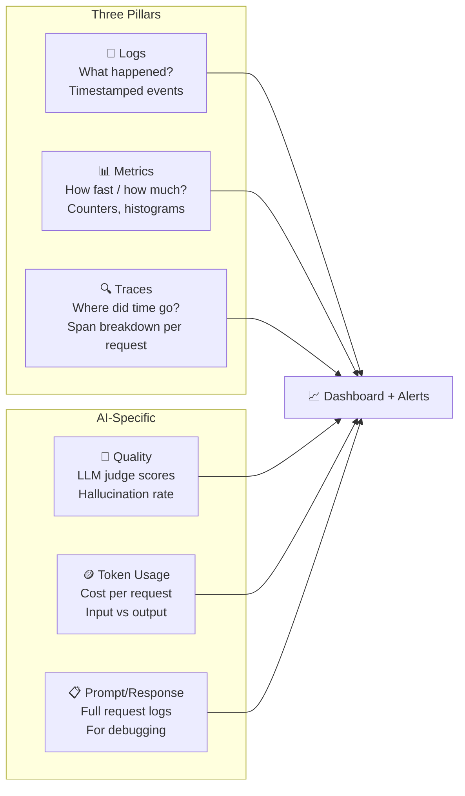
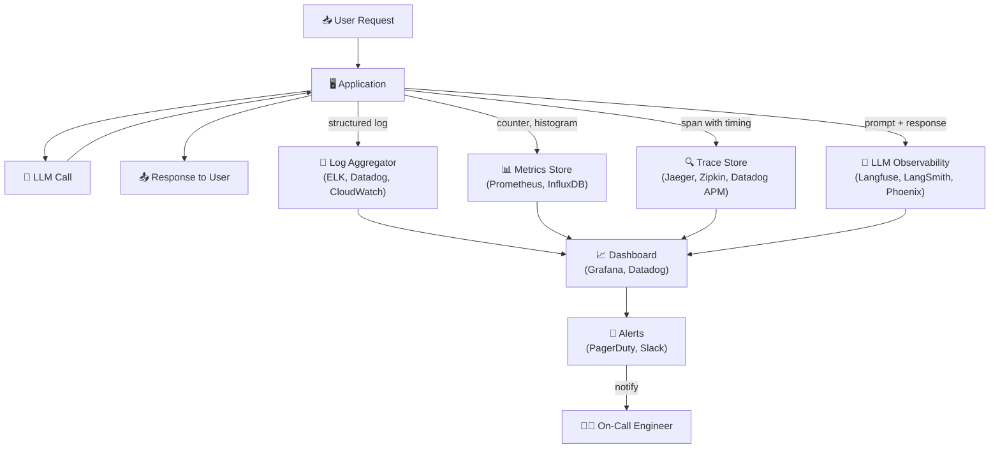

# Theory — Observability

## The Story 📖

Every patient in a hospital ICU is connected to monitors: heart rate, blood pressure, oxygen saturation. Nurses watch a bank of screens; when a number goes red, an alarm sounds. Remove those monitors — nurses check on patients every 30 minutes by eye — and outcomes collapse. By the time you notice a problem manually, it's too late.

A production AI system without observability is exactly that. Requests are flowing, users are getting answers, but you don't know if it's getting slower, costing more, or silently failing 5% of users — until a customer tweets about it.

👉 This is **Observability** — the infrastructure and practices that give you real-time visibility into every dimension of your AI system's health.

---

## What is Observability?

**Observability** is the ability to understand the internal state of your system from its external outputs. A system is observable if you can answer "Why is this happening?" from the data it produces.

### The Three Pillars

- **Logs** — *What happened*: timestamped events ("Request 1234 arrived at 10:30:15, returned after 340ms, 1,200 input tokens")
- **Metrics** — *How fast / how much*: "Requests/sec: 142. P99 latency: 840ms. Cost/hr: $2.34"
- **Traces** — *Where time was spent*: "Request 1234: 5ms auth, 12ms embedding, 320ms LLM inference, 3ms postprocessing"

### AI-Specific Additions

Traditional observability covers performance. AI systems additionally need:
- **LLM quality monitoring** — are answers actually good? hallucination rate?
- **Token usage tracking** — tokens per request, cost per request
- **Prompt/response logging** — actual prompts and responses for debugging
- **Model drift detection** — is output distribution changing over time?

---

## How It Works — Step by Step

1. **Instrument** — add logging, metrics, and tracing code to your application
2. **Collect** — ship to centralized stores (Prometheus, ELK, Jaeger)
3. **Visualize** — dashboards showing key health indicators in real time
4. **Alert** — threshold-based alerts ("if error_rate > 1% for 5 min, page me")
5. **Investigate** — use traces to drill into specific requests and find root cause
6. **Improve** — fix, verify via metrics, tighten SLOs

---

## Real-World Examples

1. **Latency regression**: After a model update, Grafana shows P99 jumping from 800ms to 3,200ms. Traces reveal the new model has 4x more parameters. Rollback in 10 minutes — before most users notice.
2. **Cost overrun**: A bug sends 20x more context than intended. The daily cost alert fires at 120% of 7-day average at 10am. Fixed by noon, saving $2,000 in API costs.
3. **Quality degradation via LangSmith**: After a prompt change, LLM-as-judge score drops from 4.2/5 to 3.1/5. Caught before any user report. Prompt change reverted.
4. **Abuse detection**: A single user makes 10,000 requests/hour. Per-user token metric triggers auto rate-limiting.
5. **Prompt injection detection**: Langfuse dashboard shows unusual system prompt override attempts. Security team investigates and patches input validation.

---

## Common Mistakes to Avoid ⚠️

**1. Only logging errors** — Log every request — successful and failed. Without it, you can't calculate error rates, latency percentiles, or cost.

**2. Adding alerts after something breaks** — Set up at minimum: error rate alert, latency spike alert, and daily cost threshold alert *before* going live.

**3. Logging prompts without considering privacy** — User inputs may contain PII, passwords, sensitive data. Implement PII scrubbing, set log retention policies, and restrict access to raw logs.

**4. Alert fatigue from low-signal alerts** — A P99 alert at "200ms" fires constantly. A P99 alert at "3x the baseline rolling average" fires only on real anomalies.

---

## Connection to Other Concepts 🔗

- **Model Serving** → Inference servers emit the raw observability data: [01_Model_Serving](../01_Model_Serving/Theory.md)
- **Latency Optimization** → Traces show exactly where time is spent: [02_Latency_Optimization](../02_Latency_Optimization/Theory.md)
- **Cost Optimization** → Token usage logs power cost tracking: [03_Cost_Optimization](../03_Cost_Optimization/Theory.md)
- **Evaluation Pipelines** → Online evaluation is the quality dimension of observability: [06_Evaluation_Pipelines](../06_Evaluation_Pipelines/Theory.md)
- **Safety and Guardrails** → Guardrail trigger rates are an important observability metric: [07_Safety_and_Guardrails](../07_Safety_and_Guardrails/Theory.md)

---

✅ **What you just learned:** Observability = three pillars (logs, metrics, traces) + AI-specific layers (prompt/response logging, token tracking, quality monitoring). Without it, you're flying blind in production. Start with basic logging and cost tracking; add tracing and quality monitoring as you grow.

🔨 **Build this now:** Add a logging wrapper around every LLM call: log `timestamp`, `model`, `input_tokens`, `output_tokens`, `latency_ms`, and compute `cost`. Ship to any log aggregation system (CloudWatch, Datadog free tier, or even a CSV). Check daily.

➡️ **Next step:** [06 Evaluation Pipelines](../06_Evaluation_Pipelines/Theory.md) — observability tells you *that* quality changed; evaluation tells you *why*.

---

## 🛠️ Practice Project

Apply what you just learned → **[A5: Fine-Tune → Evaluate → Deploy](../../22_Capstone_Projects/15_Fine_Tune_Evaluate_Deploy/03_GUIDE.md)**
> This project uses: latency tracking per request, token logging, cost per query dashboard, structured logs for debugging

---

## 📂 Navigation
