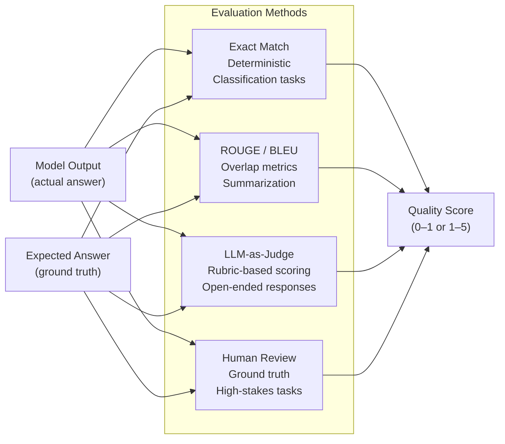
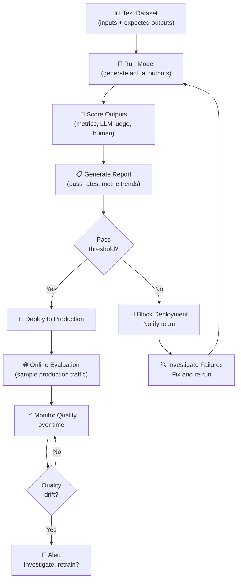

# Theory — Evaluation Pipelines

## The Story 📖

You work quality control on a factory assembly line — 1,000 products per hour. You can't manually inspect all of them, so you design a systematic process: sample 50 per hour, run 8 quality checks, record pass rates, trigger an alert if any check drops below 95%. When a new machine setting is tested, you run the evaluation on a test batch before switching the whole line.

AI systems need exactly this quality control. But the challenge is harder: "good" for an AI response isn't as obvious as "the gear fits the shaft." You're evaluating nuanced things — accuracy, helpfulness, format adherence, grounding in context.

👉 This is **Evaluation Pipelines** — the systematic process of measuring AI output quality, both before deployment (offline) and in production (online), using automated metrics, LLM judges, and human review.

---

## 📌 Learning Priority

**Must Learn** — core concepts, needed to understand the rest of this file:
[What is an Evaluation Pipeline?](#what-is-an-evaluation-pipeline) · [Two Types of Evaluation](#two-types-of-evaluation) · [Evaluation Method Types](#evaluation-method-types)

**Should Learn** — important for real projects and interviews:
[How It Works](#how-it-works--step-by-step) · [Common Mistakes](#common-mistakes-to-avoid-)

**Good to Know** — useful in specific situations, not needed daily:
[Real-World Examples](#real-world-examples)

**Reference** — skim once, look up when needed:
[Connection to Other Concepts](#connection-to-other-concepts-)

---

## What is an Evaluation Pipeline?

An **evaluation pipeline** is an automated system that:
1. Takes model inputs + expected outputs (a test set)
2. Runs the model to get actual outputs
3. Scores outputs against quality criteria
4. Reports pass/fail rates and metric trends
5. Triggers alerts or blocks deployment when quality drops

### Two Types of Evaluation

**Offline evaluation** (before deployment):
- Tests on a curated benchmark with known correct answers
- Runs on every code/model change (like unit tests in software)
- Gates new model versions, catches regressions, compares approaches

**Online evaluation** (in production):
- Monitors live traffic samples
- A/B tests between model versions
- Human review of flagged responses
- Detects drift, measures real-world quality, informs future training

### Evaluation Method Types

1. **Exact match / deterministic**: Output matches expected answer exactly. Used for classification, extraction, structured output.
2. **Statistical metrics**: BLEU, ROUGE — overlap-based scores for summarization/translation.
3. **LLM-as-judge**: A powerful model (GPT-4, Claude) scores responses on a rubric — most flexible, closest to human judgment.
4. **Human evaluation**: Ground truth for hard cases — expensive but most reliable.
5. **RAG-specific**: RAGAS framework — faithfulness, answer relevance, context precision.

---

## How It Works — Step by Step

1. **Build test set** — collect (input, expected_output) pairs from real use cases
2. **Define criteria** — what does "good" mean for your task?
3. **Choose method** — exact match, LLM judge, ROUGE, etc.
4. **Run offline eval** — generate outputs for all test inputs, score them
5. **Review failures** — understand why low-scoring outputs failed
6. **Set threshold** — e.g., "score ≥ 4/5 on 90% of test cases"
7. **Integrate into CI/CD** — block merges that degrade below threshold
8. **Monitor online** — sample production traffic, run eval asynchronously

---

## Real-World Examples

1. **Customer support bot regression testing**: 200 test conversations scored by LLM judge on every PR. Merges blocked if average score drops below 4.0/5. Results posted as PR comment.
2. **RAG pipeline with RAGAS**: Legal Q&A system evaluates faithfulness, answer relevance, and context precision weekly — catches when chunking changes degrade retrieval quality.
3. **Medical summary evaluation**: Doctors review 50 AI summaries/week for accuracy and completeness. New models must score ≥ 95% on a 100-sample human eval before deployment.
4. **A/B prompt testing**: 50/50 traffic split between prompt versions. LLM judge scores sampled responses from both. After 48 hours and 5,000 responses, the winning prompt rolls to 100%.
5. **Code generation**: Every model update runs generated code against unit tests. Pass rate must be ≥ 85% on 500 coding problems before shipping.

---

## Common Mistakes to Avoid ⚠️

**1. Test set that doesn't represent production** — Hand-picked examples that the model handles well produce false confidence. Curate test sets from actual user queries, including edge cases and known failure modes.

**2. Using LLM-as-judge with the same model you're evaluating** — The judge and evaluated model share the same biases and blind spots. Use a different model as judge, or use human evaluation for sensitive domains.

**3. Treating evaluation as a one-time setup** — User query distribution changes, new failure modes emerge, old test cases become irrelevant. Review and refresh your test set quarterly.

**4. No evaluation before shipping model updates** — Evaluation should block deployment, not trail it. Integrate it into CI/CD like unit tests.

---

## Connection to Other Concepts 🔗

- **Observability** → Online evaluation is the quality dimension of observability: [05_Observability](../05_Observability/Theory.md)
- **Fine-Tuning in Production** → Every fine-tuning run must pass the eval pipeline before deployment: [08_Fine_Tuning_in_Production](../08_Fine_Tuning_in_Production/Theory.md)
- **Safety and Guardrails** → Safety evaluation checks for harmful outputs and policy compliance: [07_Safety_and_Guardrails](../07_Safety_and_Guardrails/Theory.md)
- **RAG systems** → RAGAS is the standard evaluation framework for RAG pipelines.

---

✅ **What you just learned:** Evaluation pipelines are your quality control system. Offline evaluation catches regressions before deployment; online evaluation monitors quality in production. LLM-as-judge is the most scalable metric for open-ended responses. Integrate evals into CI/CD to block bad deployments.

🔨 **Build this now:** Create a test set of 20 (input, expected_output) pairs for any LLM feature. Write a script that runs the model on all 20, scores each response 1-5 with an LLM judge, and prints a pass rate. Run before your next code change.

➡️ **Next step:** [07 Safety and Guardrails](../07_Safety_and_Guardrails/Theory.md) — evaluation catches quality issues; guardrails prevent harmful outputs in real time.

---

## 📂 Navigation
