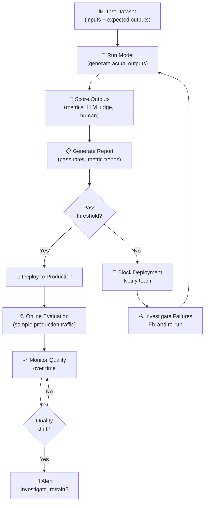

# Theory — Evaluation Pipelines

## The Story 📖

Imagine you work quality control on a factory assembly line. Every hour, 1,000 products roll off the line. You can't manually inspect all of them — that's impossible. So you design a systematic testing process: sample 50 products per hour, run them through 8 specific quality checks, record the pass rates, and trigger an alert if any check drops below 95%. When a new machine setting is tested, you run the evaluation on a test batch before switching the whole line.

Without this system, you'd only know about defects when a customer returns a broken product. With it, you catch problems immediately, before they ship. The tests themselves define what "good" means — they are the specification made concrete.

AI systems need exactly this kind of quality control line. But the challenge is harder: "good" for an AI response is not as obvious as "the gear fits the shaft." You're evaluating nuanced things like: Is this answer accurate? Is it helpful? Does it follow the format? Is it grounded in the provided context? These require thoughtful evaluation design.

👉 This is **Evaluation Pipelines** — the systematic process of measuring AI output quality, both before deployment (offline) and in production (online), using automated metrics, LLM judges, and human review.

---

## What is an Evaluation Pipeline?

An **evaluation pipeline** is an automated system that:
1. Takes model inputs + expected outputs (a test set)
2. Runs the model to get actual outputs
3. Scores the outputs against quality criteria
4. Reports pass/fail rates and metric trends
5. Triggers alerts or blocks deployment when quality drops

Think of it as: **a continuous quality control system that runs 24/7 and tells you immediately when your AI starts getting worse.**

### Two Types of Evaluation

**Offline evaluation** (before deployment):
- Test on a curated benchmark dataset with known correct answers
- Run on every code/model change (like unit tests in software)
- Fast feedback loop — run in CI/CD pipeline
- Used to: gate new model versions, catch regressions, compare approaches

**Online evaluation** (in production):
- Monitor live traffic samples
- A/B tests between model versions
- Human review of flagged responses
- Used to: detect drift, measure real-world quality, inform future training

### Evaluation Method Types

1. **Exact match / deterministic metrics**: Does the output exactly match the expected answer? Used for classification, extraction, structured output.
2. **Statistical metrics**: BLEU, ROUGE — overlap-based scores for summarization/translation.
3. **LLM-as-judge**: Use a powerful model (GPT-4, Claude) to evaluate responses on a rubric. The most flexible and closest to human judgment.
4. **Human evaluation**: Ground truth for hard cases. Expensive but most reliable.
5. **RAG-specific**: RAGAS framework — faithfulness, answer relevance, context precision.

---

## How It Works — Step by Step

Step by step:
1. **Build your test set** — collect (input, expected_output) pairs from real use cases
2. **Define your evaluation criteria** — what does "good" mean for your task?
3. **Choose evaluation method** — exact match, LLM judge, ROUGE, etc.
4. **Run offline eval** — generate model outputs for all test inputs, score them
5. **Review failures** — understand why low-scoring outputs failed
6. **Set a pass threshold** — e.g., "score must be ≥ 4/5 on 90% of test cases"
7. **Integrate into CI/CD** — block merges that degrade quality below threshold
8. **Monitor online** — sample production traffic, run the same evaluation asynchronously

---

## Real-World Examples

1. **Customer support bot regression testing**: A company has 200 test conversations (each with a prompt and an ideal reference answer). On every PR, the eval pipeline runs the new model/prompt on all 200, scores them with an LLM judge, and comments the results on the GitHub PR. Merges are blocked if the average score drops below 4.0/5.

2. **RAG pipeline evaluation with RAGAS**: A legal Q&A system uses RAGAS to evaluate: faithfulness (does the answer contradict the retrieved context?), answer relevance (does the answer address the question?), and context precision (were the right documents retrieved?). A weekly eval run catches when document chunking changes degrade retrieval quality.

3. **Medical summary evaluation**: A healthcare startup uses human doctors to review 50 AI-generated summaries per week. Doctors rate accuracy and completeness. This feeds into a quality trend dashboard. When a new model is considered, it must score ≥ 95% on a 100-sample human eval before deployment.

4. **A/B testing for prompt improvements**: 50% of live traffic goes to prompt version A, 50% to version B. An LLM judge scores sampled responses from both. After 48 hours and 5,000 responses, the winning prompt (higher LLM judge score, no latency regression) is rolled out to 100%.

5. **Code generation accuracy**: An AI coding tool evaluates every model update by running the generated code against actual unit tests. Pass rate must be ≥ 85% on a suite of 500 coding problems (from LeetCode and real codebases) before any model update ships.

---

## Common Mistakes to Avoid ⚠️

**1. Test set that doesn't represent production distribution**
If your test set is too easy (hand-picked examples that you know the model handles well) or too narrow (only one type of query), your evaluation will pass when real-world performance is poor. Curate test sets from actual user queries, including edge cases and failure modes you've seen.

**2. Using LLM-as-judge with the same model you're evaluating**
If you ask GPT-4 to evaluate GPT-4's outputs, the judge and the evaluated model share the same biases and blind spots. Use a different model as judge (evaluate GPT-4 with Claude, or vice versa), or use human evaluation for sensitive domains.

**3. Treating evaluation as a one-time setup**
Evaluation needs are not static. As your product evolves, the distribution of user queries changes, new failure modes emerge, and old test cases become irrelevant. Review and refresh your test set quarterly.

**4. No evaluation before shipping model updates**
"We'll just check the metrics after deployment" is how you ship regressions to all your users. Evaluation should block deployment, not trail it. Integrate it into your CI/CD pipeline like you would unit tests.

---

## Connection to Other Concepts 🔗

- **Observability** → Online evaluation is a part of observability — it's the quality dimension. Production metrics tell you about speed and cost; evaluations tell you about quality. See [05_Observability](../05_Observability/Theory.md).
- **Fine-Tuning in Production** → Every fine-tuning run must be evaluated before deployment. The eval pipeline is your gate. See [08_Fine_Tuning_in_Production](../08_Fine_Tuning_in_Production/Theory.md).
- **Safety and Guardrails** → Safety evaluation is a specialized evaluation type — checking for harmful outputs, compliance with policies. See [07_Safety_and_Guardrails](../07_Safety_and_Guardrails/Theory.md).
- **RAG systems** → RAGAS is the standard evaluation framework for RAG pipelines, covering retrieval quality and answer faithfulness.

---

✅ **What you just learned:** Evaluation pipelines are your quality control system. Offline evaluation catches regressions before deployment (test set + automated scoring). Online evaluation monitors quality in production (sampling + LLM judge). LLM-as-judge is the most scalable quality metric for open-ended responses. Integrate evals into CI/CD to block bad deployments.

🔨 **Build this now:** Create a test set of 20 representative (input, expected_output) pairs for any LLM feature you've built. Write a script that runs the model on all 20, uses an LLM judge to score each response 1-5, and prints a pass rate. Run it before your next code change.

➡️ **Next step:** [07 Safety and Guardrails](../07_Safety_and_Guardrails/Theory.md) — evaluation catches quality issues; guardrails prevent harmful outputs in real time.

---

## 📂 Navigation
