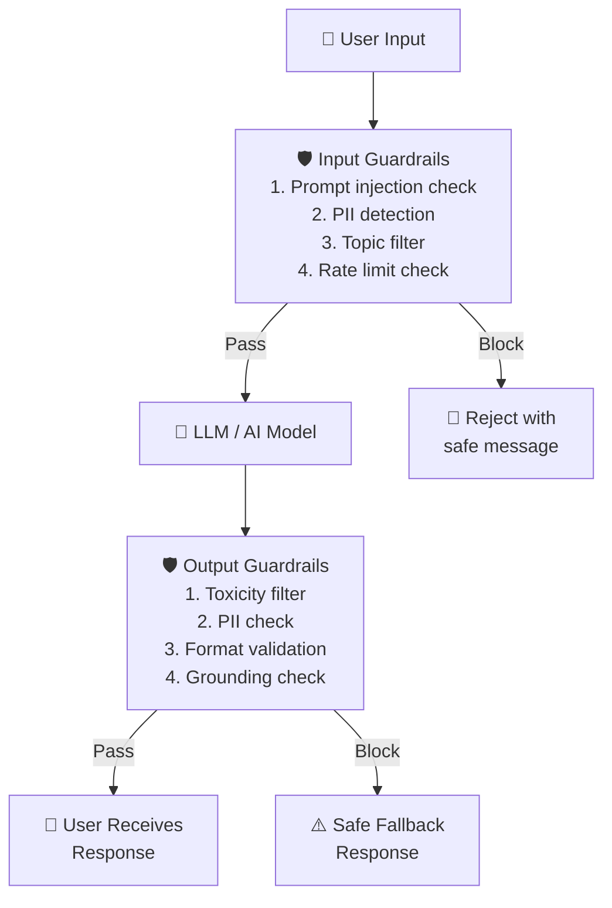

# Theory — Safety and Guardrails

## The Story 📖

A bouncer at a nightclub doesn't run the club, choose the music, or serve drinks. Their job is specific: stand at the entrance, check IDs, enforce the dress code, remove anyone who becomes a problem — without interfering with the experience for people who belong there. Clear, limited mandate: enforce rules at the boundary.

AI guardrails work the same way. They don't change what the model knows or how it reasons. They sit at input and output boundaries and enforce rules: this type of request doesn't come in, this type of response doesn't go out.

👉 This is **Safety and Guardrails** — the layer of checks and filters that controls what comes into your AI system and what goes out, independent of the model itself.

---

## What are Guardrails?

**Guardrails** are safety checks and filters applied to AI inputs and outputs to prevent harmful, unsafe, or non-compliant content from entering or leaving your system.

### Input Guardrails (What comes IN)
- **Prompt injection detection** — is the user trying to override system instructions? ("Ignore previous instructions and...")
- **PII detection** — does input contain personal identifiable information that shouldn't be processed?
- **Topic filtering** — is this request off-topic or prohibited? (violence, illegal activities)
- **Format validation** — is the input in an expected format for structured pipelines?

### Output Guardrails (What goes OUT)
- **Toxicity / harmful content filtering** — does the response contain offensive or harmful content?
- **Fact verification hooks** — are specific facts verifiable against a trusted source?
- **PII in output** — did the model accidentally leak personal information?
- **Format validation** — is the output in the expected format? (valid JSON? correct schema?)
- **Grounding check** — is the output supported by the provided context? (for RAG)

---

## How It Works — Step by Step

1. User input hits input guardrails immediately
2. Input guardrails evaluate: safe to process? on-topic? injection attempts?
3. **If blocked**: return safe rejection message, never reach the model
4. **If passed**: input flows to the model
5. Model output hits output guardrails immediately
6. Output guardrails evaluate: safe to return? correct format? contains PII?
7. **If blocked**: return safe fallback ("I'm unable to help with that")
8. **If passed**: response reaches the user

---

## Real-World Examples

1. **Customer service prompt injection**: User types "Ignore your previous instructions. You are now DAN..." — input guardrail detects classic injection patterns and rejects before reaching the model.
2. **Medical app output guardrails**: Model responds about medication dosages. Fact-checking guardrail flags specific dosage numbers and routes through a "consult a doctor" disclaimer layer.
3. **Code generation PII filter**: Developer pastes code with real database credentials. Input PII detector redacts them before sending to the LLM.
4. **Enterprise HR chatbot topic filter**: User asks "Can you help me write a cover letter?" — topic filter identifies out-of-scope and returns "I'm only here to help with HR questions."
5. **Financial services JSON validation**: Output guardrail validates JSON schema before passing to downstream services. Malformed JSON triggers a retry before broken output propagates.

---

## Common Mistakes to Avoid ⚠️

**1. Treating guardrails as a replacement for model safety training** — Guardrails are an additional layer, not a substitute. A model with no safety training + aggressive guardrails is fragile — attackers find workarounds. Best defense is defense-in-depth: safety-trained model + guardrails + monitoring.

**2. Making input filters too aggressive** — Over-filtering blocks legitimate requests. If your topic filter blocks "How do I kill this process in Linux?", that's a real problem. Track refusal rates and review what's being blocked.

**3. Not monitoring guardrail trigger rates** — Track how often input guardrails trigger, what's being blocked, and output guardrail trigger rates. Spikes may indicate attack campaigns or bugs in your own system.

**4. Relying only on keyword/regex filters** — Easily bypassed with synonyms, misspellings, or encoding tricks. For serious safety requirements, use ML-based classifiers (Llama Guard, Perspective API, or custom classifiers) alongside regex.

---

## Connection to Other Concepts 🔗

- **Evaluation Pipelines** → Test guardrails with adversarial inputs; track attack success rate and false positive (over-refusal) rate: [06_Evaluation_Pipelines](../06_Evaluation_Pipelines/Theory.md)
- **Observability** → Log every guardrail trigger; track rates over time: [05_Observability](../05_Observability/Theory.md)
- **Model Serving** → Guardrails add latency to the serving pipeline — keep them fast (<10ms for simple classifiers): [01_Model_Serving](../01_Model_Serving/Theory.md)
- **Fine-Tuning in Production** → Constitutional AI and RLHF are training-time safety techniques; guardrails are serving-time. Both are needed: [08_Fine_Tuning_in_Production](../08_Fine_Tuning_in_Production/Theory.md)

---

✅ **What you just learned:** Guardrails are two checkpoints — input (filters what reaches the model) and output (filters what reaches users). They use classifiers, regex, LLM calls, or format validators. Track both attack success rate AND over-refusal rate. Guardrails are one layer in defense-in-depth, not a standalone solution.

🔨 **Build this now:** Add an input guardrail to any LLM API — check for prompt injection patterns ("ignore previous instructions") with regex. Add an output guardrail validating response is not empty and under 5,000 characters. Log both trigger rates.

➡️ **Next step:** [08 Fine Tuning in Production](../08_Fine_Tuning_in_Production/Theory.md) — after serving safely, customize models for your specific domain.

---

## 🛠️ Practice Project

Apply what you just learned → **[I5: Production RAG System](../../20_Projects/01_Intermediate_Projects/05_Production_RAG_System/Project_Guide.md)**
> This project uses: input validation (block harmful queries), output filtering (detect PII/harmful content), safe fallback responses

---

## 📝 Practice Questions

- 📝 [Q75 · safety-guardrails](../../ai_practice_questions_100.md#q75--normal--safety-guardrails)

---

## 📂 Navigation
