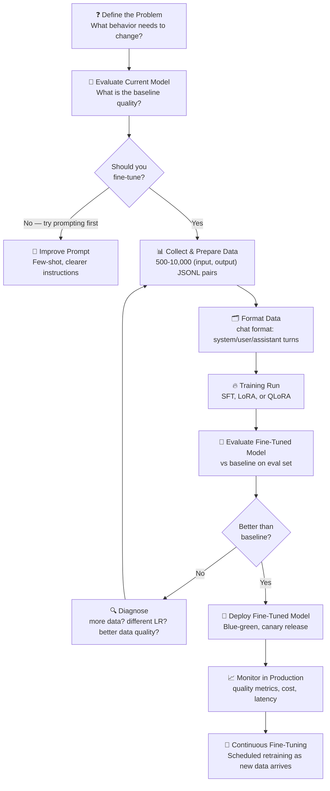

# Theory — Fine-Tuning in Production

## The Story 📖

Imagine you are hiring for a specialized role at your company. You have two options. You can bring in an outside consultant — brilliant, knows everything about the industry in general, but doesn't know your company's specific terminology, internal processes, or preferred communication style. Every engagement requires extensive briefing. The consultant is expensive and the briefings take time.

Or you can hire a new employee and invest heavily in onboarding. Three weeks of intensive training: learn our systems, our terminology, our customers, our tone of voice, our decision-making frameworks. Yes, it's expensive upfront. But after onboarding, they work completely naturally within your environment — no briefing needed, they already know it, their communication style matches exactly what you need. Over time, the cost per interaction drops dramatically.

Fine-tuning is that intensive employee onboarding. The base model (GPT-4, Claude, Llama) is the brilliant new hire — already knows everything. Fine-tuning is teaching them specifically how to work at your company. After fine-tuning, your model knows your company's exact output format, your terminology, your product catalog, your tone — without needing 2,000 tokens of system prompt reminders every time.

👉 This is **Fine-Tuning in Production** — the process of adapting a pre-trained model to your specific domain, task, or style, and then managing that custom model as a production asset.

---

## What is Fine-Tuning?

**Fine-tuning** is the process of continuing to train a pre-trained model on a new, task-specific dataset. The model's weights are updated (starting from the pre-trained checkpoint) to optimize performance on your specific use case.

Think of it as: **shifting the model's defaults — so the thing it "naturally does" matches what you need.**

### When Fine-Tuning Makes Sense

Fine-tuning is powerful but not always the right tool. It makes sense when:
- **Consistent output format/style**: You need every response in a specific structure, and prompt-based instructions aren't 100% reliable
- **Proprietary terminology**: Your company, product, or domain has specific language that a base model doesn't know
- **Latency/cost reduction**: A fine-tuned smaller model can replace a larger prompted model
- **Reducing prompt length**: If you have a 2,000-token system prompt teaching the model your format, fine-tuning can eliminate the prompt
- **Large labeled dataset**: You have thousands of (input, output) pairs that encode expert knowledge

Fine-tuning does NOT make sense when:
- You need the latest information (fine-tuning doesn't update knowledge cutoff — use RAG)
- You have limited data (< 50-100 examples — use few-shot prompting instead)
- The task changes frequently (fine-tuning is a training run, not a quick update)
- It's a one-time use case

### Fine-Tuning Methods

| Method | What Changes | Memory Need | Quality | Best For |
|---|---|---|---|---|
| **Full SFT** | All model weights | Very High | Best | Small models, ample GPU |
| **LoRA** | Low-rank adapter matrices only | Medium | Nearly as good | Most production use cases |
| **QLoRA** | LoRA + quantized base model | Low | Slight quality cost | Limited GPU memory |
| **Prompt tuning** | Learned soft prompt tokens | Very Low | Lower | Experimental |

---

## How It Works — Step by Step

Steps in detail:
1. **Define the problem**: What specific behavior are you trying to improve? Vague goals ("better quality") produce bad fine-tuning projects.
2. **Evaluate baseline**: Run your current model on your eval set. This is the bar to beat.
3. **Collect data**: Gather (input, output) pairs. The quality of your training data determines the quality of your fine-tuned model.
4. **Format**: Convert to the training format (JSONL with chat turns for most models).
5. **Train**: Run the fine-tuning job. Monitor training loss.
6. **Evaluate**: Run your eval set on the fine-tuned model. Compare to baseline.
7. **Deploy**: Use blue-green or canary deployment with ability to roll back.
8. **Monitor**: Track quality metrics in production. Data drift means you may need to retrain.

---

## Real-World Examples

1. **Legal document classification**: A law firm fine-tuned a 7B model on 5,000 labeled legal document excerpts. The fine-tuned model classifies document types (contract, pleading, brief, deposition) with 94% accuracy — matching what previously required a 70B model with a complex prompt. 10x cheaper, 8x faster.

2. **Customer email routing**: An enterprise fine-tuned a model on 10,000 labeled support emails (input: email, output: category, priority, suggested_response_template). The fine-tuned model reliably outputs perfect JSON every time — the consistent format was the primary motivation (not accuracy — the base model was accurate enough, but inconsistent output format).

3. **Code style enforcement**: A software company fine-tuned on their internal code review comments. The fine-tuned model now reviews PRs in the company's specific style and calls out their specific anti-patterns. Zero-shot prompting never reliably reproduced the exact tone and format their engineers expected.

4. **Medical note generation**: A healthcare company fine-tuned on 20,000 deidentified doctor-patient transcripts → clinical notes pairs. The fine-tuned model generates notes in the specific SOAP format their EHR requires, with their specialty's specific abbreviations. The base model needed a 3,000-token prompt to approach this — the fine-tuned version does it with 200 tokens.

5. **Product description generation**: An e-commerce company fine-tuned on 50,000 (product_attributes, description) pairs. The fine-tuned model generates descriptions in the company's brand voice, at the exact length and bullet-point format their website uses, without any complex prompting.

---

## Common Mistakes to Avoid ⚠️

**1. Fine-tuning before exhausting prompting options**
Fine-tuning is expensive and slow. Before starting, try: better prompt engineering, few-shot examples in the prompt, chain-of-thought instructions. If a 5-shot prompt solves 80% of the problem, fine-tuning for the remaining 20% may not be worth the investment.

**2. Using low-quality training data**
"Garbage in, garbage out" applies especially to fine-tuning. If your training data has inconsistencies, errors, or poor examples, the fine-tuned model will learn those errors. The best fine-tuning datasets are: consistent in style, high quality, diverse in inputs, curated by domain experts (not crowdsourced).

**3. Not having a holdout evaluation set**
If you use all your data for training and none for evaluation, you have no way to measure whether fine-tuning actually helped or just overfit to training examples. Reserve 10-20% of data as a held-out eval set and never use it in training.

**4. Catastrophic forgetting**
Fine-tuning can cause the model to "forget" general capabilities as it specializes. A model fine-tuned heavily on medical texts might lose general reasoning ability. Mitigate with: LoRA (doesn't modify base weights), keeping fine-tuning epochs low (1-3), mixing in general instruction-following data.

---

## Connection to Other Concepts 🔗

- **Model Serving** → Fine-tuned models need the same serving infrastructure, plus careful versioning. See [01_Model_Serving](../01_Model_Serving/Theory.md).
- **Evaluation Pipelines** → You MUST evaluate before deploying a fine-tuned model. The eval pipeline is your deployment gate. See [06_Evaluation_Pipelines](../06_Evaluation_Pipelines/Theory.md).
- **Cost Optimization** → A fine-tuned smaller model often costs 10-50x less than a prompted larger model. See [03_Cost_Optimization](../03_Cost_Optimization/Theory.md).
- **Observability** → Monitor quality metrics in production after deploying fine-tuned models. Data drift may require retraining. See [05_Observability](../05_Observability/Theory.md).

---

✅ **What you just learned:** Fine-tuning adapts a pre-trained model to your specific task by continuing training on your dataset. It makes sense for consistent format needs, domain-specific terminology, cost/latency reduction, and large labeled datasets. LoRA is the practical default. Always evaluate before deploying and monitor for quality drift.

🔨 **Build this now:** Prepare a JSONL file with 100 (input, output) pairs from a real task you care about. Use OpenAI's fine-tuning API (GPT-3.5-turbo) to run a fine-tuning job. Compare the fine-tuned model vs the base model on 20 held-out examples.

➡️ **Next step:** [09 Scaling AI Apps](../09_Scaling_AI_Apps/Theory.md) — once your model is fine-tuned and serving well, you need to scale it.

---

## 📂 Navigation
