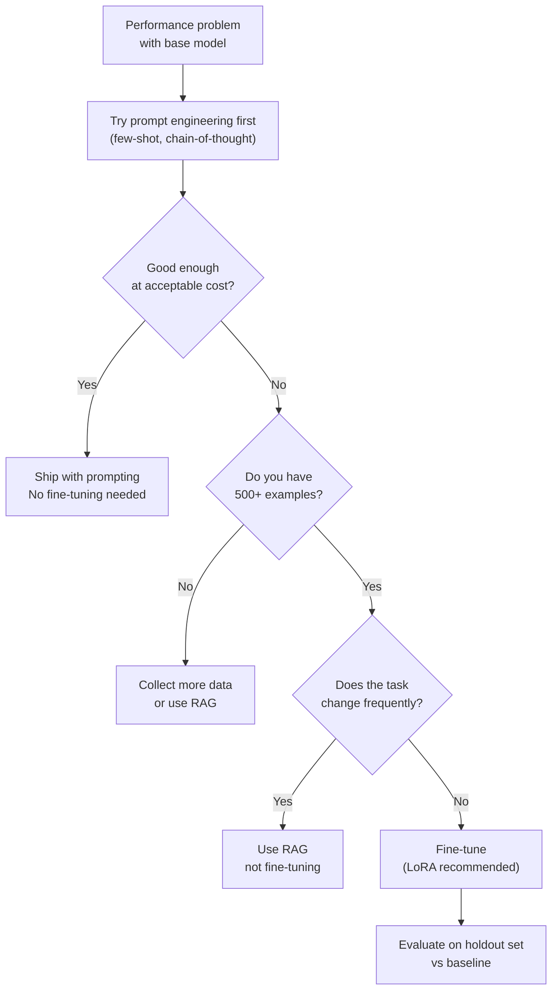
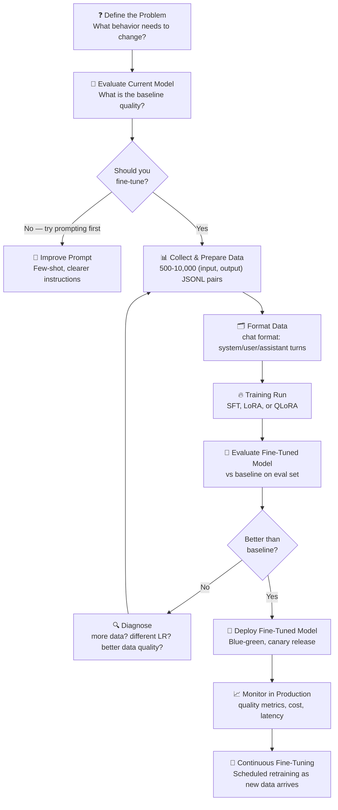

# Theory — Fine-Tuning in Production

## The Story 📖

You're hiring for a specialized role and have two options. Option A: bring in an outside consultant — brilliant, knows the industry, but doesn't know your company's terminology, processes, or communication style. Every engagement requires extensive briefing. Option B: hire someone and invest in intensive onboarding — three weeks learning your systems, terminology, customers, and tone. Expensive upfront, but after onboarding they work completely naturally within your environment with no briefing needed.

Fine-tuning is that intensive onboarding. The base model (GPT-4, Claude, Llama) is the brilliant new hire. Fine-tuning teaches them specifically how to work at your company — your output format, terminology, product catalog, tone — without needing 2,000 tokens of system prompt reminders every time.

👉 This is **Fine-Tuning in Production** — adapting a pre-trained model to your domain, task, or style, then managing that custom model as a production asset.

---

## What is Fine-Tuning?

**Fine-tuning** continues training a pre-trained model on a task-specific dataset, updating weights from the pre-trained checkpoint to optimize for your use case.

### When Fine-Tuning Makes Sense

Fine-tuning is the right tool when:
- **Consistent output format/style** — prompt-based instructions aren't 100% reliable for your required structure
- **Proprietary terminology** — your domain has specific language the base model doesn't know
- **Latency/cost reduction** — a fine-tuned smaller model can replace a larger prompted model
- **Reducing prompt length** — eliminate a 2,000-token system prompt by baking behavior into weights
- **Large labeled dataset** — you have thousands of (input, output) pairs encoding expert knowledge

Fine-tuning does NOT make sense when:
- You need the latest information (use RAG — fine-tuning doesn't update knowledge cutoff)
- You have limited data (< 50-100 examples — use few-shot prompting)
- The task changes frequently (fine-tuning is a training run, not a quick update)
- It's a one-time use case

### Fine-Tuning Methods

| Method | What Changes | Memory Need | Quality | Best For |
|---|---|---|---|---|
| **Full SFT** | All model weights | Very High | Best | Small models, ample GPU |
| **LoRA** | Low-rank adapter matrices only | Medium | Nearly as good | Most production use cases |
| **QLoRA** | LoRA + quantized base model | Low | Slight quality cost | Limited GPU memory |
| **Prompt tuning** | Learned soft prompt tokens | Very Low | Lower | Experimental |

---

## How It Works — Step by Step

1. **Define the problem** — vague goals ("better quality") produce bad fine-tuning projects
2. **Evaluate baseline** — run current model on eval set; this is the bar to beat
3. **Collect data** — quality of training data determines quality of fine-tuned model
4. **Format** — convert to JSONL with chat turns
5. **Train** — run the fine-tuning job; monitor training loss
6. **Evaluate** — compare fine-tuned vs baseline on eval set
7. **Deploy** — blue-green or canary with rollback capability
8. **Monitor** — data drift means you may need to retrain

---

## Real-World Examples

1. **Legal document classification**: 5,000 labeled excerpts fine-tuned a 7B model to 94% accuracy — matching what previously required a 70B model with a complex prompt. 10x cheaper, 8x faster.
2. **Customer email routing**: 10,000 labeled support emails trained a model to reliably output perfect JSON every time — consistent format was the primary motivation, not accuracy.
3. **Code style enforcement**: Fine-tuned on internal code review comments. The model now reviews PRs in the company's specific style and flags their specific anti-patterns — zero-shot prompting never reliably reproduced the exact tone.
4. **Medical note generation**: 20,000 deidentified transcript→note pairs. Fine-tuned model generates SOAP-format notes with specialty abbreviations using 200 tokens of prompt vs the 3,000-token prompt the base model needed.
5. **Product descriptions**: 50,000 (attributes, description) pairs. Fine-tuned model generates brand-voice descriptions at exact length and bullet format — no complex prompting required.

---

## Common Mistakes to Avoid ⚠️

**1. Fine-tuning before exhausting prompting options** — Fine-tuning is expensive and slow. If a 5-shot prompt solves 80% of the problem, fine-tuning for the remaining 20% may not be worth the investment.

**2. Low-quality training data** — Garbage in, garbage out. The best fine-tuning datasets are: consistent in style, high quality, diverse in inputs, curated by domain experts.

**3. No holdout evaluation set** — Reserve 10-20% of data as a held-out eval set and never use it in training. Otherwise you can't measure whether fine-tuning helped or just overfit.

**4. Catastrophic forgetting** — Heavy fine-tuning on specialized texts can degrade general reasoning ability. Mitigate with: LoRA (doesn't modify base weights), keeping epochs low (1-3), mixing in general instruction-following data.

---

## Connection to Other Concepts 🔗

- **Model Serving** → Fine-tuned models need the same serving infrastructure plus careful versioning: [01_Model_Serving](../01_Model_Serving/Theory.md)
- **Evaluation Pipelines** → You must evaluate before deploying — the eval pipeline is your deployment gate: [06_Evaluation_Pipelines](../06_Evaluation_Pipelines/Theory.md)
- **Cost Optimization** → A fine-tuned smaller model often costs 10-50x less than a prompted larger model: [03_Cost_Optimization](../03_Cost_Optimization/Theory.md)
- **Observability** → Monitor quality metrics in production; data drift may require retraining: [05_Observability](../05_Observability/Theory.md)

---

✅ **What you just learned:** Fine-tuning adapts a pre-trained model by continuing training on your dataset. Best for consistent format needs, domain terminology, cost/latency reduction, and large labeled datasets. LoRA is the practical default. Always evaluate before deploying; monitor for quality drift.

🔨 **Build this now:** Prepare a JSONL file with 100 (input, output) pairs from a real task. Use OpenAI's fine-tuning API (GPT-3.5-turbo) to run a fine-tuning job. Compare the fine-tuned model vs base on 20 held-out examples.

➡️ **Next step:** [09 Scaling AI Apps](../09_Scaling_AI_Apps/Theory.md) — once your model is fine-tuned and serving well, scale it.

---

## 🛠️ Practice Project

Apply what you just learned → **[A5: Fine-Tune → Evaluate → Deploy](../../20_Projects/02_Advanced_Projects/05_Fine_Tune_Evaluate_Deploy/Project_Guide.md)**
> This project uses: full QLoRA fine-tuning pipeline → evaluation → quantization → FastAPI serving → observability

---

## 📂 Navigation
