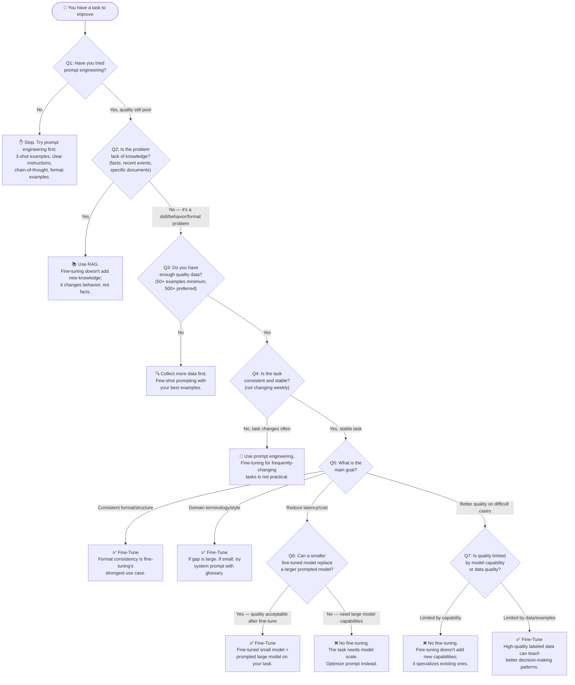

# When to Fine-Tune — Decision Guide

A systematic decision flowchart for determining whether fine-tuning is the right approach for your AI problem.

---

## The Core Question

Fine-tuning is an investment. Before starting, ask: **Is fine-tuning the most efficient path to my goal, or is there a cheaper, faster approach?**

The decision tree below helps you answer this. Go through each question in order.

---

## Decision Flowchart



---

## Quick Decision Matrix

| Scenario | Recommended Approach | Why |
|---|---|---|
| Model doesn't know recent facts | **RAG** | Fine-tuning doesn't update knowledge |
| Output format is inconsistent | **Fine-tune** | Best use case for fine-tuning |
| Model uses wrong terminology | **Fine-tune** (if large vocabulary gap) | Can be taught in fine-tuning |
| Model uses wrong terminology | **System prompt** (if small gap) | Cheaper and faster |
| Need to reduce prompt length | **Fine-tune** | Internalize instructions → shorter prompts |
| Task keeps changing | **Prompt engineering** | Can't retrain every week |
| Have < 50 examples | **Few-shot prompting** | Not enough data to fine-tune |
| One-time task | **Prompt engineering** | Training cost not justified |
| Complex multi-step reasoning | **Prompt (chain-of-thought)** | Fine-tuning rarely improves reasoning |
| Specific writing style | **Fine-tune** | Hard to capture in prompts consistently |
| Safety/policy compliance | **Both + guardrails** | Defense in depth |
| Multi-language support | **Prompt engineering first** | Base models are multilingual |
| Need personalization | **RAG + prompting** | Personalization via user context, not training |

---

## The Three Alternatives to Fine-Tuning

Before committing to fine-tuning, exhaust these options in order:

### Option 1: Prompt Engineering
**Cost**: Virtually free | **Time**: Hours | **Best for**: Format, style, behavior

```python
# Instead of fine-tuning for JSON output, try:
system_prompt = """You are a product classifier.
ALWAYS return valid JSON matching exactly this schema:
{"category": "string", "subcategory": "string", "confidence": 0.0-1.0}

Examples:
Input: "Blue jeans, men's size 32"
Output: {"category": "Clothing", "subcategory": "Pants", "confidence": 0.95}

Input: "Wireless earbuds"
Output: {"category": "Electronics", "subcategory": "Audio", "confidence": 0.92}"""
```

### Option 2: Few-Shot Prompting
**Cost**: Token cost per request | **Time**: Hours | **Best for**: Pattern-based tasks

Include 3-10 high-quality examples directly in the prompt. This is remarkably effective and eliminates the fine-tuning complexity.

### Option 3: RAG (Retrieval Augmented Generation)
**Cost**: Embedding + retrieval | **Time**: Days | **Best for**: Knowledge-intensive tasks

If the problem is "the model doesn't know X", RAG is almost always better than fine-tuning. Fine-tuning can memorize facts but doesn't reliably use them accurately and can't be updated without retraining.

---

## Fine-Tuning Method Selection

Once you've decided to fine-tune, choose the right method:

```
Q: Do you have access to the model weights?
  NO (using OpenAI/Anthropic API) → Use provider's fine-tuning API
    OpenAI: Fine-tune GPT-3.5-turbo or GPT-4o-mini
    Anthropic: No fine-tuning API yet (as of 2025); use prompting or switch model

  YES (open source model) → Choose based on resources:
    ↓
    Q: What GPU memory do you have?
      ≥ 80 GB: Full SFT possible (best quality, most expensive)
      16-40 GB: LoRA fine-tuning (nearly same quality, much cheaper)
      8-16 GB: QLoRA (LoRA + 4-bit quantization, slight quality tradeoff)
      < 8 GB: Too limited; use OpenAI API or larger cloud instance
```

---

## Data Readiness Checklist

Before starting a fine-tuning project, verify your data meets these criteria:

- [ ] **Volume**: 100+ examples minimum; 500+ preferred; 5,000+ for complex tasks
- [ ] **Quality**: Examples reviewed by domain experts, not just engineers
- [ ] **Format consistency**: Every example follows the exact same input/output format
- [ ] **Diversity**: Examples cover the full range of inputs the model will see in production
- [ ] **Edge cases**: Include examples from known failure modes (hard cases)
- [ ] **Clean holdout set**: 15-20% held out, never seen in training
- [ ] **No data leakage**: Eval examples are genuinely unseen
- [ ] **Deduplication**: Near-duplicate examples removed
- [ ] **Balanced classes**: For classification tasks, reasonable class balance

If any box is unchecked, address it before training — bad data produces bad fine-tuned models.

---

## Expected ROI by Scenario

| Scenario | Engineering Time | Ongoing Cost Savings | Break-Even |
|---|---|---|---|
| JSON format consistency | 1-2 weeks | 30-50% (shorter prompts) | 1-2 months |
| Domain terminology | 2-4 weeks | 20-40% | 2-4 months |
| Replace 70B with 7B fine-tuned | 4-8 weeks | 50-80% | 2-3 months |
| Reduce customer support quality gap | 4-8 weeks | Qualitative (user satisfaction) | Hard to quantify |
| Custom writing style | 1-2 weeks | 30% (shorter prompts) | 1-2 months |

**Rule of thumb**: Fine-tuning makes sense if:
`(monthly_API_savings) × 12 > engineering_time_cost × 2`

The ×2 accounts for maintenance, retraining, and monitoring overhead.

---

## 📂 Navigation

**In this folder:**
| File | |
|---|---|
| [📄 Theory.md](./Theory.md) | Core concepts |
| [📄 Cheatsheet.md](./Cheatsheet.md) | Quick reference |
| [📄 Interview_QA.md](./Interview_QA.md) | Interview prep |
| [📄 Code_Example.md](./Code_Example.md) | Python code examples |
| 📄 **When_to_Fine_Tune.md** | ← you are here |

⬅️ **Prev:** [07 Safety and Guardrails](../07_Safety_and_Guardrails/Theory.md) &nbsp;&nbsp;&nbsp; ➡️ **Next:** [09 Scaling AI Apps](../09_Scaling_AI_Apps/Theory.md)
