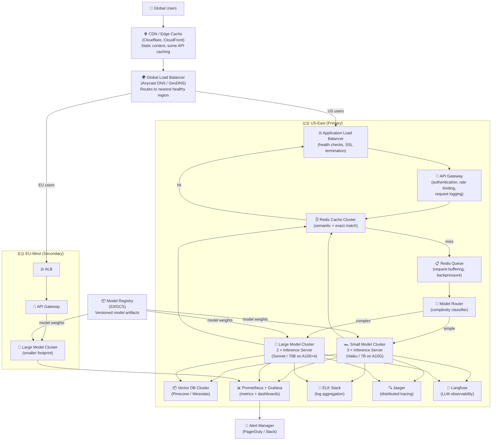
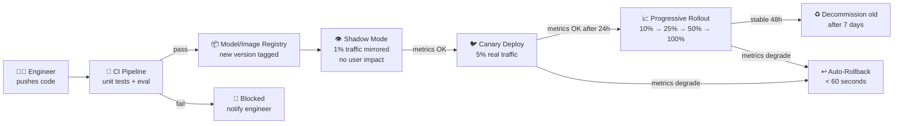

# Architecture Deep Dive — Scaling AI Apps

A comprehensive reference for production-scale AI application architectures, from single-region deployments to global distributed systems.

---

## Full Production Architecture



---

## Component-by-Component Breakdown

### CDN / Edge Layer
**Purpose**: Cache static responses (documentation, public FAQs), terminate SSL, protect against DDoS.
**For AI apps**: Can cache non-personalized responses (e.g., fixed FAQ answers). Cannot cache personalized or dynamic responses.
**Tools**: Cloudflare, AWS CloudFront, Fastly.
**Config tip**: Set `Cache-Control: no-store` on any personalized endpoint.

---

### Global Load Balancer
**Purpose**: Route users to the nearest healthy region.
**Routing strategies**:
- **Latency-based**: Route to region with lowest measured latency from user's location
- **Geolocation**: Route EU users to EU region (GDPR compliance)
- **Health-based**: If primary region fails health checks, route all traffic to secondary

**Failover configuration:**
```yaml
# AWS Route53 latency-based routing
us-east: latency routing, health check required, TTL=30s
eu-west: latency routing, health check required, TTL=30s
# If both fail: route to us-west-2 (tertiary, no health check)
```

---

### API Gateway
**Purpose**: First line of defense. Handles auth, rate limiting, logging.
**Critical functions**:

```
Incoming request →
  1. Validate JWT / API key (reject 401 if invalid)
  2. Rate limit check (reject 429 if over quota)
  3. Request size limit (reject 413 if payload > 10MB)
  4. Log request metadata (NOT the body — privacy)
  5. Add trace ID header (for distributed tracing)
  6. Route to backend
```

**Rate limiting configuration:**
```yaml
# Per-user rate limits
default_user: 100 req/min, 10,000 req/day
pro_user: 1,000 req/min, 100,000 req/day
enterprise: custom

# Per-IP rate limits (DDoS protection)
default: 500 req/min per IP
burst: 1,000 req/min for 30 seconds
```

---

### Request Queue

**Purpose**: Decouple request receipt from processing. Absorb traffic spikes.

```python
# Queue implementation with Redis Streams
import redis
import json
import time

r = redis.Redis()

class RequestQueue:
    QUEUES = {
        "realtime": "queue:rt",      # SLA: < 2s
        "standard": "queue:std",     # SLA: < 30s
        "batch": "queue:batch"       # SLA: < 10min
    }

    def enqueue(self, request: dict, tier: str = "standard") -> str:
        job_id = f"job_{int(time.time()*1000)}"
        request["job_id"] = job_id
        request["enqueued_at"] = time.time()

        r.lpush(self.QUEUES[tier], json.dumps(request))
        return job_id

    def dequeue(self, tier: str = "standard") -> dict | None:
        result = r.brpop(self.QUEUES[tier], timeout=1)
        if result:
            return json.loads(result[1])
        return None

    def get_queue_depth(self, tier: str) -> int:
        return r.llen(self.QUEUES[tier])
```

**Queue depth monitoring** (Prometheus scrape):
```python
# Expose queue depths as metrics
from prometheus_client import Gauge

queue_depth = Gauge('inference_queue_depth', 'Current queue depth', ['tier'])
for tier in ["realtime", "standard", "batch"]:
    queue_depth.labels(tier=tier).set(queue.get_queue_depth(tier))
```

---

### Model Router

**Purpose**: Direct each request to the most cost-efficient model that can handle it.

```python
from enum import Enum

class ModelTier(Enum):
    CHEAP = "claude-3-haiku-20240307"      # $0.25/$1.25 per M tokens
    STANDARD = "claude-3-5-sonnet-20241022" # $3.00/$15.00 per M tokens
    PREMIUM = "claude-opus-4-6"            # $15.00/$75.00 per M tokens

def route_to_model(request: dict) -> ModelTier:
    """Route request to appropriate model tier."""
    query = request.get("query", "")
    user_tier = request.get("user_tier", "free")

    # Premium users always get standard+
    if user_tier == "enterprise":
        return ModelTier.STANDARD  # Still use standard unless explicitly needing premium

    # Short, simple queries → cheap model
    tokens = len(query.split())
    if tokens < 30:
        return ModelTier.CHEAP

    # Long queries or complex operations → standard
    if tokens > 200 or needs_complex_reasoning(query):
        return ModelTier.STANDARD

    return ModelTier.CHEAP

def needs_complex_reasoning(query: str) -> bool:
    signals = ["analyze", "compare", "explain why", "write a", "summarize",
               "step by step", "calculate", "design", "debug"]
    return any(s in query.lower() for s in signals)
```

---

### Inference Server Clusters

**Small model cluster** (cost-optimized):
```yaml
# Kubernetes Deployment
replicas: 3           # Minimum warm instances
image: llm-server:haiku-v2
resources:
  requests:
    nvidia.com/gpu: 1
    memory: "16Gi"
  limits:
    nvidia.com/gpu: 1
    memory: "24Gi"
env:
  - name: MODEL_NAME
    value: "claude-3-haiku-20240307"
  - name: MAX_BATCH_SIZE
    value: "8"
  - name: BATCH_TIMEOUT_MS
    value: "10"
```

**Large model cluster** (capability-optimized):
```yaml
replicas: 2
resources:
  requests:
    nvidia.com/gpu: 4   # 4× A100 80GB for tensor parallel 70B
    memory: "320Gi"
env:
  - name: TENSOR_PARALLEL_SIZE
    value: "4"
```

---

### Auto-Scaling Configuration

```yaml
# KEDA ScaledObject — scale based on Redis queue depth
apiVersion: keda.sh/v1alpha1
kind: ScaledObject
metadata:
  name: llm-inference-scaler
spec:
  scaleTargetRef:
    name: llm-inference-small
  minReplicaCount: 2      # Always keep 2 warm
  maxReplicaCount: 20
  cooldownPeriod: 300     # 5 min cool-down before scaling down
  pollingInterval: 15     # Check every 15 seconds
  triggers:
  - type: redis
    metadata:
      address: redis:6379
      listName: queue:rt
      listLength: "50"    # Target: ~50 items per pod
  - type: redis
    metadata:
      address: redis:6379
      listName: queue:std
      listLength: "100"
```

---

## Deployment Pipeline



---

## Monitoring Dashboard Layout

```
┌─────────────────────────────────────────────────────────────┐
│ REAL-TIME HEALTH                                             │
│ Requests/sec: 342  │  Error rate: 0.03%  │  P99: 1.2s      │
├──────────────────┬──────────────────┬────────────────────────┤
│ QUEUE DEPTHS     │ GPU UTILIZATION  │ COST TRACKING          │
│ RT:   12 items   │ Small: 71%       │ This hour: $12.40      │
│ Std: 234 items   │ Large: 84%       │ Today: $187.20         │
│ Batch: 1.2K      │                  │ Budget: $250           │
├──────────────────┴──────────────────┴────────────────────────┤
│ LATENCY TRENDS (last 24h)                                    │
│ [P50 chart]    [P95 chart]    [P99 chart]                    │
├──────────────────────────────────────────────────────────────┤
│ MODEL ROUTING                                                │
│ Small model: 68% of requests                                 │
│ Large model: 32% of requests                                 │
│ Cache hits: 41% of requests                                  │
└──────────────────────────────────────────────────────────────┘
```

---

## SLA Design and Degraded Mode

```python
class ServiceTier:
    """
    Progressive degradation: maintain service at reduced quality
    rather than failing completely under extreme load.
    """

    @staticmethod
    def serve_response(request: dict, load_factor: float) -> str:
        """
        load_factor: 1.0 = normal, 2.0 = double normal load
        """
        if load_factor < 1.5:
            # Normal mode: full model, streaming
            return full_inference(request)

        elif load_factor < 2.5:
            # Degraded mode 1: use smaller model
            return fast_inference(request, model="haiku")

        elif load_factor < 4.0:
            # Degraded mode 2: use cached response if available
            cached = get_cached_response(request)
            if cached:
                return cached
            return fast_inference(request, model="haiku")

        else:
            # Degraded mode 3: queue and return "try again"
            enqueue_for_later(request)
            return "System is under high load. Your request has been queued. Estimated wait: 2-5 minutes."
```

---

## Cost Estimation at Scale

```
At 1,000,000 requests/day:

Option A: All API (Claude 3.5 Sonnet)
  Avg input:  1,500 tokens × $3/M  = $0.0045
  Avg output: 400 tokens × $15/M   = $0.006
  Per request: $0.0105
  Daily: $10,500  |  Monthly: $315,000

Option B: Model routing (70% Haiku, 30% Sonnet)
  70% × $0.00046 = $0.000322
  30% × $0.0105  = $0.00315
  Blended: $0.003472
  Daily: $3,472  |  Monthly: $104,000  ← 67% savings

Option C: Self-hosted (Llama 70B, 10 × A100 80GB)
  GPU: 10 × $5/hr × 24 = $1,200/day hardware
  Engineering overhead: ~$100/day amortized
  Daily: $1,300  |  Monthly: $39,000  ← 88% savings vs A, 63% vs B
  (Requires full MLOps capability; only makes sense at sustained high volume)
```

---

## 📂 Navigation

**In this folder:**
| File | |
|---|---|
| [📄 Theory.md](./Theory.md) | Core concepts |
| [📄 Cheatsheet.md](./Cheatsheet.md) | Quick reference |
| [📄 Interview_QA.md](./Interview_QA.md) | Interview prep |
| 📄 **Architecture_Deep_Dive.md** | ← you are here |

⬅️ **Prev:** [08 Fine Tuning in Production](../08_Fine_Tuning_in_Production/Theory.md) &nbsp;&nbsp;&nbsp; ➡️ **Next:** [01 Customer Support Agent](../../13_AI_System_Design/01_Customer_Support_Agent/Architecture_Blueprint.md)
