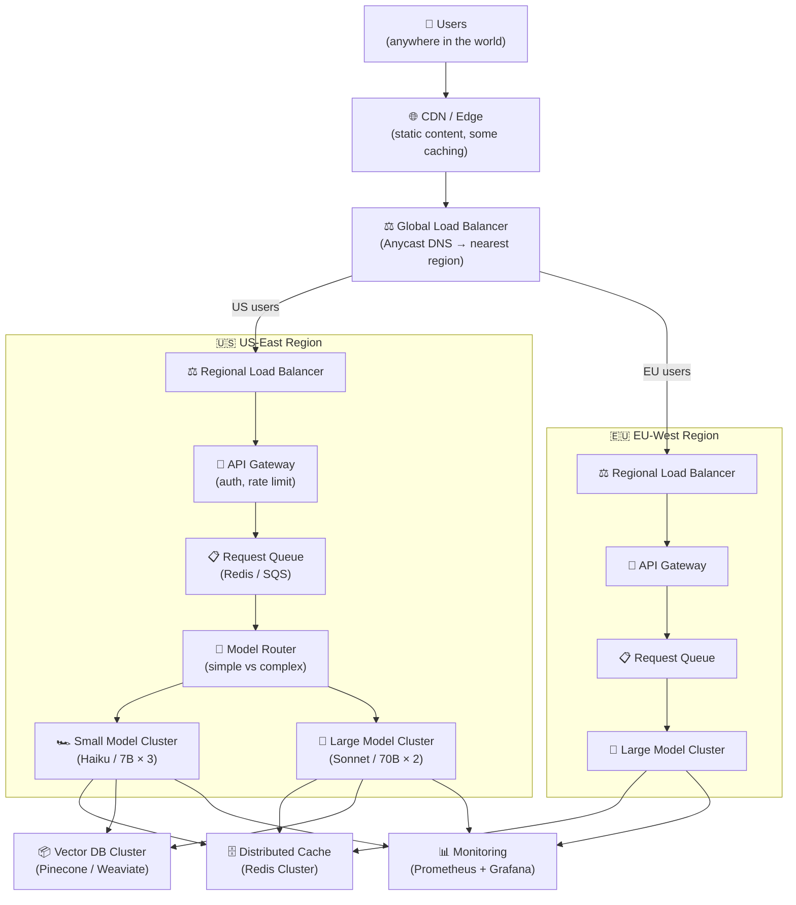

# Theory — Scaling AI Apps

## The Story 📖

You start a food truck. One truck, one menu, you behind the window — 50 happy customers per lunch hour. Then a food blogger posts about you, you go viral, and 3,000 people show up Monday. The fryer overheats. You run out of ingredients. Half the customers leave. Your five-star reputation evaporates overnight.

The food truck model doesn't scale. A restaurant chain does: multiple locations, standardized recipes, a supply chain, location managers, central operations. You don't own 50 food trucks — you build systems that allow 50 locations to operate independently but consistently.

Scaling AI applications follows the same logic. One inference server works perfectly for small traffic. The moment traffic spikes 10x-100x, it collapses. Scaling means building the chain: load balancers, multiple inference servers, auto-scaling, geographic distribution, queue management, and fallback strategies.

👉 This is **Scaling AI Apps** — the architectural patterns that allow your AI system to handle growing traffic, maintain performance under load, and operate reliably at scale.

---

## 📌 Learning Priority

**Must Learn** — core concepts, needed to understand the rest of this file:
[What is Scaling?](#what-is-scaling-in-ai-systems) · [Scaling Challenges](#scaling-challenges-specific-to-ai)

**Should Learn** — important for real projects and interviews:
[How It Works](#how-it-works--step-by-step) · [Common Mistakes](#common-mistakes-to-avoid-)

**Good to Know** — useful in specific situations, not needed daily:
[Real-World Examples](#real-world-examples)

**Reference** — skim once, look up when needed:
[Connection to Other Concepts](#connection-to-other-concepts-)

---

## What is Scaling in AI Systems?

**Scaling** is the ability to handle increased load — more requests, more users, more data — while maintaining acceptable latency, throughput, and reliability.

**Horizontal scaling** (scaling out): Add more servers/containers, each handling a fraction of traffic. Cheaper per unit, more resilient to individual failures. Default strategy for AI serving.

**Vertical scaling** (scaling up): Use a bigger machine — more GPU memory, CPU, RAM. Limited by hardware ceiling and cost. Used to enable larger models on a single node.

### Scaling Challenges Specific to AI

1. **Model loading time** — Spinning up a new inference server takes 30-60 seconds (loading weights into GPU). Rapid auto-scaling requires warm spare capacity.
2. **GPU memory constraints** — Models have a minimum VRAM requirement; you can't infinitely subdivide across tiny machines.
3. **Stateful KV cache** — Requests continuing a conversation must go to the same server or share the cache — complicates load balancing.
4. **Variable response length** — LLM responses vary from 50 to 2,000 tokens, making capacity planning harder than fixed-cost endpoints.
5. **Cold starts** — Starting new containers takes time; you need a warm pool strategy.

---

## How It Works — Step by Step

The scaling strategy:
1. **CDN** caches static responses and reduces origin load
2. **Global load balancer** routes to nearest region (latency) or healthy region (failover)
3. **API gateway** handles auth and rate limiting before requests touch expensive inference
4. **Request queue** absorbs traffic spikes — users wait a bit longer, system doesn't collapse
5. **Model router** directs simple requests to cheap/fast servers, complex to powerful ones
6. **Auto-scaling** adjusts cluster size based on queue depth and GPU utilization
7. **Monitoring** tracks everything and triggers alerts

---

## Real-World Examples

1. **ChatGPT**: Geographically distributed data centers with custom inference infrastructure and continuous batching. During demand spikes, requests queue and show "ChatGPT is at capacity" — graceful degradation rather than collapsed quality.
2. **Perplexity AI**: Simple lookup queries go to a fast cheap model; complex multi-step research queries go to a powerful model. Millions of queries/day served cost-effectively.
3. **Midjourney**: Image generation (10-60 seconds) never done synchronously. Requests go to a queue; users see their place in line. Queue-first architecture handles traffic spikes without infrastructure explosions.
4. **GitHub Copilot**: Millions of completions/day at <300ms. Aggressive caching (model weights in GPU memory), continuous batching, geographically distributed inference nodes.
5. **Stability AI**: 70% of traffic on spot instances; interruptions handled by requeueing. Auto-scaling based on queue depth.

---

## Common Mistakes to Avoid ⚠️

**1. Synchronous inference for long-running tasks** — Any AI task over 1-2 seconds should not be synchronous. A 30-second synchronous request holds a connection open and ties up server threads under load. Use async queues + webhooks or polling for anything over ~2 seconds.

**2. No request queuing** — Without a queue, traffic spikes hit inference servers directly. At 10x normal traffic, response time degrades exponentially, then the server crashes. A queue absorbs the spike gracefully.

**3. Not keeping warm instances** — Scaling to zero saves money but means 30-60 second cold starts for the first requests after quiet periods. Maintain 1-2 warm instances for production systems with real-time SLAs.

**4. Scaling only vertically** — An H100 is 3x faster than an A100, not 100x. When you need 100x capacity, you need horizontal scaling: more servers, load balancers, clustering logic. Plan for horizontal scaling from the design phase.

---

## Connection to Other Concepts 🔗

- **Model Serving** → Scaling is the next step after basic serving: [01_Model_Serving](../01_Model_Serving/Theory.md)
- **Latency Optimization** → Scaling adds more servers; latency optimization makes each server faster. Both are needed: [02_Latency_Optimization](../02_Latency_Optimization/Theory.md)
- **Cost Optimization** → Auto-scaling is the primary cost management tool — scale up when needed, scale down (or to zero for batch jobs) when quiet: [03_Cost_Optimization](../03_Cost_Optimization/Theory.md)
- **Observability** → At scale, you need distributed tracing and metrics aggregation across all instances: [05_Observability](../05_Observability/Theory.md)
- **Caching** → Distributed caching (Redis Cluster) is a critical scaling component: [04_Caching_Strategies](../04_Caching_Strategies/Theory.md)

---

✅ **What you just learned:** Scaling AI apps means handling more traffic while maintaining performance. Key patterns: horizontal scaling (more servers), request queuing (absorb spikes), auto-scaling (adjust capacity), model routing (right model for each task), geographic distribution (latency + compliance). Always design for horizontal scaling; use queues for async tasks; keep warm instances to avoid cold starts.

🔨 **Build this now:** Take a single-server FastAPI + model endpoint. Put a Redis queue in front of it. Submit requests to the queue; have a worker pull and process asynchronously. This queue-first architecture is the foundation for all scaling.

➡️ **Next step:** [AI System Design](../../13_AI_System_Design/01_Customer_Support_Agent/Architecture_Blueprint.md) — apply everything you've learned to design complete AI systems.

---

## 📂 Navigation
