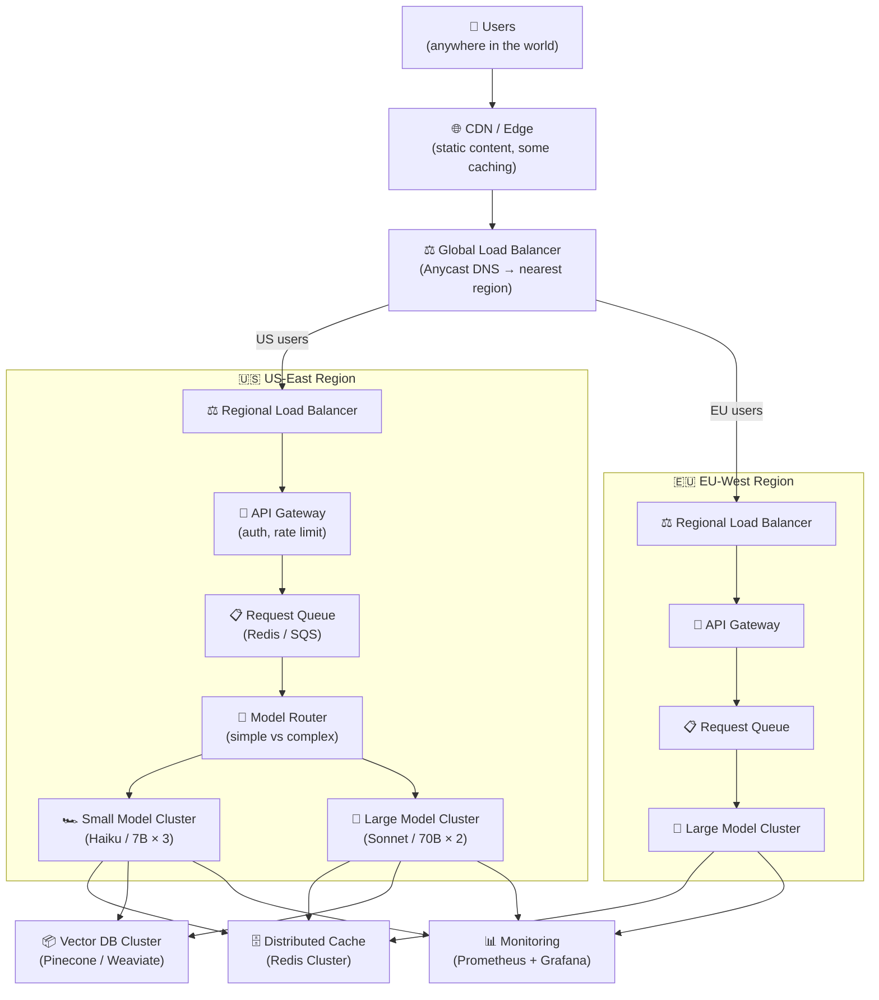

# Theory — Scaling AI Apps

## The Story 📖

Imagine you start a food truck. One truck, one menu, you behind the window. Business is great — 50 customers per lunch hour, everyone happy. Then something magical happens: a food blogger posts about you, you go viral, and the next Monday 3,000 people show up at your truck. Chaos. The line wraps around the block. The fryer overheats. You run out of ingredients. Half the customers leave without eating. Your five-star reputation evaporates overnight.

You quickly realize: the food truck model doesn't scale. A restaurant chain does. Multiple locations, standardized recipes (so any location can produce the same food), a supply chain, location managers, and a central operations team. You don't own 50 food trucks — you build systems and processes that allow 50 locations to operate independently but consistently.

Scaling AI applications follows the exact same logic. One inference server behind a single endpoint is your food truck. It works perfectly for small traffic. The moment traffic spikes — 10x, 100x — it collapses. Building a scalable AI application means building the chain: load balancers, multiple inference servers, auto-scaling policies, geographic distribution, queue management, and fallback strategies. Not to handle today's traffic, but to gracefully handle 100x today's traffic.

👉 This is **Scaling AI Apps** — the architectural patterns and infrastructure practices that allow your AI system to handle growing traffic, maintain performance under load, and operate reliably at scale.

---

## What is Scaling in AI Systems?

**Scaling** is the ability of your system to handle increased load — more requests, more users, more data — while maintaining acceptable performance (latency, throughput, reliability).

Think of it as: **designing your system to handle 10x your current traffic before you need to.**

### Two Dimensions of Scaling

**Horizontal scaling** (scaling out): Add more servers/containers. Each handles a fraction of traffic. Cheaper per unit than vertical, more resilient to individual failures. The default strategy for AI serving.

**Vertical scaling** (scaling up): Use a bigger machine. More GPU memory, more CPU, more RAM. Limited by hardware ceiling and cost. Often used to enable larger models on a single node.

### Scaling Challenges Specific to AI

1. **Model loading time**: Spinning up a new inference server takes 30-60 seconds (loading model weights into GPU). This makes rapid auto-scaling difficult — you need "warm" spare capacity.

2. **GPU memory constraints**: A model has a minimum VRAM requirement. You can't infinitely subdivide across tiny machines.

3. **Stateful KV cache**: For LLMs using KV caching, requests that continue a conversation must go to the same server (or the cache must be shared). This complicates load balancing.

4. **Variable response length**: LLM responses vary from 50 to 2,000 tokens. This makes capacity planning harder than fixed-cost API endpoints.

5. **Cold starts**: Starting new containers takes time. You need a warm pool strategy.

---

## How It Works — Step by Step

The scaling strategy:
1. **CDN** caches static responses and reduces origin load
2. **Global load balancer** routes to nearest region (latency) or healthy region (failover)
3. **API gateway** handles auth and rate limiting before requests touch expensive inference
4. **Request queue** absorbs traffic spikes (prevents cascading failure under load)
5. **Model router** directs simple requests to cheap/fast servers, complex to powerful ones
6. **Auto-scaling** adjusts cluster size based on queue depth and GPU utilization
7. **Monitoring** tracks everything and triggers alerts

---

## Real-World Examples

1. **ChatGPT's scaling approach**: OpenAI uses geographically distributed data centers, custom-built inference infrastructure with continuous batching, and a tiered architecture. When demand spikes, they queue requests and show "ChatGPT is at capacity" rather than degrading response quality.

2. **Perplexity AI's model routing**: Routes search queries to different models based on complexity. A simple lookup query goes to a fast, cheap model; a complex multi-step research query goes to a more powerful model. This allows them to handle millions of queries/day cost-effectively.

3. **Midjourney's queue-based scaling**: Image generation takes 10-60 seconds. They never try to do it synchronously. Requests go into a queue. Users see their place in line. Jobs are processed as GPU capacity is available. This queue-first architecture handles traffic spikes gracefully without infrastructure explosions.

4. **GitHub Copilot's inference**: Copilot serves millions of code completions per day with strict latency requirements (must respond in < 300ms for inline suggestions). They use aggressive caching (model weights cached in GPU memory), continuous batching, and geographically distributed inference nodes close to developers.

5. **Stability AI**: Image generation models distributed across multiple GPU clusters, auto-scaling based on queue depth, with spot instances handling 70% of traffic (interruptions handled gracefully by requeueing the job).

---

## Common Mistakes to Avoid ⚠️

**1. Synchronous inference for long-running tasks**
If your AI task takes more than 1-2 seconds, it should not be synchronous. A synchronous request that takes 30 seconds holds a connection open, ties up server threads, and degrades the experience for all users under load. Use async queues + webhooks or polling for anything over ~2 seconds.

**2. No request queuing**
Without a queue, traffic spikes hit your inference servers directly. If 10x normal traffic arrives, each server tries to handle 10x its capacity — response time degrades exponentially, then the server crashes. A queue absorbs the spike: users wait a bit longer, but the system doesn't collapse.

**3. Not keeping warm instances**
Auto-scaling down to zero when traffic is low saves money but means the first requests after a quiet period experience 30-60 second cold start latency (loading model weights). Maintain a minimum of 1-2 warm instances at all times for production systems with real-time SLAs.

**4. Scaling only vertically**
Bigger GPUs help but have a ceiling. An H100 is 3x faster than an A100, not 100x. When you need 100x capacity, you need horizontal scaling: more servers, load balancers, and clustering logic. Plan for horizontal scaling from the architecture design phase.

---

## Connection to Other Concepts 🔗

- **Model Serving** → Scaling is the next step after basic serving. You first build a serving layer, then scale it. See [01_Model_Serving](../01_Model_Serving/Theory.md).
- **Latency Optimization** → Scaling adds more servers; latency optimization makes each server faster. Both are needed. See [02_Latency_Optimization](../02_Latency_Optimization/Theory.md).
- **Cost Optimization** → Auto-scaling is the primary cost management tool: scale up when needed, scale down (or to zero for batch jobs) when quiet. See [03_Cost_Optimization](../03_Cost_Optimization/Theory.md).
- **Observability** → At scale, you need distributed tracing and metrics aggregation across all instances. See [05_Observability](../05_Observability/Theory.md).
- **Caching** → Distributed caching (Redis Cluster) is a critical scaling component. Cache hits bypass inference entirely. See [04_Caching_Strategies](../04_Caching_Strategies/Theory.md).

---

✅ **What you just learned:** Scaling AI apps means handling more traffic while maintaining performance. Key patterns: horizontal scaling (more servers), request queuing (absorb spikes), auto-scaling (adjust capacity), model routing (right model for each task), and geographic distribution (latency + compliance). Always design for horizontal scaling; use queues for async tasks; keep warm instances to avoid cold starts.

🔨 **Build this now:** Take an existing single-server FastAPI + model endpoint. Put a Redis queue in front of it. Submit requests to the queue; have a worker pull from it and process asynchronously. This queue-first architecture is the foundation for all scaling.

➡️ **Next step:** [AI System Design](../../13_AI_System_Design/01_Customer_Support_Agent/Architecture_Blueprint.md) — now apply everything you've learned to design complete AI systems.

---

## 📂 Navigation
