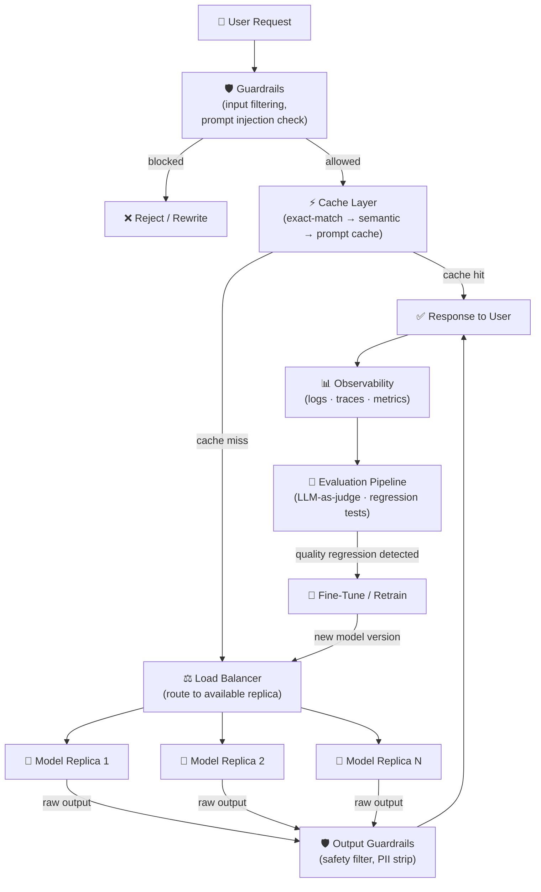

# 🏭 12 — Production AI

⬅️ [11 MCP Protocol](../11_MCP_Model_Context_Protocol/Readme.md) &nbsp;|&nbsp; [🏠 Home](../00_Learning_Guide/Readme.md) &nbsp;|&nbsp; [13 AI System Design ➡️](../13_AI_System_Design/Readme.md)

> Building the model is 20% of the work. Shipping it reliably, cheaply, and safely is the other 80%.

**[▶ Start here → Model Serving Theory](./01_Model_Serving/Theory.md)**

---

## At a Glance

| | |
|---|---|
| 📚 Topics | 9 topics + checklist |
| ⏱️ Est. Time | 8–10 hours |
| 📋 Prerequisites | [11 MCP Protocol](../11_MCP_Model_Context_Protocol/Readme.md) |
| 🔓 Unlocks | [13 AI System Design](../13_AI_System_Design/Readme.md) |

---

## What's in This Section

---

## Topics

| # | Topic | What You'll Learn | Files |
|---|---|---|---|
| 01 | [Model Serving](./01_Model_Serving/) | Deploy models as APIs — blue-green deployments, health checks, self-hosted vs managed | [📖 Theory](./01_Model_Serving/Theory.md) · [⚡ Cheatsheet](./01_Model_Serving/Cheatsheet.md) · [🎯 Interview Q&A](./01_Model_Serving/Interview_QA.md) · [🏗️ Deep Dive](./01_Model_Serving/Architecture_Deep_Dive.md) |
| 02 | [Latency Optimization](./02_Latency_Optimization/) | Quantization, batching, speculative decoding — making inference 4x faster | [📖 Theory](./02_Latency_Optimization/Theory.md) · [⚡ Cheatsheet](./02_Latency_Optimization/Cheatsheet.md) · [🎯 Interview Q&A](./02_Latency_Optimization/Interview_QA.md) · [🔧 Techniques](./02_Latency_Optimization/Optimization_Techniques.md) |
| 03 | [Cost Optimization](./03_Cost_Optimization/) | Token reduction, model routing, prompt compression — cutting your API bill by 60%+ | [📖 Theory](./03_Cost_Optimization/Theory.md) · [⚡ Cheatsheet](./03_Cost_Optimization/Cheatsheet.md) · [🎯 Interview Q&A](./03_Cost_Optimization/Interview_QA.md) · [🧮 Cost Calculator](./03_Cost_Optimization/Cost_Calculator_Guide.md) |
| 04 | [Caching Strategies](./04_Caching_Strategies/) | Exact-match, semantic, and KV prompt caching — returning answers without hitting the model | [📖 Theory](./04_Caching_Strategies/Theory.md) · [⚡ Cheatsheet](./04_Caching_Strategies/Cheatsheet.md) · [🎯 Interview Q&A](./04_Caching_Strategies/Interview_QA.md) · [💻 Code](./04_Caching_Strategies/Code_Example.md) |
| 05 | [Observability](./05_Observability/) | Logs, metrics, distributed traces — knowing what your AI system is actually doing in prod | [📖 Theory](./05_Observability/Theory.md) · [⚡ Cheatsheet](./05_Observability/Cheatsheet.md) · [🎯 Interview Q&A](./05_Observability/Interview_QA.md) · [💻 Code](./05_Observability/Code_Example.md) · [🛠️ Tools Guide](./05_Observability/Tools_Guide.md) |
| 06 | [Evaluation Pipelines](./06_Evaluation_Pipelines/) | LLM-as-judge, golden datasets, regression testing — catching quality drops before users do | [📖 Theory](./06_Evaluation_Pipelines/Theory.md) · [⚡ Cheatsheet](./06_Evaluation_Pipelines/Cheatsheet.md) · [🎯 Interview Q&A](./06_Evaluation_Pipelines/Interview_QA.md) · [💻 Code](./06_Evaluation_Pipelines/Code_Example.md) · [📏 Metrics](./06_Evaluation_Pipelines/Metrics_Guide.md) |
| 07 | [Safety & Guardrails](./07_Safety_and_Guardrails/) | Input/output filtering, prompt injection defense, content moderation at the API layer | [📖 Theory](./07_Safety_and_Guardrails/Theory.md) · [⚡ Cheatsheet](./07_Safety_and_Guardrails/Cheatsheet.md) · [🎯 Interview Q&A](./07_Safety_and_Guardrails/Interview_QA.md) · [🔧 Implementation](./07_Safety_and_Guardrails/Implementation_Guide.md) |
| 08 | [Fine-Tuning in Production](./08_Fine_Tuning_in_Production/) | When fine-tuning beats prompting, LoRA/QLoRA, and continuous retraining pipelines | [📖 Theory](./08_Fine_Tuning_in_Production/Theory.md) · [⚡ Cheatsheet](./08_Fine_Tuning_in_Production/Cheatsheet.md) · [🎯 Interview Q&A](./08_Fine_Tuning_in_Production/Interview_QA.md) · [💻 Code](./08_Fine_Tuning_in_Production/Code_Example.md) · [🤔 When to Fine-Tune](./08_Fine_Tuning_in_Production/When_to_Fine_Tune.md) |
| 09 | [Scaling AI Apps](./09_Scaling_AI_Apps/) | Horizontal scaling, auto-scaling, multi-region, queue-based architecture for 100k+ req/day | [📖 Theory](./09_Scaling_AI_Apps/Theory.md) · [⚡ Cheatsheet](./09_Scaling_AI_Apps/Cheatsheet.md) · [🎯 Interview Q&A](./09_Scaling_AI_Apps/Interview_QA.md) · [🏗️ Deep Dive](./09_Scaling_AI_Apps/Architecture_Deep_Dive.md) |

---

## Key Concepts at a Glance

| Concept | Why It Matters |
|---|---|
| **Caching is your highest-leverage lever** | A semantic cache hit costs ~$0.001; a GPT-4 call costs ~$0.03; the math is obvious |
| **Guardrails are architectural, not afterthoughts** | Prompt injection, jailbreaks, and PII leaks must be caught at the API boundary before the model sees them |
| **Observability for AI ≠ observability for software** | You need token counts, latency per token, output quality scores, and drift detection — not just CPU/RAM |
| **Evaluation pipelines run on every deploy** | LLM-as-judge catches regressions that traditional unit tests cannot; treat model quality like test coverage |
| **Fine-tuning is a last resort** | Exhaust prompt engineering, RAG, and few-shot examples first; fine-tuning is expensive and creates a maintenance burden |

---

## Also in This Section

[✅ Production Checklist](./Production_Checklist.md) — a launch checklist covering serving, latency, cost, observability, safety, and scaling. Use it before every prod deployment.

---

## 📂 Navigation

⬅️ **Prev:** [11 MCP — Model Context Protocol](../11_MCP_Model_Context_Protocol/Readme.md) &nbsp;&nbsp; ➡️ **Next:** [13 AI System Design](../13_AI_System_Design/Readme.md)
