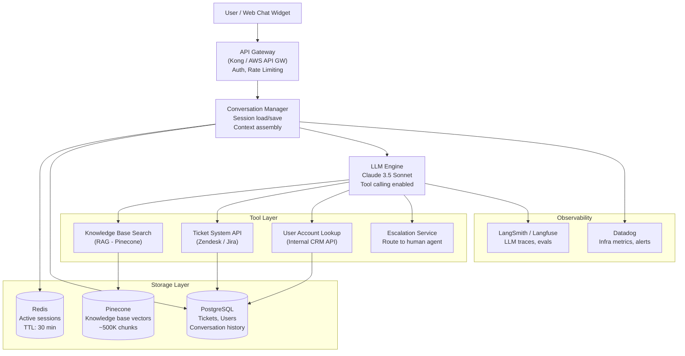
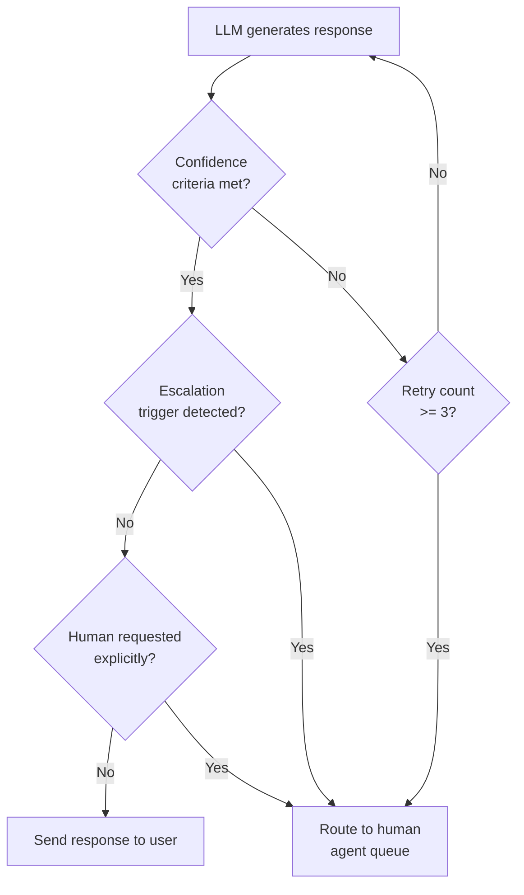

# Architecture Blueprint
## Design Case 01: Customer Support Agent

An AI agent that handles customer support tickets end-to-end: answers questions from a knowledge base, looks up user accounts, creates/updates tickets, and escalates to humans when the situation requires it. This is a multi-turn, tool-using agent with persistent session memory.

---

## System Overview



---

## Escalation Decision Logic

This is one of the most important parts of the design. The agent should escalate when:



**Escalation triggers (hardcoded rules evaluated before/after LLM call):**
- Knowledge base search returns no results above similarity threshold (0.75)
- User has sent the same type of query 3+ times in this session without resolution
- Detected keywords: "speak to a human", "manager", "lawsuit", "legal action", "refund > $500"
- Account status is flagged (VIP, active dispute, fraud flag)
- LLM output contains hedge phrases like "I'm not sure" or "you may want to contact" — detected via post-processing

---

## Component Table

| Component | Technology | Responsibility | Scales How |
|---|---|---|---|
| API Gateway | Kong / AWS API Gateway | Auth (JWT), rate limiting (100 req/min/user), request routing | Horizontal (stateless) |
| Conversation Manager | Python FastAPI service | Load session from Redis, assemble context window, call LLM, save session | Horizontal with Redis as shared state |
| LLM Engine | Claude 3.5 Sonnet via Anthropic API | Generate responses, decide tool calls, synthesize tool results | Scales via API concurrency limits |
| Knowledge Base Search | Pinecone (managed vector DB) | Semantic search over support docs, FAQs, product manuals | Pinecone scales independently |
| Ticket System API | Zendesk REST API (or Jira Service Management) | Create tickets, update status, look up ticket history | External API rate limits apply |
| Account Lookup | Internal CRM REST API | Fetch user plan, order history, account flags | Internal service, cache-friendly |
| Escalation Service | Internal queue + PubSub | Route conversation to next available human agent, notify via Slack/email | Queue-based, scales with agent headcount |
| PostgreSQL | AWS RDS PostgreSQL | Long-term storage: tickets, users, full conversation history | Vertical + read replicas |
| Pinecone | Pinecone Managed | Vector embeddings of all support documentation | Managed, auto-scales |
| Redis | AWS ElastiCache | Hot session cache (last 10 messages), TTL 30 min | Cluster mode for high availability |
| LangSmith | LangSmith / Langfuse | Trace every LLM call (input/output/tokens/latency), run evals on sampled traffic | SaaS |
| Datadog | Datadog APM | Service health, latency histograms, error rates, cost dashboards | SaaS |

---

## Context Window Budget

The Conversation Manager assembles this exact structure before every LLM call:

```
System prompt (persona + tool descriptions + escalation rules):   ~600 tokens
Recent conversation history (last 8 message pairs):             ~1,600 tokens
Retrieved KB chunks (top 3 × ~400 tokens):                      ~1,200 tokens
Current user message:                                              ~100 tokens
─────────────────────────────────────────────────────────────────────────────
Total input:                                                     ~3,500 tokens
Expected output (response + tool call JSON):                       ~500 tokens
```

**Total per call: ~4,000 tokens.** At Claude 3.5 Sonnet pricing ($3/1M input, $15/1M output), this is roughly **$0.019 per conversation turn**. At 100,000 turns/day, that's **$1,900/day** — which is where caching and model tiering become important.

---

## 📂 Navigation

**In this folder:**
| File | |
|---|---|
| 📄 **Architecture_Blueprint.md** | ← you are here |
| [📄 Build_Guide.md](./Build_Guide.md) | Step-by-step build guide |
| [📄 Component_Breakdown.md](./Component_Breakdown.md) | Component breakdown |
| [📄 Data_Flow_Diagram.md](./Data_Flow_Diagram.md) | Data flow diagram |
| [📄 Interview_QA.md](./Interview_QA.md) | Interview prep |
| [📄 Tech_Stack.md](./Tech_Stack.md) | Technology stack choices |

⬅️ **Prev:** [09 Scaling AI Apps](../../12_Production_AI/09_Scaling_AI_Apps/Theory.md) &nbsp;&nbsp;&nbsp; ➡️ **Next:** [02 RAG Document Search System](../02_RAG_Document_Search_System/Architecture_Blueprint.md)
