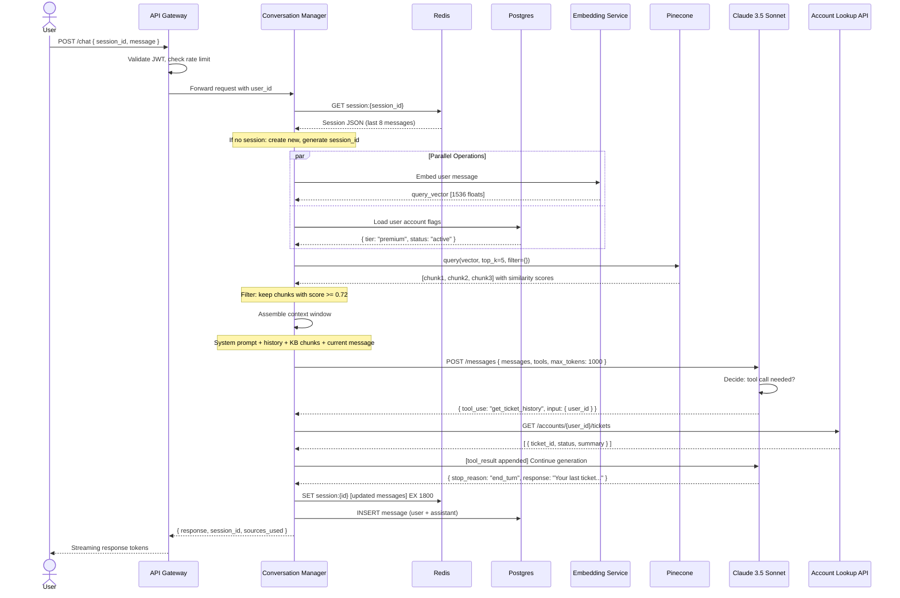
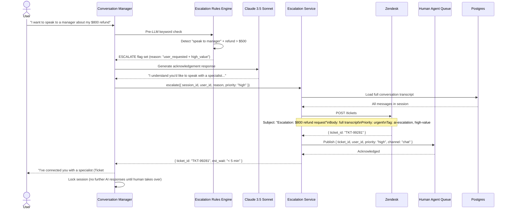
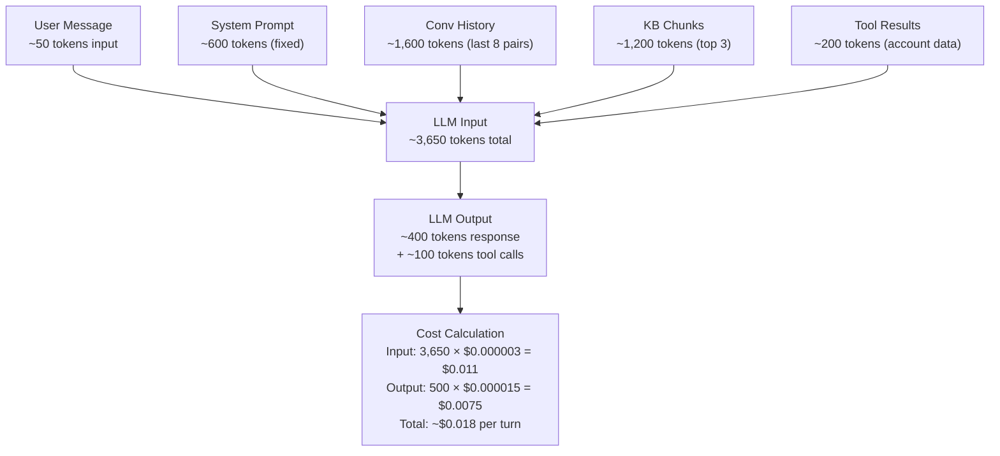

# Data Flow Diagram
## Design Case 01: Customer Support Agent

Two flows: the happy path (agent answers successfully) and the escalation path (agent hands off to human). Both are shown in full detail.

---

## Happy Path: Agent Answers the Question

---

## Escalation Path: Handing Off to Human

---

## Knowledge Base Indexing Flow (Background Process)

This flow runs whenever new documentation is uploaded, not during user conversations.

```mermaid
flowchart LR
    A["Document Upload\nPDF / Word / HTML / Confluence"] --> B["Text Extraction\npymupdf, python-docx\nBeautifulSoup"]
    B --> C["Text Cleaning\nRemove headers/footers\nNormalize whitespace"]
    C --> D["Chunking\nRecursiveCharacterTextSplitter\n512 tokens, 50 overlap"]
    D --> E["Embedding\ntext-embedding-3-small\nBatch: 100 chunks/request"]
    E --> F{"Existing doc\nin Pinecone?"}
    F -- Yes --> G["Delete old vectors\nby document_id"]
    F -- No --> H["Continue"]
    G --> H
    H --> I["Upsert to Pinecone\nID, vector, metadata"]
    I --> J["Update Postgres\ndocuments table:\nchunk_count, indexed_at, status=active"]
    J --> K["Notify: indexing complete\nLog chunk count, total tokens"]
```

---

## Token Flow and Cost Breakdown

For every conversation turn, here is exactly where tokens are consumed:

**At 10,000 active users sending 5 messages/day = 50,000 turns/day:**
- Cost per day: 50,000 × $0.018 = **$900/day**
- Cost per month: **$27,000/month**

This is where semantic caching pays off. If 40% of queries are FAQ-type (similar to previously asked questions), caching reduces this to **$540/day**.

---

## 📂 Navigation

**In this folder:**
| File | |
|---|---|
| [📄 Architecture_Blueprint.md](./Architecture_Blueprint.md) | System architecture blueprint |
| [📄 Build_Guide.md](./Build_Guide.md) | Step-by-step build guide |
| [📄 Component_Breakdown.md](./Component_Breakdown.md) | Component breakdown |
| 📄 **Data_Flow_Diagram.md** | ← you are here |
| [📄 Interview_QA.md](./Interview_QA.md) | Interview prep |
| [📄 Tech_Stack.md](./Tech_Stack.md) | Technology stack choices |

⬅️ **Prev:** [09 Scaling AI Apps](../../12_Production_AI/09_Scaling_AI_Apps/Theory.md) &nbsp;&nbsp;&nbsp; ➡️ **Next:** [02 RAG Document Search System](../02_RAG_Document_Search_System/Architecture_Blueprint.md)
