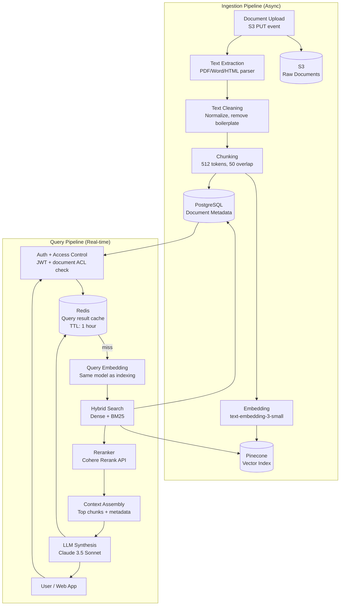
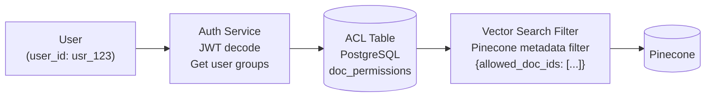

# Architecture Blueprint
## Design Case 02: RAG Document Search System

An enterprise document search system that handles the full lifecycle: document upload, text extraction, chunking, vector indexing, and natural language question-answering with citations. Users can query across thousands of documents and get precise, cited answers.

---

## System Overview

---

## Two-Pipeline Architecture

This system has two completely separate pipelines that share only the vector store and document metadata database.

**Why separate pipelines?**
- Ingestion is async, batch-oriented, and triggered by document uploads (not user requests)
- Query is synchronous, latency-sensitive, and triggered by user interactions
- Mixing them would mean ingestion jobs compete for resources with user queries
- Each pipeline can be scaled, optimized, and deployed independently

**Ingestion Pipeline** runs as a background worker service (SQS consumer or Celery worker). Triggered by S3 event notifications when a new document is uploaded. Can process hundreds of documents in parallel without affecting query latency.

**Query Pipeline** is the real-time API. User sends a question, gets back an answer with citations in under 3 seconds.

---

## Access Control Architecture

**This is the most underestimated challenge in enterprise RAG.** Users should only get answers from documents they have permission to read.

**Implementation:**
- Every document has an `access_groups` field (e.g., `["hr-team", "managers", "all-staff"]`)
- Every user belongs to groups (stored in your identity provider: Okta, Auth0, Google Workspace)
- On every query: get user's groups → get all doc IDs they can access → pass as metadata filter to Pinecone
- **Critical:** Never rely on post-retrieval filtering alone. Filter at the search layer so unauthorized chunks never leave the vector store.

---

## Component Table

| Component | Technology | Responsibility | Scales How |
|---|---|---|---|
| Document Upload | S3 + Presigned URLs | Store raw files (PDF, Word, HTML, Confluence export) | S3 scales infinitely |
| Text Extraction | Apache Tika / PyMuPDF / python-docx | Extract clean text from any document format | Horizontal (stateless workers) |
| Chunking Service | LangChain RecursiveCharacterTextSplitter | Split text into 512-token overlapping chunks | Horizontal (parallel per doc) |
| Embedding Service | OpenAI text-embedding-3-small API | Convert text chunks to 1536-dim vectors | API-based, batch requests |
| Vector Store | Pinecone Managed (p2 pods) | Similarity search with metadata filtering, access control filters | Pinecone auto-scales |
| BM25 Index | Elasticsearch (co-deployed) | Keyword-based search for exact matches, product codes, proper nouns | Horizontal (ES cluster) |
| Hybrid Search Merger | Python service | Combines dense + BM25 results via Reciprocal Rank Fusion | Stateless, horizontal |
| Reranker | Cohere Rerank API | Cross-encoder reranking of top-10 candidates to top-3 | API-based |
| Document Metadata | PostgreSQL | Title, author, upload date, chunk count, access groups, version | Read replicas for scale |
| Query Cache | Redis | Cache (query_hash → answer + citations) TTL 1 hour | ElastiCache cluster |
| LLM Synthesis | Claude 3.5 Sonnet | Generate grounded answer from retrieved chunks, output citations | API-based |
| Auth Service | JWT + internal ACL DB | Validate user identity, return allowed document IDs | Stateless, horizontal |

---

## Key Design Decision: Chunk Size = 512 Tokens

This is not arbitrary. Here is the reasoning:

| Chunk Size | Pros | Cons |
|---|---|---|
| 128 tokens | Very precise retrieval, minimal noise | Too short — loses sentence context, needs many chunks to cover a concept |
| 256 tokens | Good for FAQ-style docs | Can split mid-sentence on complex content |
| **512 tokens** | **Balances context and precision, fits ~1 A4 paragraph** | **Some topic bleed at chunk boundaries** |
| 1024 tokens | Rich context per chunk, fewer chunks needed | Retrieval less precise, one chunk covers multiple topics |
| 2048 tokens | Near-document level | Terrible for retrieval precision, fills context window fast |

**50-token overlap** ensures that sentences split at a chunk boundary appear in at least one chunk in full. This prevents the "answer is split across chunk 3 and chunk 4" problem.

---

## 📂 Navigation

**In this folder:**
| File | |
|---|---|
| 📄 **Architecture_Blueprint.md** | ← you are here |
| [📄 Build_Guide.md](./Build_Guide.md) | Step-by-step build guide |
| [📄 Component_Breakdown.md](./Component_Breakdown.md) | Component breakdown |
| [📄 Data_Flow_Diagram.md](./Data_Flow_Diagram.md) | Data flow diagram |
| [📄 Interview_QA.md](./Interview_QA.md) | Interview prep |
| [📄 Tech_Stack.md](./Tech_Stack.md) | Technology stack choices |

⬅️ **Prev:** [01 Customer Support Agent](../01_Customer_Support_Agent/Architecture_Blueprint.md) &nbsp;&nbsp;&nbsp; ➡️ **Next:** [03 AI Coding Assistant](../03_AI_Coding_Assistant/Architecture_Blueprint.md)
