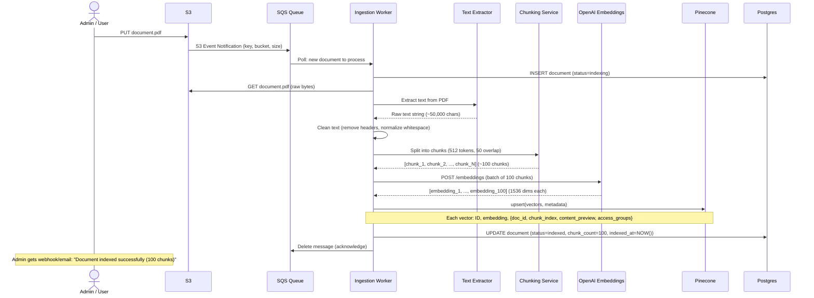
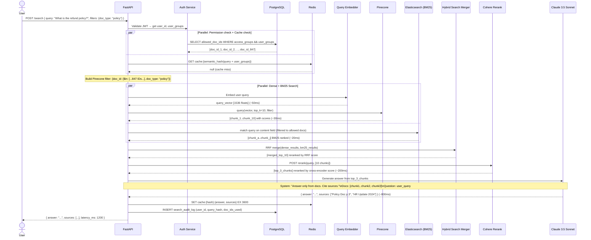
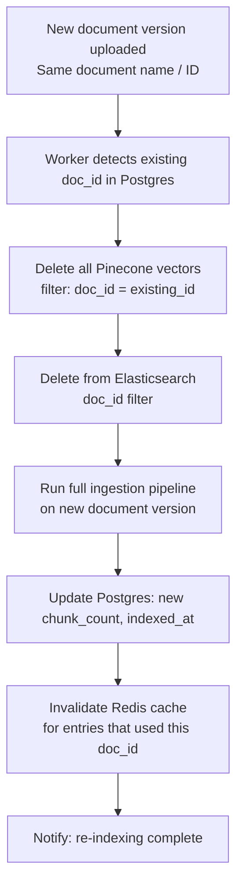

# Data Flow Diagram
## Design Case 02: RAG Document Search System

Two completely separate flows: the asynchronous ingestion pipeline (triggered by document uploads) and the real-time query pipeline (triggered by user questions).

---

## Flow 1: Document Ingestion Pipeline

This flow runs asynchronously in the background. It is triggered by an S3 upload event and can take seconds to minutes depending on document size.

**Error handling in the ingestion pipeline:**
- Text extraction fails (corrupt PDF): Update status to `failed_extraction`, dead-letter queue for manual review
- Embedding API fails: Retry with exponential backoff (3 attempts), then DLQ
- Pinecone upsert fails: Retry, then mark status `failed_indexing`
- On retry: delete any partially-upserted vectors first to avoid duplicates

---

## Flow 2: Query Pipeline (Happy Path)

This flow runs in real-time on every user search. Target: P99 < 3 seconds.

---

## Latency Budget Analysis

```mermaid
gantt
    title Query Pipeline Latency Budget (1200ms total target)
    dateFormat X
    axisFormat %Lms

    section Auth
    JWT validate + permission lookup   :0, 50

    section Search (Parallel)
    Query embedding                    :50, 100
    Pinecone dense search              :50, 80
    Elasticsearch BM25 search          :50, 70

    section Reranking
    Wait for both search results       :100, 110
    Cohere Rerank API                  :110, 310

    section Generation
    LLM synthesis (Claude streaming)   :310, 1100

    section Overhead
    Cache check + response write       :1100, 1200
```

**Bottleneck analysis:**
- **LLM inference** dominates: 800ms of the 1200ms total
- **Mitigation:** Stream the response — user sees first tokens at ~300ms even though full response takes 1.1s
- **Reranking:** 200ms is the second largest cost — worth it for quality but can be skipped for simple queries
- **Dense + BM25 search run in parallel** — the combined retrieval phase only costs ~100ms (max of the two, not sum)

---

## Document Update Flow

When an existing document is modified (e.g., policy updated), we need to re-index it without leaving stale chunks.

**Why delete first?** If you upsert without deleting, you get orphan chunks from the old version mixed with chunks from the new version. The LLM will find contradictory information in the same document.

---

## 📂 Navigation

**In this folder:**
| File | |
|---|---|
| [📄 Architecture_Blueprint.md](./Architecture_Blueprint.md) | System architecture blueprint |
| [📄 Build_Guide.md](./Build_Guide.md) | Step-by-step build guide |
| [📄 Component_Breakdown.md](./Component_Breakdown.md) | Component breakdown |
| 📄 **Data_Flow_Diagram.md** | ← you are here |
| [📄 Interview_QA.md](./Interview_QA.md) | Interview prep |
| [📄 Tech_Stack.md](./Tech_Stack.md) | Technology stack choices |

⬅️ **Prev:** [01 Customer Support Agent](../01_Customer_Support_Agent/Architecture_Blueprint.md) &nbsp;&nbsp;&nbsp; ➡️ **Next:** [03 AI Coding Assistant](../03_AI_Coding_Assistant/Architecture_Blueprint.md)
