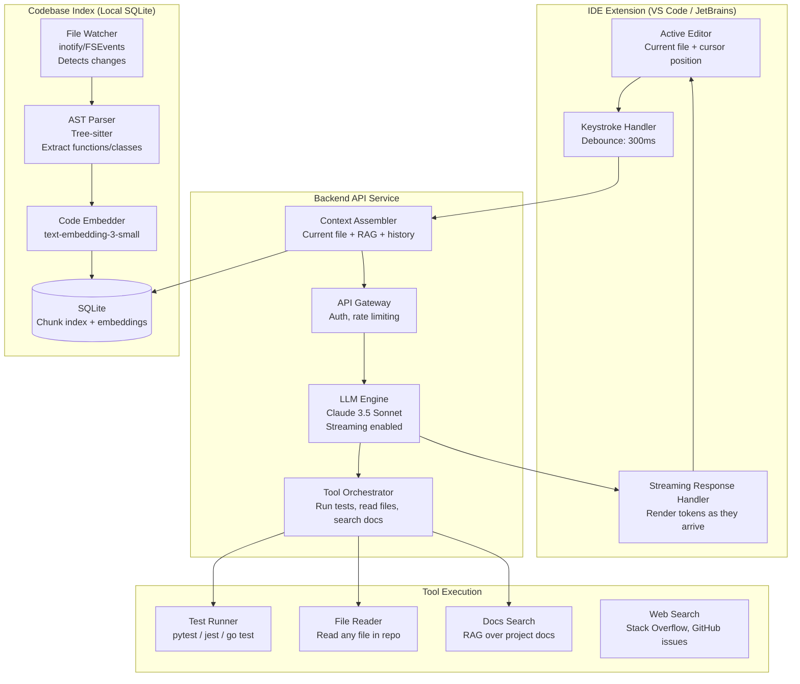
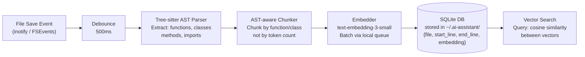

# Architecture Blueprint
## Design Case 03: AI Coding Assistant

A coding assistant that understands your entire codebase, not just the file you're currently editing. It answers questions, suggests fixes, writes new code, and runs tests. It runs inside your IDE as an extension communicating with a backend service.

---

## System Overview



---

## Context Assembly: The Heart of the System

The quality of the coding assistant depends almost entirely on how well the context is assembled. The LLM is only as good as what you put in front of it.

**Context window budget for a 128K token model:**

```
Component                          Tokens    Source
─────────────────────────────────────────────────────
System prompt + tool definitions    1,500    Fixed
Current file (full)                 2,000    Active editor buffer
Cursor context (±50 lines)          1,000    Current position
Related functions (RAG - top 3)     2,500    SQLite vector search
Imported files (directly imported)  1,500    AST import analysis
Recent conversation history         1,500    Last 5 exchanges
─────────────────────────────────────────────────────
Total context:                     10,000    Well under 128K
LLM output budget:                  2,000    Streaming response
```

**Why not just pass the full codebase?**
Even with 128K context window, dumping your entire codebase is inefficient. The LLM attends less to content in the middle of a very long context. Relevant code retrieved via RAG (top 3 most similar functions) dramatically outperforms the full codebase approach for most queries.

---

## Codebase Indexing Architecture



**Why AST-aware chunking instead of token-based chunking?**

Token-based chunking (`RecursiveCharacterTextSplitter`) cuts code at arbitrary points — sometimes in the middle of a function. This produces chunks that:
- Have no semantic meaning (half a function)
- Break the ability to understand scope (variables out of context)
- Are useless for code completion suggestions

AST-aware chunking respects code structure:
- Each function is one chunk (regardless of length)
- Each class with its methods is one chunk
- Imports are grouped separately
- **A short 3-line function and a long 100-line function are both complete chunks**

Tree-sitter parses any language (Python, JavaScript, TypeScript, Go, Rust, Java) and extracts the AST. From the AST, we extract every function and class definition with their start/end line numbers.

---

## Staleness and Incremental Indexing

Code changes constantly. Every file save needs to update the index within milliseconds (or the suggestions will be based on old code).

**Incremental update strategy:**
- File watcher detects save event
- Hash the file content (`md5(file_content)`)
- Look up the stored hash in SQLite
- If hash matches: no change, skip
- If hash differs: re-parse with Tree-sitter, delete old chunks for this file, insert new chunks
- Re-embedding only runs for the changed file, not the whole codebase

**Cost:** A 300-line Python file has ~15 functions. Re-embedding 15 functions = 15 API calls to `text-embedding-3-small` = about 500 tokens = $0.00001. Effectively free.

**Latency:** Parsing + embedding a 300-line file takes ~300ms total. The file watcher is debounced to 500ms after last keystroke, so indexing completes before the next query is likely.

---

## Component Table

| Component | Technology | Responsibility |
|---|---|---|
| IDE Extension | VS Code Extension API / JetBrains Platform | Capture keystrokes, debounce, send context, render streaming response |
| File Watcher | Node.js `chokidar` (VS Code) / Java FSWatcher | Watch for file saves, trigger incremental re-indexing |
| AST Parser | Tree-sitter (native bindings) | Parse any language to AST, extract function/class definitions |
| Code Embedder | text-embedding-3-small via OpenAI API | Convert code chunks to vectors for semantic search |
| Local Index | SQLite (stored on developer's machine) | Store chunk embeddings, file metadata, content — works offline |
| Context Assembler | TypeScript service (in-IDE) | Combine current file + RAG results + history into prompt |
| Backend API | FastAPI (Python) | Receive context, call LLM, stream response back |
| LLM Engine | Claude 3.5 Sonnet | Generate code, explain code, suggest fixes, answer questions |
| Tool Orchestrator | Python async executor | Run tests, read files, search external docs |
| Test Runner | Subprocess (pytest/jest/go test) in sandboxed container | Execute code safely, return results |

---

## 📂 Navigation

**In this folder:**
| File | |
|---|---|
| 📄 **Architecture_Blueprint.md** | ← you are here |
| [📄 Build_Guide.md](./Build_Guide.md) | Step-by-step build guide |
| [📄 Component_Breakdown.md](./Component_Breakdown.md) | Component breakdown |
| [📄 Data_Flow_Diagram.md](./Data_Flow_Diagram.md) | Data flow diagram |
| [📄 Interview_QA.md](./Interview_QA.md) | Interview prep |
| [📄 Tech_Stack.md](./Tech_Stack.md) | Technology stack choices |

⬅️ **Prev:** [02 RAG Document Search System](../02_RAG_Document_Search_System/Architecture_Blueprint.md) &nbsp;&nbsp;&nbsp; ➡️ **Next:** [04 AI Research Assistant](../04_AI_Research_Assistant/Architecture_Blueprint.md)
