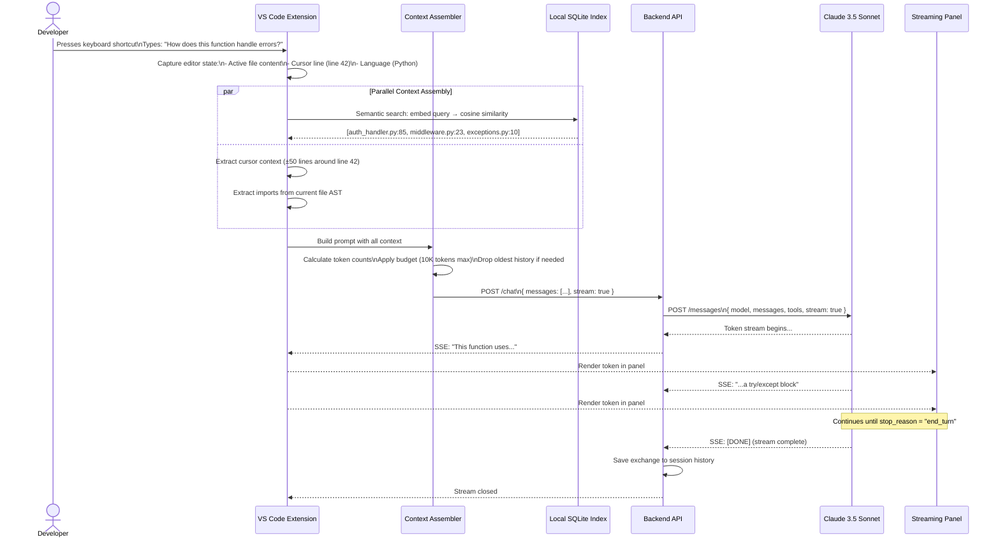
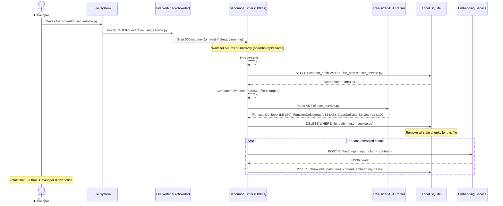
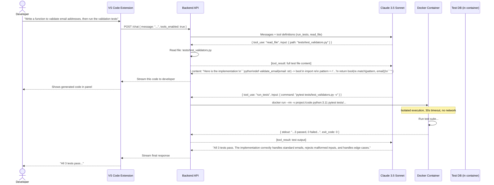
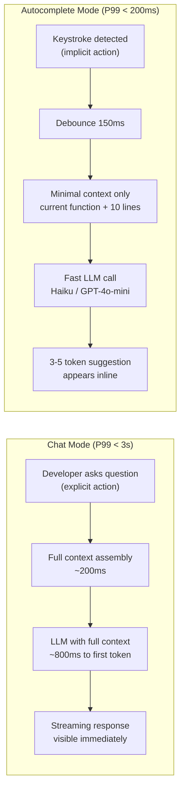

# Data Flow Diagram
## Design Case 03: AI Coding Assistant

Three flows: the main query flow (developer asks a question), the background indexing flow (codebase stays current), and the tool execution flow (tests run, files read).

---

## Flow 1: Developer Sends a Query

From keystroke to streaming response — the complete path.

---

## Flow 2: Background Codebase Indexing

This flow runs silently in the background. The developer never sees it, but it's what makes the assistant context-aware.

---

## Flow 3: Tool Execution (Running Tests)

When the developer asks the assistant to write code and verify it passes tests.

---

## Autocomplete vs Chat: The Latency Difference

This assistant supports two interaction modes with very different latency requirements:

**Autocomplete mode design constraints:**
- Latency target: < 200ms total (150ms debounce + 30ms embedding + 20ms context + 100ms LLM first token)
- Use a faster, cheaper model (Claude 3.5 Haiku, GPT-4o-mini)
- Never use RAG retrieval in autocomplete — the vector search adds 30-50ms
- Cache common completions (exact cache on the last 200 tokens of context)
- Cancel the request if the developer types another character before the response arrives

---

## 📂 Navigation

**In this folder:**
| File | |
|---|---|
| [📄 Architecture_Blueprint.md](./Architecture_Blueprint.md) | System architecture blueprint |
| [📄 Build_Guide.md](./Build_Guide.md) | Step-by-step build guide |
| [📄 Component_Breakdown.md](./Component_Breakdown.md) | Component breakdown |
| 📄 **Data_Flow_Diagram.md** | ← you are here |
| [📄 Interview_QA.md](./Interview_QA.md) | Interview prep |
| [📄 Tech_Stack.md](./Tech_Stack.md) | Technology stack choices |

⬅️ **Prev:** [02 RAG Document Search System](../02_RAG_Document_Search_System/Architecture_Blueprint.md) &nbsp;&nbsp;&nbsp; ➡️ **Next:** [04 AI Research Assistant](../04_AI_Research_Assistant/Architecture_Blueprint.md)
