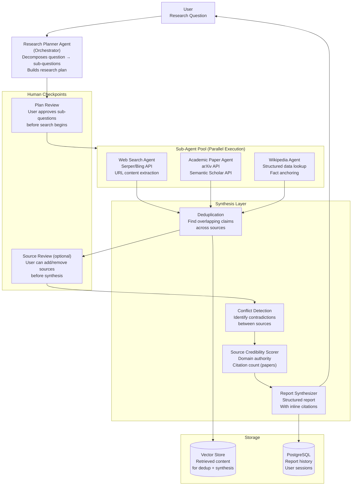
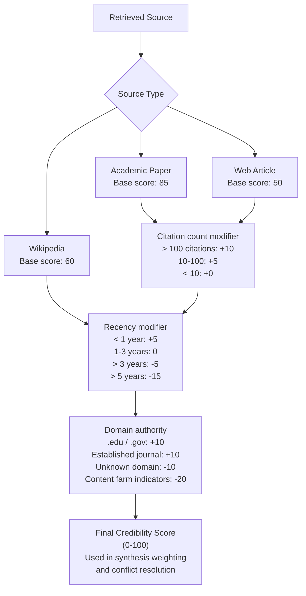

# Architecture Blueprint
## Design Case 04: AI Research Assistant

A research agent that autonomously handles the complete research workflow: decomposing a complex question into sub-questions, searching web and academic sources in parallel, extracting and synthesizing content, detecting conflicting information, and producing a structured report with citations.

---

## System Overview



---

## Multi-Agent Orchestration Architecture

This system uses a supervisor pattern (one orchestrator managing multiple specialist sub-agents) rather than a fully autonomous swarm.

**Why supervisor pattern over fully autonomous:**
- Fully autonomous agents can run indefinitely, consuming tokens and time unpredictably
- The supervisor controls the research plan, knows when enough information has been gathered, and decides when to synthesize
- Human checkpoints (plan review, source review) are only practical in a supervisor pattern

**Research Planner as the orchestrator:**
```
Input: "What are the most effective interventions for reducing AI hallucinations?"

Output (research plan):
1. "What causes hallucinations in large language models?" → Web + Paper agents
2. "What retrieval-augmented approaches reduce hallucination rates?" → Paper agent
3. "What production systems have published results on hallucination reduction?" → Web agent
4. "What are the current benchmark results for hallucination on common datasets?" → Paper agent
```

The planner breaks a complex question into 3-5 specific sub-questions. Each sub-question maps to one or more agents and a search strategy.

---

## Agent Specialization

Each agent has a distinct role, tools, and evaluation criteria.

| Agent | Primary Tools | Search Strategy | Output |
|---|---|---|---|
| Web Search Agent | Serper/Bing Search API + URL content extractor | Google-style queries, recent results (last 2 years) | Extracted article text + URL + title + date |
| Academic Paper Agent | arXiv API + Semantic Scholar API | Academic keyword search, citation-filtered results | Abstract + full text (if open access) + citation count + authors |
| Wikipedia Agent | Wikipedia API | Specific entity/concept lookup for factual grounding | Structured article sections + categories + references |
| Synthesis Agent | Vector store search (internal) | Semantic search over all collected content | Structured report with citations |

---

## Source Credibility Scoring

Not all sources are equal. A Reddit post and a peer-reviewed Nature paper should not be weighted equally in the synthesis.



Sources with credibility score < 30 are excluded from synthesis. Sources with score < 50 are included but flagged: "Note: this claim is based on a lower-confidence source."

---

## Component Table

| Component | Technology | Responsibility |
|---|---|---|
| Research Planner | Claude 3.5 Sonnet (Orchestrator LLM) | Decompose research question, build plan, track completion, decide when to synthesize |
| Web Search Agent | Serper API (Google search) + trafilatura (content extraction) | Search, extract article content, clean text |
| Academic Paper Agent | arXiv API + Semantic Scholar API | Search papers, retrieve abstracts + full text for open-access papers |
| Wikipedia Agent | Wikipedia Python API | Fast structured lookup for factual grounding |
| Deduplication Service | Sentence transformer + cosine similarity | Find overlapping claims across sources, prevent synthesis from repeating itself |
| Conflict Detection | Claude 3.5 Sonnet as judge | Compare claims on the same topic from different sources, flag contradictions |
| Credibility Scorer | Rules-based Python service | Score sources based on type, domain, citation count, recency |
| Report Synthesizer | Claude 3.5 Sonnet (synthesis LLM) | Generate structured report from collected evidence, inline citations, conflict sections |
| Vector Store | Chroma (in-memory per research session) | Store all extracted content for dedup + synthesis context |
| PostgreSQL | Report storage, session history | Persist completed reports, user query history |
| LangGraph | Multi-agent orchestration framework | Define agent graph, manage state passing between agents, handle retries |

---

## 📂 Navigation

**In this folder:**
| File | |
|---|---|
| 📄 **Architecture_Blueprint.md** | ← you are here |
| [📄 Build_Guide.md](./Build_Guide.md) | Step-by-step build guide |
| [📄 Component_Breakdown.md](./Component_Breakdown.md) | Component breakdown |
| [📄 Data_Flow_Diagram.md](./Data_Flow_Diagram.md) | Data flow diagram |
| [📄 Interview_QA.md](./Interview_QA.md) | Interview prep |
| [📄 Tech_Stack.md](./Tech_Stack.md) | Technology stack choices |

⬅️ **Prev:** [03 AI Coding Assistant](../03_AI_Coding_Assistant/Architecture_Blueprint.md) &nbsp;&nbsp;&nbsp; ➡️ **Next:** [05 Multi-Agent Workflow](../05_Multi_Agent_Workflow/Architecture_Blueprint.md)
