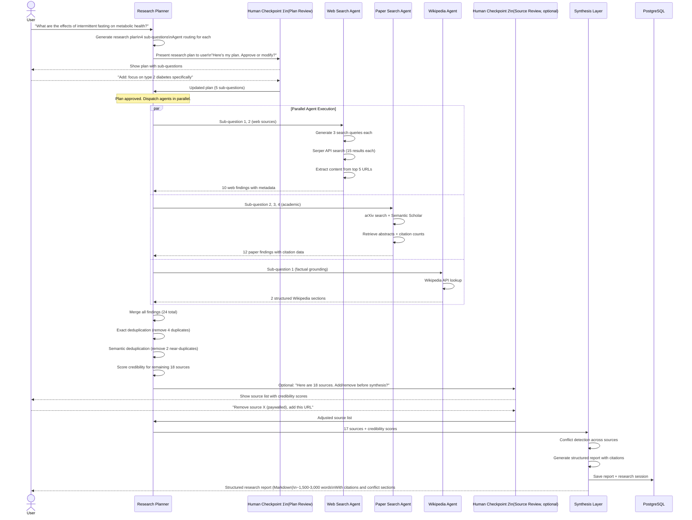
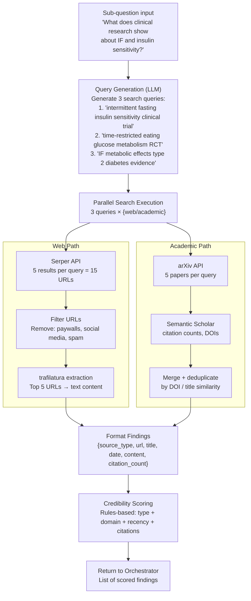
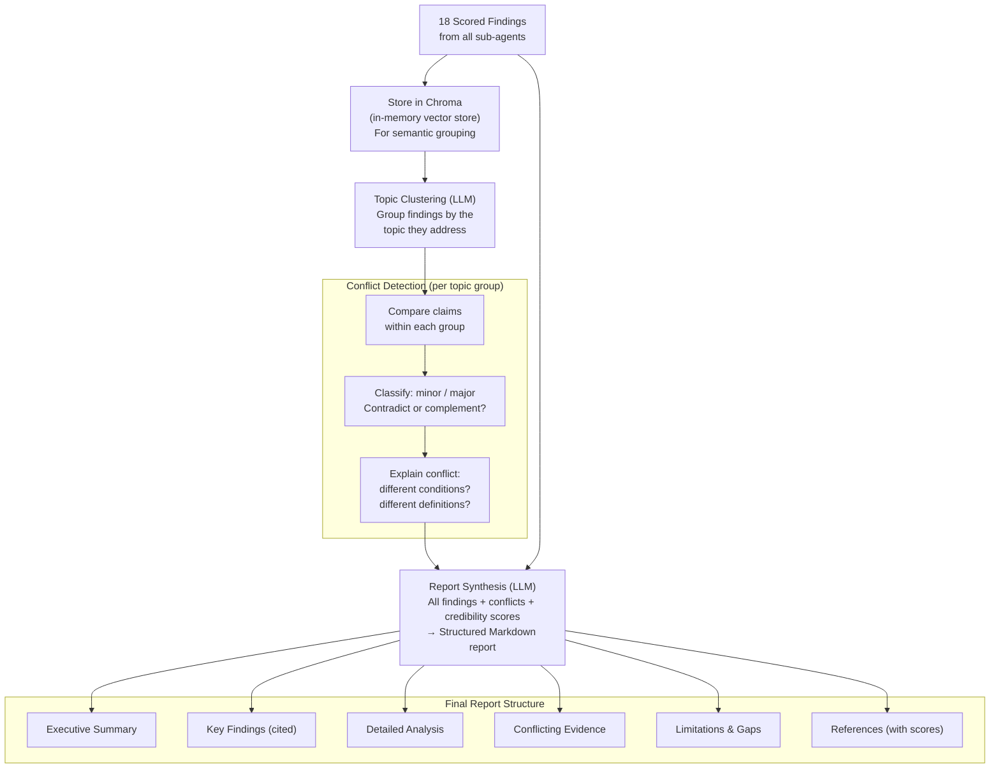

# Data Flow Diagram
## Design Case 04: AI Research Assistant

Two flows: the main research flow from question to report (with parallel sub-agents and human checkpoints), and the synthesis flow (how collected evidence becomes a structured report).

---

## Main Research Flow



---

## Parallel Sub-Agent Detail (Zoomed In)

Each sub-agent runs this internal flow independently and concurrently.



---

## Synthesis Flow (Detailed)

How 18 raw findings become a coherent research report.



---

## Token Budget for the Full Research Session

A typical research session with 4 sub-questions and 18 sources:

```
Planning phase:
- Planner call (question → plan): ~1,500 tokens in, ~500 tokens out
- Total: 2,000 tokens

Sub-agent execution (per agent, per sub-question):
- Query generation: ~300 tokens in, ~100 out = 400 tokens
- × 4 sub-questions × 1.5 agents average = ~2,400 tokens

Conflict detection:
- ~800 tokens per topic pair × 4 topic groups = ~3,200 tokens

Synthesis (the big one):
- 18 sources × ~400 tokens average = 7,200 tokens context
- System prompt + instructions: ~800 tokens
- Output (2,000-word report): ~2,500 tokens
- Total synthesis call: ~10,500 tokens

Approximate session total:
Input: ~18,000 tokens × $3/1M = $0.054
Output: ~5,000 tokens × $15/1M = $0.075
Total per research session: ~$0.13
```

This is remarkably cheap for a research session that would take a human researcher 2-4 hours. The economics make it viable even for individual use at low scale.

---

## 📂 Navigation

**In this folder:**
| File | |
|---|---|
| [📄 Architecture_Blueprint.md](./Architecture_Blueprint.md) | System architecture blueprint |
| [📄 Build_Guide.md](./Build_Guide.md) | Step-by-step build guide |
| [📄 Component_Breakdown.md](./Component_Breakdown.md) | Component breakdown |
| 📄 **Data_Flow_Diagram.md** | ← you are here |
| [📄 Interview_QA.md](./Interview_QA.md) | Interview prep |
| [📄 Tech_Stack.md](./Tech_Stack.md) | Technology stack choices |

⬅️ **Prev:** [03 AI Coding Assistant](../03_AI_Coding_Assistant/Architecture_Blueprint.md) &nbsp;&nbsp;&nbsp; ➡️ **Next:** [05 Multi-Agent Workflow](../05_Multi_Agent_Workflow/Architecture_Blueprint.md)
