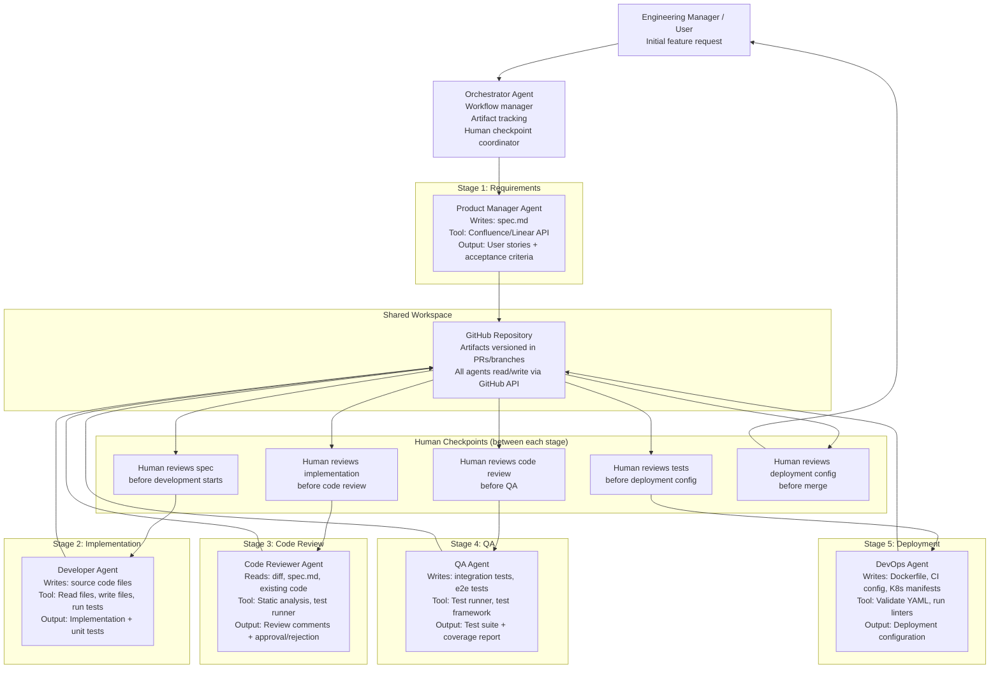
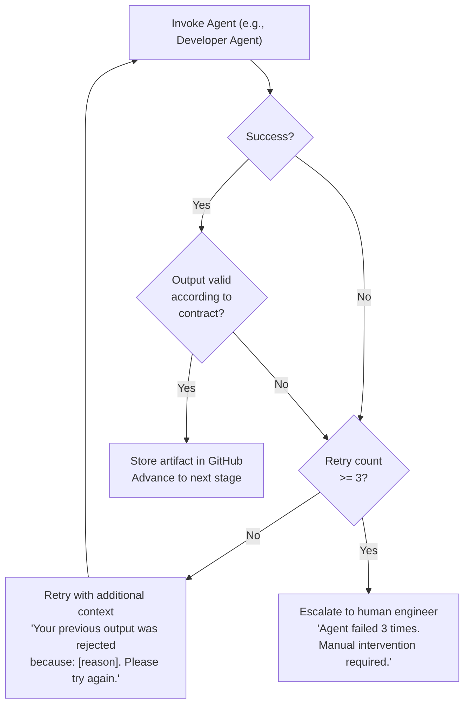

# Architecture Blueprint
## Design Case 05: Multi-Agent Software Development Workflow

A software development pipeline where multiple AI agents collaborate on the complete development lifecycle: a Product Manager agent writes specs, a Developer agent implements them, a Code Reviewer agent reviews, a QA agent writes tests, and a DevOps agent creates deployment configuration. Humans review and approve at each stage.

---

## System Overview

---

## Agent Specialization Design

Each agent has a specific role, system prompt, available tools, and output contract. The output of each agent becomes an artifact stored in the shared GitHub repository.

| Agent | System Prompt Focus | Available Tools | Input | Output Artifact |
|---|---|---|---|---|
| **Product Manager** | "Write clear, testable user stories with acceptance criteria. Focus on the user's goal, not the implementation." | Confluence API, Linear/Jira API, read existing specs | Feature request from user | `spec.md` (user stories + acceptance criteria + out-of-scope) |
| **Developer** | "Write clean, well-tested code. Follow the project's existing patterns. Every function needs a unit test. Handle errors explicitly." | Read files (entire repo), write files, run tests (pytest/jest), read spec | `spec.md` + codebase | Source code files + unit tests |
| **Code Reviewer** | "Review for: correctness, security vulnerabilities, performance, test coverage, code style consistency with codebase. Be specific." | Read all files (diff + context), run static analysis (ruff, eslint), run tests | Implementation diff + spec.md | Review comments (inline) + summary + approve/request-changes |
| **QA Agent** | "Write integration tests and end-to-end tests. Test happy path and all error conditions from acceptance criteria. Verify edge cases." | Read spec, read implementation, run tests, write test files | spec.md + source code | Integration test suite + e2e test suite + coverage report |
| **DevOps Agent** | "Write deployment configuration. Container must be minimal (no dev dependencies in prod). Use health checks. Set resource limits." | Read source code, validate YAML (kubeval), run Dockerfile linter (hadolint) | Source code + test results | Dockerfile + GitHub Actions CI config + Kubernetes manifests |

---

## Orchestrator: The Most Critical Component

The Orchestrator is not an AI agent — it's a deterministic workflow manager built with LangGraph. It:

1. Manages the state of the entire pipeline (which stage is active, what artifacts exist, what humans have approved)
2. Invokes the correct agent for each stage with the right context
3. Enforces human checkpoints (pauses execution and waits for human input)
4. Handles failures (retry logic, escalation to human if agent fails 3x)
5. Routes based on agent output (if reviewer requests changes, route back to developer)
6. Writes all transitions to an audit log

**Why deterministic, not AI-based?**
Making the orchestrator itself an AI agent introduces failure modes: it might skip stages, make unexpected routing decisions, or fail in ways that are hard to predict. The value of the orchestrator is reliability and predictability — exactly what AI is bad at. Keep the orchestrator as simple, deterministic code.

---

## Failure Handling

**Output validation contracts:**
Each agent has a structured output format that the orchestrator validates deterministically:
- PM Agent: Must produce a spec with at least 3 user stories, each with acceptance criteria, each with an out-of-scope section
- Developer Agent: Must produce compilable code + all tests pass (verified by running `pytest` / `jest`)
- Review Agent: Must produce structured JSON with `{ "decision": "approved" | "changes_requested", "comments": [...] }`
- QA Agent: Must produce test files that run and coverage report >= 80%
- DevOps Agent: Must produce valid Dockerfile (passes `hadolint`) and valid YAML (passes `kubeval`)

---

## 📂 Navigation

**In this folder:**
| File | |
|---|---|
| 📄 **Architecture_Blueprint.md** | ← you are here |
| [📄 Build_Guide.md](./Build_Guide.md) | Step-by-step build guide |
| [📄 Component_Breakdown.md](./Component_Breakdown.md) | Component breakdown |
| [📄 Data_Flow_Diagram.md](./Data_Flow_Diagram.md) | Data flow diagram |
| [📄 Interview_QA.md](./Interview_QA.md) | Interview prep |
| [📄 Tech_Stack.md](./Tech_Stack.md) | Technology stack choices |

⬅️ **Prev:** [04 AI Research Assistant](../04_AI_Research_Assistant/Architecture_Blueprint.md)
