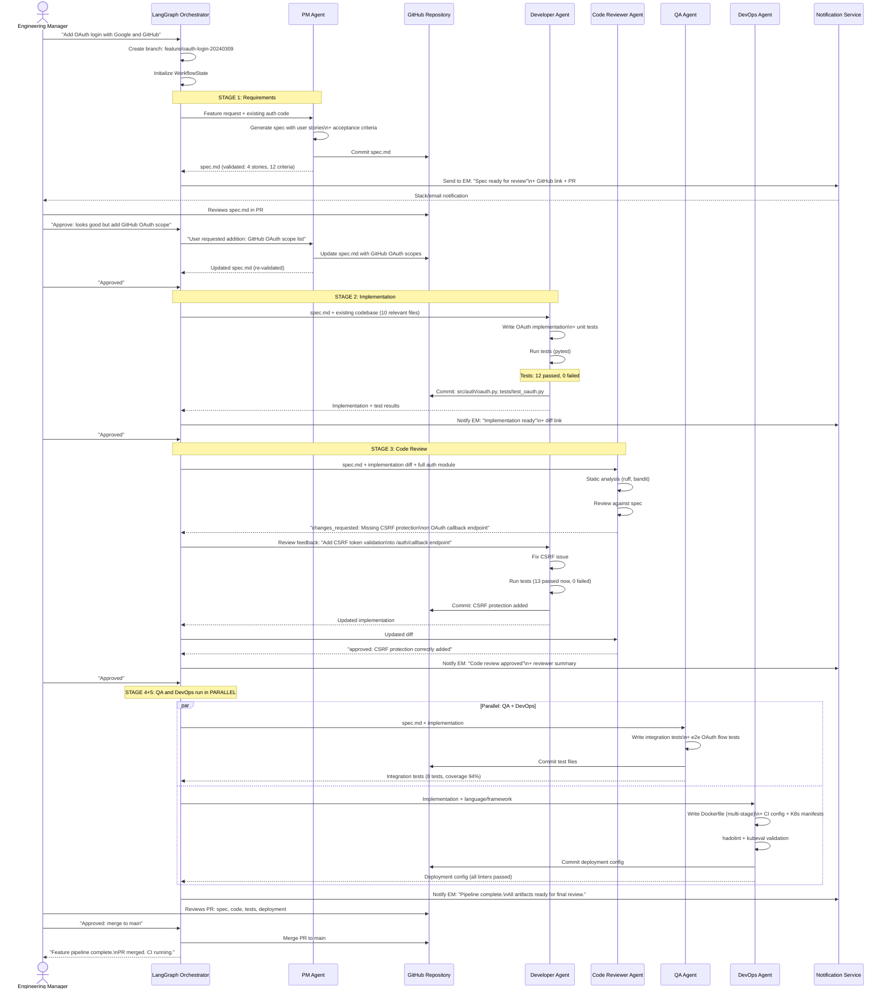
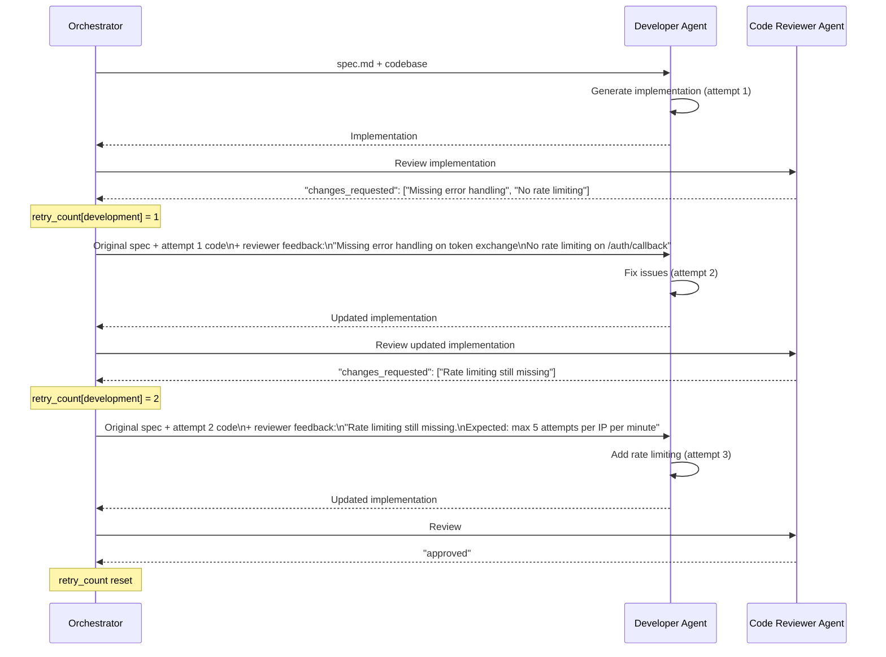
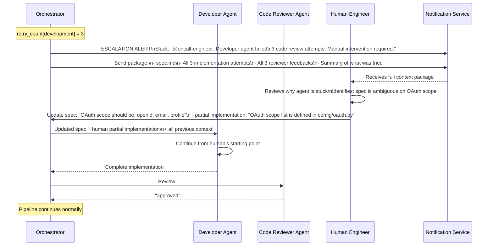
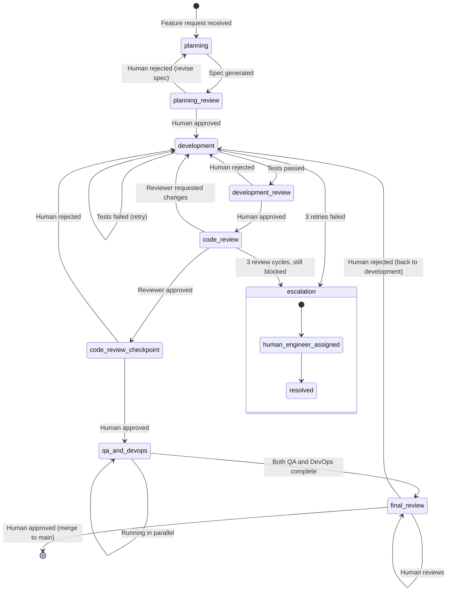

# Data Flow Diagram
## Design Case 05: Multi-Agent Software Development Workflow

The complete pipeline from feature request to deployed configuration, with all human checkpoints shown explicitly.

---

## Full Pipeline Flow (Happy Path)

---

## Retry Flow (Developer Agent Fails Review)

---

## Escalation Flow (Agent Fails 3 Times)

---

## State Transitions Diagram

---

## 📂 Navigation

**In this folder:**
| File | |
|---|---|
| [📄 Architecture_Blueprint.md](./Architecture_Blueprint.md) | System architecture blueprint |
| [📄 Build_Guide.md](./Build_Guide.md) | Step-by-step build guide |
| [📄 Component_Breakdown.md](./Component_Breakdown.md) | Component breakdown |
| 📄 **Data_Flow_Diagram.md** | ← you are here |
| [📄 Interview_QA.md](./Interview_QA.md) | Interview prep |
| [📄 Tech_Stack.md](./Tech_Stack.md) | Technology stack choices |

⬅️ **Prev:** [04 AI Research Assistant](../04_AI_Research_Assistant/Architecture_Blueprint.md)
