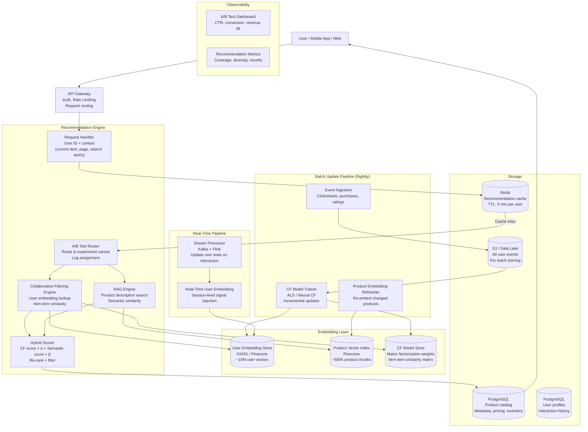
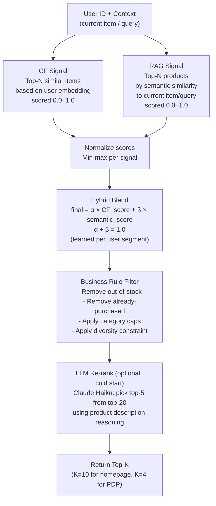
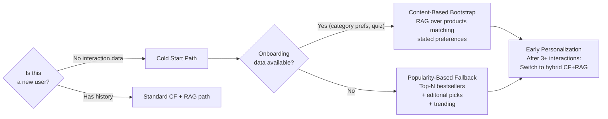

# Architecture Blueprint
## Design Case 06: Recommendation System with RAG

A hybrid product recommendation engine that combines **collaborative filtering** (what similar users bought) with **RAG over product descriptions** (semantic understanding of what a product actually is). The result is a system that can recommend both "users like you bought this" and "this product is semantically similar to what you're browsing" — and blend both signals intelligently.

---

## System Overview



---

## Hybrid Scoring Architecture

The critical design decision: how to blend collaborative filtering scores with semantic similarity scores from RAG.



---

## Cold Start Architecture

New users have no purchase history. New products have no interaction data. Both require special handling:



---

## Component Table

| Component | Technology | Responsibility | Scales How |
|---|---|---|---|
| API Gateway | AWS API Gateway / Kong | Auth, rate limiting, routing | Horizontal, stateless |
| Request Handler | Python FastAPI | Validate request, check Redis cache, dispatch to engines | Horizontal with Redis shared state |
| Collaborative Filtering Engine | Custom Python service | Load user embedding, query FAISS for top-N similar items | Horizontal; FAISS index loaded in-memory per replica |
| RAG Engine | Python + Pinecone | Embed query/current item, retrieve semantically similar products | Horizontal; Pinecone scales independently |
| Hybrid Scorer | Stateless scoring service | Merge CF and semantic scores, apply business rules, filter inventory | Horizontal, stateless |
| A/B Test Router | Custom + LaunchDarkly | Route users to experiment variants, log assignments | Stateless, millisecond overhead |
| User Embedding Store | FAISS (in-memory) + S3 backup | 10M user vectors for CF nearest-neighbor | FAISS sharded across replicas; nightly rebuild from S3 |
| Product Vector Index | Pinecone | 500K product chunks embedded with text-embedding-3-small | Pinecone managed, auto-scales |
| CF Model Store | S3 + in-memory model | Trained CF model weights + item similarity matrix | Loaded at startup, refreshed nightly |
| Redis | AWS ElastiCache | Cache top-10 recommendations per user, TTL 5 min | Cluster mode |
| PostgreSQL | AWS RDS | Product catalog, user profiles, order history | Read replicas for catalog queries |
| Kafka + Flink | AWS MSK + Kinesis | Real-time event streaming for immediate user state updates | Kafka partitions scale horizontally |
| Batch Pipeline | Airflow + Spark on EMR | Nightly CF model retraining, embedding refreshes | EMR auto-scales with job size |

---

## Latency Budget

For a homepage recommendation load (user opens app):

```
Redis cache check:                     3ms
  Cache miss path only:
  CF engine (FAISS lookup):           12ms
  RAG engine (Pinecone query):        25ms  (runs parallel with CF)
  Hybrid scoring + business rules:     5ms
  Optional LLM rerank (Haiku):       120ms  (only for cold-start users)
─────────────────────────────────────────────────────────────────────
Warm path (cache hit):                 3ms
Cold path (no LLM rerank):            45ms
Cold start path (with Haiku rerank): 165ms
```

Target SLA: P99 < 200ms for warm users, P99 < 500ms for cold start.

---

## 📂 Navigation

**In this folder:**
| File | |
|---|---|
| 📄 **Architecture_Blueprint.md** | ← you are here |
| [📄 Component_Breakdown.md](./Component_Breakdown.md) | Component deep dive |
| [📄 Interview_QA.md](./Interview_QA.md) | Interview prep |

⬅️ **Prev:** [05 Multi-Agent Workflow](../05_Multi_Agent_Workflow/Architecture_Blueprint.md) &nbsp;&nbsp;&nbsp; ➡️ **Next:** [07 AI Content Moderation Pipeline](../07_AI_Content_Moderation_Pipeline/Architecture_Blueprint.md)
