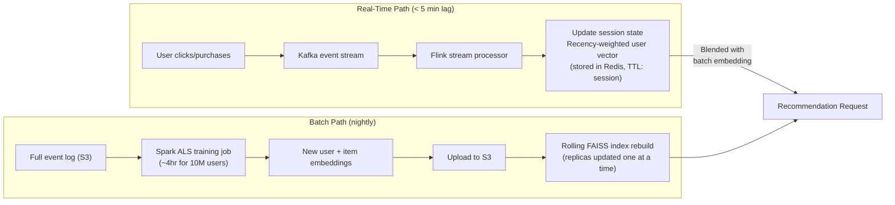

# Component Breakdown
## Design Case 06: Recommendation System with RAG

Deep dive into each component — design rationale, failure modes, and implementation details.

---

## 1. Collaborative Filtering Engine

**Collaborative filtering** is the "users like you also bought" signal. Its core idea: if users A and B have similar purchase histories, they'll likely have similar preferences for future items.

### How It Works

The CF engine uses **matrix factorization** (specifically ALS — Alternating Least Squares) to decompose the user-item interaction matrix into latent embeddings:

```
Interaction matrix R (users × items) ≈ User embeddings U × Item embeddings V^T

R[u][i] = U[u] · V[i]    (dot product predicts affinity)
```

Each user and item gets a 128-dimensional embedding vector. To find recommendations for a user, you find the item vectors most similar to the user's vector (nearest neighbor search via FAISS).

### FAISS In-Memory Architecture

FAISS (Facebook AI Similarity Search) is the key technology. The full item index (~500K product vectors × 128 dims × 4 bytes = ~256MB) fits in memory on each recommendation service replica.

```
Startup sequence:
  1. Service starts
  2. Load item embeddings from S3 (pre-built by nightly Spark job)
  3. Build FAISS IVF index in memory (~15 seconds for 500K vectors)
  4. Service is ready to handle requests

Query:
  1. Receive user_id
  2. Fetch user embedding from User Embedding Store (Redis or S3 lookup by ID)
  3. FAISS.search(user_vector, top_k=50) → 50 candidate item IDs in ~5ms
  4. Return candidates with similarity scores
```

**Why in-memory FAISS vs managed vector DB for CF?**
CF lookups are extremely hot (every recommendation request). FAISS in-memory at sub-5ms is faster than any managed vector DB (Pinecone averages 20-50ms). The tradeoff: each replica holds its own copy of the index; you need to reload on updates. Nightly reloads on a rolling basis (one replica at a time) handles this without downtime.

### Item-Item Similarity

Beyond user-based recommendations, you can pre-compute item-item similarity matrices. "Customers also viewed" on a product detail page uses item-item CF, not user-based CF:

```
For product P, precompute: top-20 most similar items by item embedding cosine similarity
Store as: item_similar[product_id] = [(item_id, score), ...]
Persist in Redis for O(1) lookup at product page load time
```

---

## 2. RAG Engine (Product Description Search)

The RAG engine solves what CF cannot: **semantic understanding of product content**.

CF knows that users who bought "running shoes" also buy "compression socks" because it observed that behavior. But CF cannot recommend a newly added item (no interaction data yet) or explain *why* two products are related.

RAG over product descriptions fills this gap.

### Product Indexing Pipeline

```
For each product in catalog:
  1. Construct document:
     title + brand + category + description + key features + specifications
     (typically 200–600 tokens per product)

  2. Chunking strategy:
     - For short products (< 300 tokens): index as single chunk
     - For long products (> 300 tokens): split into semantic sections
       (description chunk, specifications chunk, use-case chunk)

  3. Embed with text-embedding-3-small (1536 dims, $0.02/1M tokens)

  4. Upsert to Pinecone with metadata:
     {product_id, category, brand, price_tier, in_stock, updated_at}

  5. Metadata filtering enabled: can search only in-stock items,
     or only within a price range, without post-filtering
```

### Query Construction

When a user is viewing a product, the RAG engine queries for semantically similar products:

```
Context signal        → Query text
──────────────────────────────────────────────────────────
Viewing product       → Use product title + key features as query
Search query          → Use raw search query
Category browsing     → Use category name + user preference signals
After purchase        → Use "complementary to [product name]" query
```

The RAG engine returns candidate products with similarity scores. These become the semantic signal in the hybrid scorer.

---

## 3. Hybrid Scorer

The hybrid scorer is the intelligence layer that produces the final ranked list.

### Score Blending

```python
def hybrid_score(cf_score: float, semantic_score: float,
                 alpha: float, beta: float) -> float:
    """
    alpha + beta should sum to 1.0
    alpha = weight of collaborative filtering signal
    beta  = weight of semantic (RAG) signal
    """
    return alpha * cf_score + beta * semantic_score
```

**Alpha/beta are not fixed — they vary by user segment:**

| User Segment | Alpha (CF weight) | Beta (Semantic weight) | Rationale |
|---|---|---|---|
| Power users (50+ orders) | 0.80 | 0.20 | Rich history → trust CF heavily |
| Regular users (5-50 orders) | 0.60 | 0.40 | Mix of signals |
| New users (< 5 orders) | 0.20 | 0.80 | Sparse history → lean on semantics |
| Cold start (0 orders) | 0.00 | 1.00 | No CF signal available |

Segment thresholds and weights are tuned via A/B testing and adjusted monthly.

### Business Rule Filters

After scoring, business rules are applied as hard filters (not ranking adjustments):

1. Remove out-of-stock items (real-time inventory check against Redis)
2. Remove already-purchased items (from user's order history)
3. Category diversity constraint: no more than 3 items from same leaf category in top-10
4. Price range constraint (optional): filter by user's historical average order value ± 2σ
5. Sponsored slots: inject 1-2 paid placements with score floor enforcement

---

## 4. Cold Start Problem

Cold start is a first-class concern, not an edge case.

**Two types of cold start:**

**New user cold start (no purchase history):**
```
1. During onboarding, collect: 3-5 category preferences, optional budget range
2. Use these as seed queries to RAG engine: "best [category] products for [use case]"
3. Present curated "starter pack" recommendations
4. After first interaction (click, add to cart, purchase): inject as implicit feedback
5. After 3 interactions: user embedding initialized; switch to hybrid mode
```

**New item cold start (just added to catalog):**
```
1. New product has no interaction data → CF score = 0 for all users
2. RAG embedding is created immediately upon product creation
3. New item can appear via RAG signal immediately
4. As interactions accumulate (typically 24-48 hours): CF signal becomes usable
5. After 50+ interactions: item treated as "warm" in CF model
```

**The "feature hashing" trick for CF new items:**
When a new item appears, initialize its CF embedding from the average embedding of items in the same category. This is a cold start proxy that degrades gracefully as real interaction data arrives.

---

## 5. A/B Testing Layer

Recommendations are experiments. You need to measure whether your algorithm changes actually improve business outcomes.

### What to Measure

| Metric | What It Measures | Target |
|---|---|---|
| Click-through rate (CTR) | Are users clicking recommended items? | +5% vs baseline |
| Add-to-cart rate | Do clicks convert to cart additions? | +3% vs baseline |
| Purchase conversion | Do cart additions become purchases? | +2% vs baseline |
| Revenue per user session | Ultimate business metric | +5% vs baseline |
| Recommendation diversity | Entropy of recommended categories | Maintain baseline |
| Long-tail coverage | % of catalog appearing in recommendations | > 20% of catalog |

### Assignment Logic

```
User makes recommendation request
→ Hash user_id to experiment bucket (deterministic, consistent per user)
→ Lookup bucket → experiment variant assignment
→ Log {user_id, experiment_id, variant, timestamp}
→ Serve recommendations for that variant
→ Log downstream events (click, purchase) with experiment_id for attribution
```

Users stay in the same variant for the duration of an experiment (typically 2-4 weeks). This prevents the novelty effect from contaminating results.

---

## 6. Real-Time vs Batch Update Design



**Why two paths?**

The batch path trains the global model with full statistical power (all historical data). The real-time path captures the user's intent in the current session without waiting for the next nightly run. A user who just searched for "camping gear" should see camping recommendations now, not tomorrow.

---

## 📂 Navigation

**In this folder:**
| File | |
|---|---|
| [📄 Architecture_Blueprint.md](./Architecture_Blueprint.md) | System architecture blueprint |
| 📄 **Component_Breakdown.md** | ← you are here |
| [📄 Interview_QA.md](./Interview_QA.md) | Interview prep |

⬅️ **Prev:** [05 Multi-Agent Workflow](../05_Multi_Agent_Workflow/Architecture_Blueprint.md) &nbsp;&nbsp;&nbsp; ➡️ **Next:** [07 AI Content Moderation Pipeline](../07_AI_Content_Moderation_Pipeline/Architecture_Blueprint.md)
