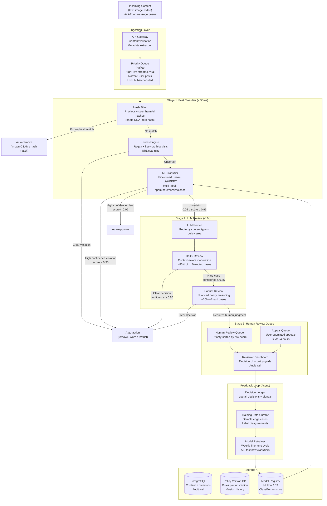
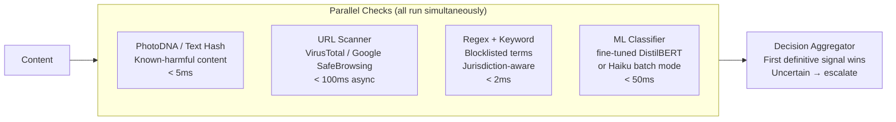
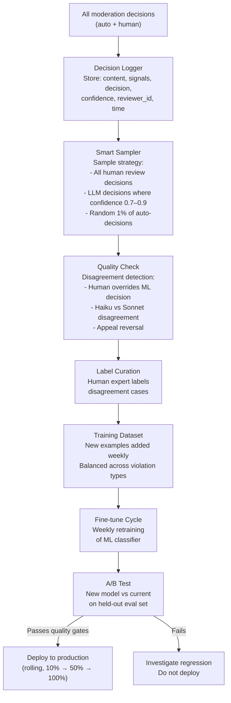

# Architecture Blueprint
## Design Case 07: AI Content Moderation Pipeline

A multi-stage content moderation system capable of processing **1 million posts per day** with sub-second latency SLAs for time-sensitive content. The architecture uses a staged funnel: cheap-and-fast classifiers handle clear-cut cases, LLMs handle ambiguous edge cases, and human reviewers handle appeals and high-stakes decisions. Each stage feeds a feedback loop that continuously improves upstream models.

---

## System Overview



---

## Throughput Design: 1M Posts/Day

At 1 million posts/day, the throughput math must be explicit:

```
1,000,000 posts/day
÷ 86,400 seconds/day
= 11.6 posts/second average

Peak factor: 3x during peak hours (8pm–midnight local)
Peak throughput: ~35 posts/second
```

**Stage distribution (based on typical social platform data):**

| Stage | % of Traffic | Posts/Day | Posts/Hour (avg) |
|---|---|---|---|
| Hash filter catches | 2% | 20,000 | 833 |
| Rules engine catches | 8% | 80,000 | 3,333 |
| ML classifier auto-action | 15% | 150,000 | 6,250 |
| ML classifier auto-approve | 65% | 650,000 | 27,083 |
| Routes to LLM (Haiku) | 8% | 80,000 | 3,333 |
| Routes to LLM (Sonnet) | 1.5% | 15,000 | 625 |
| Routes to human review | 0.5% | 5,000 | 208 |

**Human queue:** 5,000 posts/day ÷ 8 working hours = 625 posts/hour. At a reviewer throughput of 60 posts/hour per person, you need ~11 reviewers during business hours to keep up. Scale to 20 for peak days, coverage across time zones.

---

## Latency SLA by Content Type

Different content types carry different risk profiles and therefore different latency requirements:

| Content Type | SLA | Rationale |
|---|---|---|
| Live stream segments | < 100ms | Viral spread risk, real-time audience |
| Text posts from new accounts | < 500ms | Spam and coordinated campaigns |
| Standard text posts | < 2s | Users expect quick publish confirmation |
| Images (standard) | < 3s | Vision processing overhead |
| Videos (< 60s) | < 10s | Transcription + frame analysis |
| Appeals | < 24 hours | Human review window |

---

## Stage 1: Fast Classifier Architecture



**Why parallel and not sequential?** Sequential checks add latency. Running all Stage 1 checks simultaneously means total Stage 1 latency equals the slowest check's latency, not the sum.

---

## Feedback Loop: The Self-Improving Pipeline

The feedback loop is what makes the system get better over time rather than degrading.



---

## 📂 Navigation

**In this folder:**
| File | |
|---|---|
| 📄 **Architecture_Blueprint.md** | ← you are here |
| [📄 Component_Breakdown.md](./Component_Breakdown.md) | Component deep dive |
| [📄 Interview_QA.md](./Interview_QA.md) | Interview prep |

⬅️ **Prev:** [06 Recommendation System with RAG](../06_Recommendation_System_with_RAG/Architecture_Blueprint.md) &nbsp;&nbsp;&nbsp; ➡️ **Next:** [08 Cost-Aware AI Router](../08_Cost_Aware_AI_Router/Architecture_Blueprint.md)
