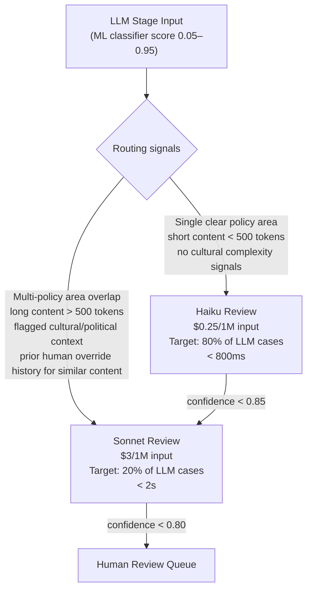

# Component Breakdown
## Design Case 07: AI Content Moderation Pipeline

Deep dive into each stage and component of the content moderation pipeline.

---

## 1. Ingestion Layer and Priority Queue

Content enters the system through two paths: the synchronous API path (user submits a post and waits for publish confirmation) and the asynchronous queue path (bulk review, retroactive moderation, appeals).

### Priority Queue Design

Not all content carries equal urgency. A Kafka topic with three priority partitions handles traffic triage:

```
HIGH priority (consume first):
  - Live stream segments (< 100ms SLA)
  - Content from flagged accounts (prior violations)
  - Viral content (> 1,000 shares in last hour)
  - Content reported by multiple users (> 5 reports)

NORMAL priority:
  - Standard user posts (< 2s SLA)
  - Content from accounts with no violation history

LOW priority (batch-processable):
  - Retroactive moderation sweeps
  - Bulk content from API integrations
  - Scheduled review tasks
```

**Why Kafka over a simple HTTP fanout?**

Kafka provides back-pressure handling. At 35 posts/second peak, if the ML classifier slows down (e.g., a model deployment in progress), Kafka absorbs the burst without dropping content. Without a queue, a processing slowdown would cascade into API timeouts visible to users.

**Kafka configuration details:**
- 20 partitions for normal priority (allows 20 parallel consumers)
- 5 partitions for high priority (smaller, kept emptier to minimize latency)
- Message retention: 7 days (reprocessing possible if needed)
- Consumer group: moderation-workers, each worker processes one partition

---

## 2. Stage 1: Fast Classifier

Stage 1's job is to handle the easy 90% of cases in under 50ms, so the expensive LLM stage only sees the genuinely ambiguous 10%.

### Hash Filter

**PhotoDNA** (for images) and SHA-256 hashing (for text) catch known-harmful content instantly. The hash database is maintained by:
- Integration with NCMEC (National Center for Missing and Exploited Children) for known CSAM hashes
- Internal hash accumulation: every piece of content that receives a definitive "remove" decision gets its hash stored
- Partnership databases (shared hashes among platforms via GIFCT)

**Text fingerprinting** is slightly different from exact hash matching. Exact hash matches are for verbatim known-harmful text. Fuzzy fingerprinting (shingling) catches near-duplicates — the same spam message with one word changed.

### ML Classifier Architecture

The ML classifier is a **multi-label classifier** — a single model predicts probability scores across all violation categories simultaneously:

```
Input: tokenized content text (+ optional image caption)
Output: {
  "spam": 0.03,
  "hate_speech": 0.87,
  "violence": 0.12,
  "nsfw_explicit": 0.04,
  "self_harm": 0.01,
  "misinformation": 0.23,
  "harassment": 0.71
}
```

**Model choice:** Fine-tuned DistilBERT (66M parameters, runs on CPU at 20ms/inference) or Claude Haiku in batch mode. DistilBERT is cheaper at scale ($0.002/1K inferences on CPU vs $0.25/1M tokens for Haiku); Haiku has better understanding of nuanced language and emerging slang.

**Decision thresholds:**

| Score | Action |
|---|---|
| Any category > 0.95 | Auto-action (remove / restrict) |
| All categories < 0.05 | Auto-approve |
| Any category in [0.05, 0.95] | Escalate to LLM stage |

Threshold tuning is critical. Too low on the "auto-action" threshold → false positives (removing legitimate content). Too high → false negatives (letting harmful content through). Calibrate against labeled data, recalibrate monthly.

### Jurisdiction-Aware Rules Engine

Different countries have different legal requirements for content removal. The rules engine is policy-as-code:

```python
class PolicyEngine:
    def evaluate(self, content: str, user_country: str, content_type: str) -> Decision:
        policy = self.policy_db.load(jurisdiction=user_country, version="current")

        for rule in policy.rules:
            if rule.matches(content, content_type):
                if rule.action == "auto_remove":
                    return Decision(action="remove", reason=rule.id, confidence=1.0)
                elif rule.action == "restrict_region":
                    return Decision(action="restrict", regions=[user_country], reason=rule.id)

        return Decision(action="uncertain")
```

Policy versions are stored in the Policy Version DB. Changes to policy rules go through a review process, are versioned, and are deployed as a staged rollout. A rollback takes seconds — just switch the version pointer.

---

## 3. Stage 2: LLM Review

The LLM stage handles the genuinely ambiguous cases that the ML classifier flagged as uncertain. These are the cases where context matters: satire, news reporting on violence, fiction containing difficult themes, cultural context differences.

### Haiku vs Sonnet Routing



### LLM Prompt Structure

The moderation prompt is engineered to provide clear policy context and force structured output:

```
System prompt (cached, 1,200 tokens):
  You are a content moderator for [Platform]. Your role is to evaluate
  content against the following policies: [policy summary].

  You must output a JSON decision with:
  - decision: "remove" | "restrict" | "approve" | "escalate"
  - confidence: 0.0–1.0
  - policy_area: the primary policy this decision applies to
  - reasoning: one sentence explaining your decision
  - needs_human: true if this case requires human judgment

  Important: "escalate" means you genuinely cannot determine if this
  violates policy with reasonable confidence. Use it sparingly.

User turn (per request):
  Content: [content text]
  Content type: [text/image caption/video transcript]
  User country: [country code]
  Prior violations on this account: [count]
  Report signals: [number of user reports, reporter account ages]

  Evaluate this content against platform policies.
```

**Prompt caching benefit:** The 1,200-token system prompt is stable across all requests. Cached at 90% hit rate, this saves ~$0.03/1K calls in input costs — meaningful at 95,000 LLM calls/day.

### Confidence Calibration

LLMs are not naturally well-calibrated on confidence scores. A Haiku response saying "confidence: 0.87" may not correspond to 87% accuracy empirically. Calibration post-processing corrects this:

1. Collect 10,000 historical Haiku decisions with their stated confidence scores
2. For each confidence bucket (0.80-0.84, 0.85-0.89, etc.), compute actual accuracy against human ground truth
3. Build a calibration map: `calibrated_confidence = f(raw_confidence)`
4. Apply calibration to all Haiku outputs before routing decisions

After calibration, a "confidence: 0.87" corresponds to ~87% accuracy on held-out data.

---

## 4. Human Review Queue

The human review queue is not a last-resort failure mode — it's a deliberate and necessary component of the system.

### What Reaches Human Review

1. LLM decisions with confidence below threshold (true ambiguity)
2. Appeals from users who dispute an automated removal decision
3. Escalations from the LLM ("needs_human": true)
4. Random quality sample (1% of all LLM decisions, for calibration)
5. Legal holds (law enforcement requests, subpoenas)

### Reviewer Dashboard Design

Reviewers see a purpose-built interface, not a raw content dump:

```
For each item in queue:
  - Content (text/image/video)
  - ML classifier scores (visual bar chart)
  - LLM reasoning (Haiku or Sonnet's one-sentence explanation)
  - Prior decisions on similar content (3 most similar past cases)
  - User account history (prior violations, account age, follower count)
  - Policy links (relevant policy section highlighted)
  - Decision buttons: [Approve] [Remove] [Restrict] [Needs Legal] [Needs Senior Review]
  - Required reasoning: one-sentence justification (captured for training data)
```

**Reviewer productivity target:** 60 items/hour per reviewer. Items are presented in priority order. High-risk items (live content, viral posts, repeat offenders) are front-loaded.

### Reviewer Disagreement Protocol

When a reviewer overrides an ML or LLM decision, it triggers a protocol:

```
Reviewer marks "Remove" on content that Haiku marked "Approve" at confidence 0.88
→ Automatic flag: potential ML/LLM gap
→ Sampled into training data curator with "reviewer_override" tag
→ If 5+ similar overrides accumulate in 48 hours: alert ML team
→ ML team decides: policy clarification needed? Model retraining needed? Rules engine update needed?
```

This is the early warning system for model degradation and policy gaps.

---

## 5. Feedback Loop and Model Improvement

The feedback loop converts every moderation decision into training signal for future models.

### Sampling Strategy

You cannot use every decision for training — volume is too high, and auto-decisions are not ground truth. Smart sampling targets the high-signal examples:

| Source | Sample Rate | Reason |
|---|---|---|
| Human review decisions | 100% | Ground truth, expensively obtained |
| Reviewer overrides of ML/LLM | 100% | Model gap signal |
| LLM decisions (confidence 0.70–0.85) | 20% | Near-boundary cases |
| LLM decisions (confidence > 0.85) | 2% | Quality monitoring only |
| Appeal reversals | 100% | High signal: model and LLM were both wrong |
| Auto-approved (ML confidence < 0.05) | 0.5% | Catches missed violations |

### Weekly Fine-Tune Cycle

```
Monday: Sampling and curation job runs over prior week's decisions
Tuesday: Human experts review flagged disagreement cases (4-8 hours)
Wednesday: New training examples added to labeled dataset (target: 500–2,000 new examples/week)
Thursday: Model fine-tuning job runs on GPU cluster (~2 hours for DistilBERT)
Friday: A/B evaluation against held-out test set
  - Must exceed current model on Precision@0.95 threshold
  - Must not regress on recall by > 1%
  - Shadow deploy to 10% of traffic for weekend
Monday: Promote to 100% if shadow results match offline eval
```

### A/B Testing New Classifiers

New classifier versions run in shadow mode (process real traffic, log decisions, don't act on them) for 5-7 days before full promotion. The comparison metrics:

- **False positive rate:** legitimate content incorrectly flagged (user-visible harm)
- **False negative rate:** harmful content missed (platform-visible harm)
- **Escalation rate:** % of traffic pushed to LLM stage (cost metric)
- **Precision at 0.95 threshold:** of auto-actions taken, what % were correct

Promotions require all four metrics to be equal or better than the current production model.

---

## 📂 Navigation

**In this folder:**
| File | |
|---|---|
| [📄 Architecture_Blueprint.md](./Architecture_Blueprint.md) | System architecture blueprint |
| 📄 **Component_Breakdown.md** | ← you are here |
| [📄 Interview_QA.md](./Interview_QA.md) | Interview prep |

⬅️ **Prev:** [06 Recommendation System with RAG](../06_Recommendation_System_with_RAG/Architecture_Blueprint.md) &nbsp;&nbsp;&nbsp; ➡️ **Next:** [08 Cost-Aware AI Router](../08_Cost_Aware_AI_Router/Architecture_Blueprint.md)
